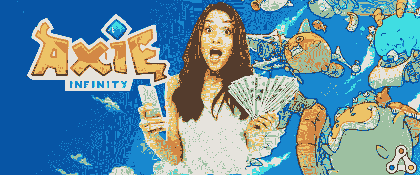
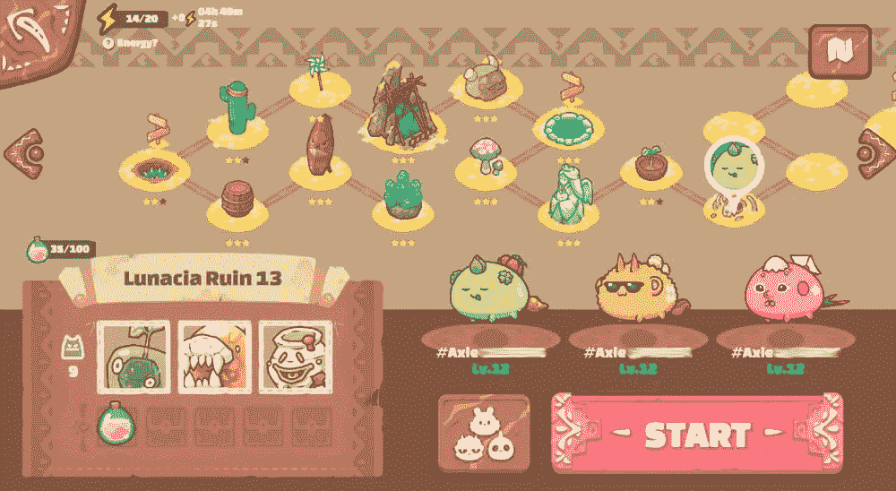
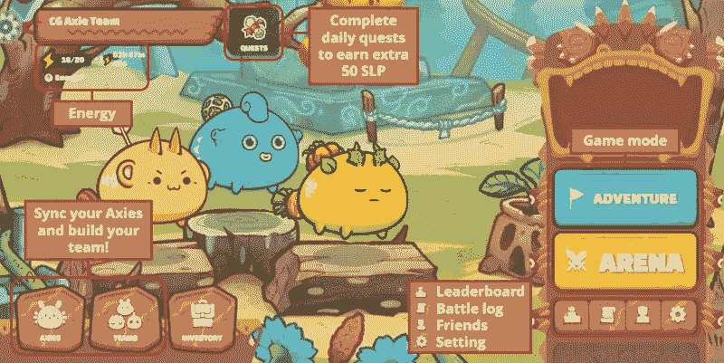
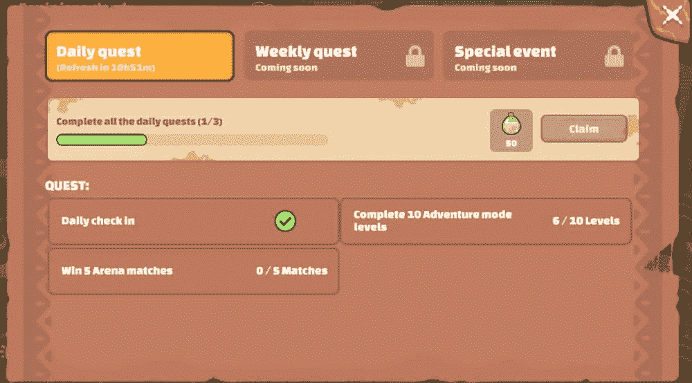
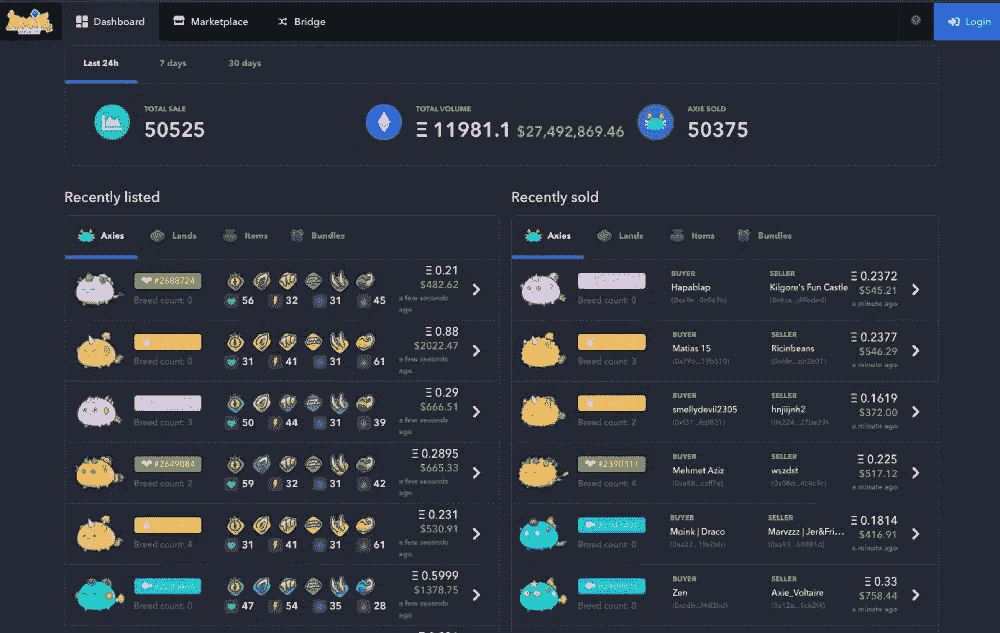
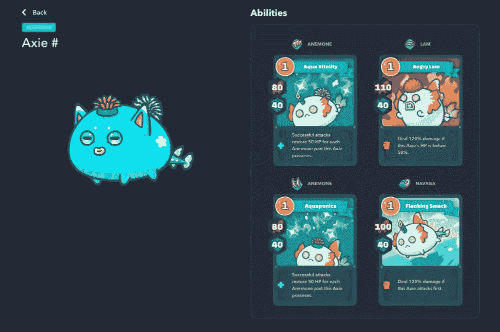
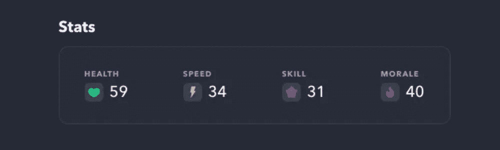

# 怎样才能从 Axie Infinity 赚到钱？

> 原文：<https://medium.com/geekculture/how-can-we-earn-from-axie-infinity-908eeeb99e5f?source=collection_archive---------11----------------------->

## **关于游戏 Axie Infinity 的完整指南**

How Can We Earn From Axie Infinity

Axie Infinity 是一款(P2E)由越南游戏开发公司 **Sky Marvis** 开发的 NFT 多人游戏。开发一个对开发者和玩家都有利的多人游戏的独特想法，从玩游戏中赚钱。这个想法为开发奇妙的游戏 Axie Infinity 铺平了道路。它被认为是这个数字领域最好的在线 p2e 游戏之一。每天大约有 250 万活跃用户在玩这款游戏。这款游戏已经吸引了全球玩家的关注。简而言之，游戏玩法就是每个玩家需要用 ETH(以太坊)购买“ **Axie** ，Axie 将帮助玩家在游戏中表现出色，这样他们就可以**通过直接将游戏点数转换成法定货币来赚取一些真金白银**，此外，游戏允许玩家繁殖和出租或重新训练他们的数字资产来赚取额外的钱。

> “我不是美元亿万富翁”——Axie Infinity 首席执行官 Nguyen Thanh Trung

我希望看博客的人会对这个游戏有所了解。与此同时，每个人心中都会产生一个问题

**这个游戏的入场费会是多少！买一个 axie 需要花多少钱？**

有点高了！你可以花 100 美元左右买到一个价格合理的 Axie。开始玩 Axie Infinity 游戏的入门级游戏大约需要花费 **$85** 美元。但是我很确定你花的钱会在一周内很容易赚回来。

就像你的游戏报名费会在你的钱包里恢复/你会在一周内拿到你的返现。听起来像是骗局吗！但是根据我的研究，我会把这个游戏定义为一个合法的行业，人们可以通过玩视频游戏来赚钱。

Axie Infinity Start UI

## 是的，你猜对了！你必须在玩游戏前付款

## 游戏的主要目标是你需要成为你对手团队的继承者。(你需要打败他们)。为此，你需要一支训练有素的军队或团队与他们作战。由三个有 3 个轴的化身组成的团队。如前所述，平均来说，你需要花费 85-100 美元来获得一个 axie 来开始一个游戏。

你甚至可以用 1000 美元甚至 800 美元建造你的整个队伍。

在开始玩这个游戏之前，你必须相信一件事，这不是一个普通的游戏，这是一个玩赚游戏，你会从你的表现中获得巨大的收入。

像其他以玩赚取角色扮演游戏一样，玩家需要收集稀有物品。例如在魔兽世界中，你可以把你的数字资产卖给出价最高的人。

一些玩家甚至出售其他游戏中的高级账户，并以巨额美元出售。

同样这一次，在 axie infinity 中，是**虚拟可爱宠物、axie** 和游戏点数。

## Axie Infinity 游戏的简短说明:

在游戏 Axie Infinity 中，游戏模式有两种规格。一个是(PVE) **玩家对环境**和(PVP) **玩家对玩家**。

Gameplay of Axie Infinity

**玩家对环境**

在(PVE) **玩家对战环境**中，每个玩家都需要通过击败怪物来赢得每个游戏阶段(最多 36 个阶段)。每个阶段都像是一次练习，玩家可以通过练习来熟悉游戏。当你到达下一关时，难度会增加。如果你是游戏新手，那么从 PVE 模式开始。

**光滑的爱情药水或 SLP** 类似于游戏的点数，也被称为“金币”。你甚至可以将 SLP 兑换成真正的法定货币。这可以通过币安等加密货币交易平台和其他加密交易所轻松完成。

**玩家对玩家**

顾名思义，这场战斗是在两个真正的玩家之间进行的。无论谁赢了这场比赛，都有机会获得 50 SLP 作为初始奖金。每个玩家在 PVP 中赢 5 次就可以得到这个奖励，而在 PVE 是 10 次。在 PVE，你每天最多可以挣 100 SLP。准确地说，你每天至少可以赚到 150 SLP。老实说，这是一个吸引人的有趣游戏。当你开始从中赚钱时，那就更有趣了。

是啊反正游戏一般都是这样的，这些就是 Axie Infinity 的玩法和游戏模式。你甚至可以在 youtube 上找到更多有趣的游戏视频和各种东西。也许在未来，我们可以期待 Axie Infinity 的开发者提供更多规格。

## 现在我们要学习如何从 Axie Infinity 赚钱？

简单来说，我们会通过玩游戏来赚钱。如前所述，你每天最少可以赚到**180 SLP/T21。180 SLP 约合 60 美元。这就好像你每个月可以赚到 4800 SLP，相当于 1500 美元。**

我知道这很难相信，但你们必须相信。一些公司/组织准备每月投资数千美元来建立他们的团队以赚取利润。最终，他们从投资中获利。

How to earn money from Axie Infinity

## Axie Infinity 中的管理者和学者是什么:

这些是每个玩家都应该知道的关键术语:

*   经理是指团队的主要所有者，管理团队的方方面面。简单来说，就是通过购买 Axies 来投资开发团队的人。
*   学者是代表经理玩游戏并获得报酬的玩家。

大多数情况下，经理和学者以 30:20 的比例分享他们的利润，就像 50-30%一样。如果你擅长数学，你自己算算，看看作为一名学者加入一个随机管理者的部落能赚多少钱。

Axie Infinity Dashboard

经理们急切地等待高技能的游戏玩家加入他们的团队。东南亚周围超过 60%的人开始通过扮演一名学者到经理的特许经营店赚很多钱。现在它被认为是合法的生意之一，所以一些政府对玩家通过 Axie Infinity 游戏赚的钱征税。

## 我知道大家会对这个问题感到困惑

**好的阿谢尔有什么用？**

例如，如果你曾经玩过口袋妖怪游戏，那么你肯定会知道你捕获的每个口袋妖怪都有自己的能力和技能。这种力量代表了每个口袋妖怪的长处和短处。而在 Axie Infinity 中，口袋妖怪被 Axis 取代。每个轴都有自己的力量。你可以在你的玩家中租借或交易你的轴。

Use of Good Axie

**在开始玩你的游戏之前，你需要知道 5 个主要数据:**

**1。速度**

速度决定谁先发起攻击。谁先打。

**2。健康**

健康决定你 Axie 的健康(生存极限)。

**3。技能**

技能决定了你技能的额外加成。

**4。士气**

士气决定了暴击和最后一战的几率。

5 main stats

最后一站是决定你的 Axie 何时在战斗中死亡/失败的术语，不要担心仍然有机会赢得你失去的钱。更有信心的再战，争取把投入的钱都收回来。

根据游戏条款，每个人都需要获得这三个位置才能在游戏中生存:

**1。油轮**

油罐车的位置将作为一个盾牌，保护你的队伍免受最大的伤害。油轮位置就像美国队长的盾牌，不会让你失去健康。如果你擅长防守，那么你将在这个位置上扮演一个重要的角色。

**2。达马格**

顾名思义，它是小队的**主要伤害处理者。它会面对所有的伤害来保护你的小队。为了保护你的 HP 和其他 HP 伤害位置被使用。这个位置经常被用来处理我们在比赛中面临的伤害。**

**3。支持**

支援将为你的小队提供支援。当你面对对手的猛烈攻击时。支持将帮助你从攻击中恢复。它将帮助你撤退并提升你反击的技能。它就像一个助推器，在面对任何苦难时提升你的力量。

然而，目前 Axie Infinity 只包含玩家对玩家(PVP)的这些游戏模式。未来，我们可以期待他们这边有更多的模式，让游戏变得更加好玩有趣。

无论如何，我写这篇博客只是为了帮助我的伙伴们了解游戏 Axie Infinity 的条款和条件。在投资你的钱或资产到游戏之前，我的意见是做你自己的市场调查。各种 youtube 频道将指导你投资正确的地方，甚至他们将指导你提升你的演奏技巧和其他举动。所以请在 YouTube 和其他有机材料上进行广泛的研究。

我很乐意帮助你们。

## 结论

我很确定你们会对玩 Axie Infinity 这个游戏有所了解。现在是你扮演你的角色并向世界证明你是谁的时候了！只要升级和提高自己，你就会达到新的高度。那么 Axie Infinity 就会成为你的主流收入。

好吧，伙计们，我很乐意帮助你们！我希望你们真的喜欢看我的博客。现在是我说再见的时候了。如果你有任何疑问就评论下来，我在这里开导你。请与我保持联系，了解更多有趣的科技新闻。