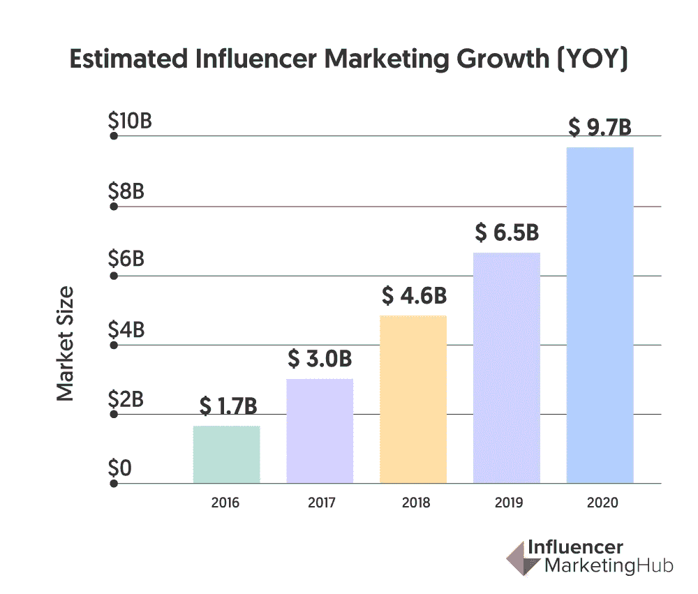

# 我们如何使用机器学习来识别新兴的影响者？

> 原文：<https://medium.com/geekculture/how-can-we-identify-emerging-influencers-using-machine-learning-229007039dd9?source=collection_archive---------20----------------------->

Photo by [Cristian Dina from Pexels](https://www.pexels.com/photo/white-smartphone-1851415/)

在社交媒体时代，营销团队比以往任何时候都更加依赖有影响力的人来宣传他们新的创新产品或服务。关注者、印象和参与的数量都会影响流量，这反过来又有助于推动一个非常重要的指标——销售额。这使得识别下一个崭露头角的影响者的能力变得更加重要和有价值，61%的营销人员认为很难为活动找到合适的影响者。

据[影响者营销中心](https://influencermarketinghub.com/influencer-marketing-benchmark-report-2020/)称，影响者营销是一个在过去几年中快速增长的行业，年增长率在 40%到 50%之间。它允许公司通过与目标受众的直接互动来提高品牌知名度和信任度，这在其他营销领域是前所未有的。

Graph taken from InfluencerMarketingHub’s [State of Influencer Marketing report](https://influencermarketinghub.com/influencer-marketing-benchmark-report-2020/#)

以最近估值 13 亿英镑的 [Gymshark](https://uk.gymshark.com/pages/about-us) 为例，这个健身服装品牌是影响者营销模式的最早采用者之一。他们因通过 Instagram 影响者和 YouTubers 社区营销产品而闻名，他们的成功证明了影响者营销的重要性，表明如果做得好，它可以成为指数增长的关键驱动力。

作为一个行业，影响者营销预计将在 2020 年达到[100 亿美元](https://digitalmarketinginstitute.com/en-gb/blog/20-influencer-marketing-statistics-that-will-surprise-you)，从 2017 年的仅 30 亿美元大幅增长。越来越多的公司重视影响者在营销中的参与，因此识别新兴影响者和最有潜力推动品牌成功的影响者比以往任何时候都更加重要。

# 那么，什么是有影响力的人呢？

最明显的影响者是名人——拥有大量追随者的个人，他们经常被崇拜。同样，其他类型的影响者包括行业专家、思想领袖和博客作者。这些类别虽然是相对模糊的术语，但都有一些相似的特征，这为我们在试图确定下一个重要影响者时提供了一些关于寻找什么特征的见解。
这些类别的共同特点是，这些人通常通过某种平台拥有相当多的受众，在大多数情况下，他们是谈论特定领域话题的人。例如，[吴恩达](https://www.coursera.org/instructor/andrewng)可以被认为是一个有影响力的人，因为他在 Twitter 上有大量的追随者，他经常在那里发布关于机器学习的帖子。

# 我们如何量化影响力？

正如大量的机器学习问题一样，能够表达像影响力这样的复杂想法对于识别趋势至关重要。在社交媒体的背景下，我们可以使用三种主要类型的数据:
1。关注人数
2。印象数
3。参与度
随着时间的推移，关注者和印象的数量可以让我们了解潜在影响者的影响范围。然后，互动为我们提供了关于个人如何转化影响力的信息，让我们深入了解查看帖子的用户有多大可能被激励去做特定的事情，例如购买产品。

# 我们如何预测一个新兴的影响者？

斯坦福大学的学生发表的一篇[论文讨论了一个潜在的解决方案，而 Kaggle(一个举办数据科学和机器学习竞赛的网站)](http://cs229.stanford.edu/proj2014/Ruishan%20Liu,%20Yang%20Zhao,%20Liuyu%20Zhou,%20Predict%20Influencers%20in%20the%20Social%20Network.pdf)[有几个其他的](https://www.kaggle.com/c/predict-who-is-more-influential-in-a-social-network)。Kaggle 最有效的条目利用了贝叶斯优化的光梯度增强机器，该机器使用比较两个个体的社交媒体统计数据进行训练，包括上面讨论的那些数据。贝叶斯优化是一个允许我们微调机器学习模型的超参数的过程。 [LightGBM 是一个相对较新的梯度推进框架，它使用基于树的学习](/@pushkarmandot/https-medium-com-pushkarmandot-what-is-lightgbm-how-to-implement-it-how-to-fine-tune-the-parameters-60347819b7fc)，与其他基于树的算法不同，它的树是垂直生长的(逐叶生长)，而不是水平生长的(逐层生长)。

Diagram taken from Microsoft’s [LightGBM](https://github.com/Microsoft/LightGBM/blob/master/docs/Features.rst#references) documentation

Diagram taken from Microsoft’s [LightGBM](https://github.com/Microsoft/LightGBM/blob/master/docs/Features.rst#references) documentation

LightGBM 的一些优点是速度快，需要较低的内存量，并支持 GPU 学习，但是，它对过度训练非常敏感。在这个实现中，LightGBM 能够以大约 87%的准确率正确识别两个人中谁最有影响力，这使得该模型非常适合于在相对较少的潜在影响者之间进行决策。然而，尽管这是解决该问题的最准确的机器学习解决方案之一，但它仍然受到需要大量精选数据才能有效的限制。这意味着，在将数据预处理为模型使用的给定格式之前，需要通过 API 或 web 抓取来访问大量用户数据。

# 我们可以做些什么来改善实施情况？

量化影响力的困难在于，这些值更好地描述了个人的影响范围，而不是他们的影响力。然而，我们也可以使用自然语言处理技术，如情感分析、命名实体识别和文档分类，来分析帖子本身，以及基于文本的约定。这将让我们更好地了解什么主题和什么类型的帖子获得了更好的影响，以及哪些帖子获得了最积极的互动。

# 你如何判断你预测的影响者是否适合你？

即使做了上面提到的工作，影响者也不一定适合你心目中的战略。为了建立品牌认知度或增加社会追随者，你可能需要选择一个宏观影响者，而为了达到理想的受众，微观影响者可能是更好的选择。影响者通常帖子的相关性和帖子的质量也有助于选择不同的影响者。