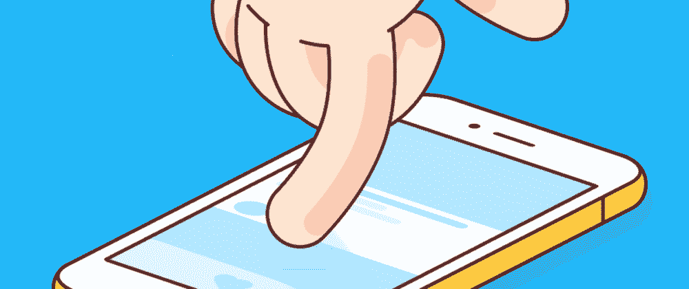

# 如何只用 HTML 创建一个滚动到顶部的按钮？

> 原文：<https://medium.com/geekculture/how-can-you-create-a-scroll-to-top-button-with-just-html-4cb69e083e50?source=collection_archive---------2----------------------->



哦，今天我要介绍一个愚蠢的把戏。这是我学到的关于 HTML 的第一件事。

所以没有作弊😉，下面是解决方案(作为推文🐦).

> *喜欢就点赞转发*

这是一个 HTML 的基础。而不是和 JavaScript 较劲。我们可以用 HTML 来做。

```
<a href="#">Scroll To Top</a>
```

当你点击这个链接时，页面立即跳转到顶部。所以我们可以用一行 CSS 代码给页面添加平滑滚动。

```
:root { scroll-behavior: smooth; }
```

这条 CSS 线将使整个页面中的所有链接平滑滚动。没关系，因为它对大多数情况都有用。

你可以使用 CSS 创建一个浮动的滚动到顶部按钮。

```
.stt {
  position: fixed;
  right: 1rem;
  bottom: 1rem;
  width: 3rem;
  height: 3rem;
  border-radius: 50%;
  background: rgb(128, 128, 255) url("data:image/svg+xml;utf8,%3Csvg xmlns='http://www.w3.org/2000/svg' viewBox='0 0 384 512'%3E%3Cpath fill='currentColor' d='M352 352c-8.188 0-16.38-3.125-22.62-9.375L192 205.3l-137.4 137.4c-12.5 12.5-32.75 12.5-45.25 0s-12.5-32.75 0-45.25l160-160c12.5-12.5 32.75-12.5 45.25 0l160 160c12.5 12.5 12.5 32.75 0 45.25C368.4 348.9 360.2 352 352 352z'%3E%3C/path%3E%3C/svg%3E") center no-repeat;
  box-shadow: 0 0.25rem 0.5rem 0 gray;
  opacity: 0.7;
}.stt:hover {
  opacity: 0.8;
}.stt:focus {
  opacity: 0.9;
}.stt:active {
  opacity: 1;
}
```

`position`使其漂浮。`right`和`bottom`放置它。`border-radius`使它变圆。使用了一种背景色，带有上箭头 SVG 作为背景图像。`opacity`用来表示状态。它很有用，因为用户可以阅读按钮后面的内容。

更新您的链接…

```
<a href='#' class="stt" title="scroll to top"></a>
```

`title`用于提高可达性。悬停时会显示一个工具提示。

感谢阅读这篇文章。
关注我获取更多文章。