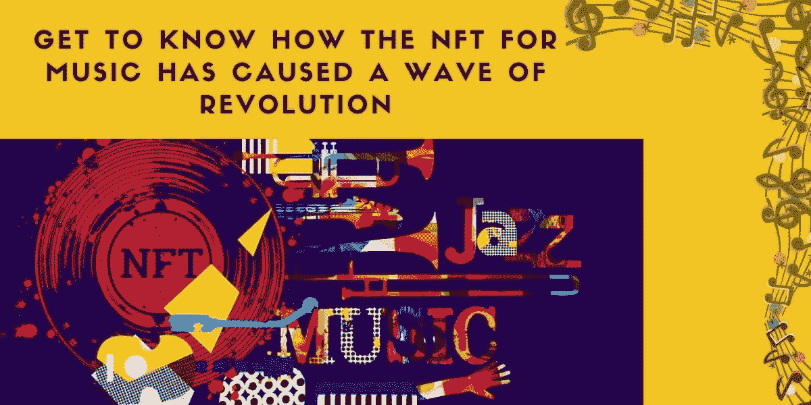
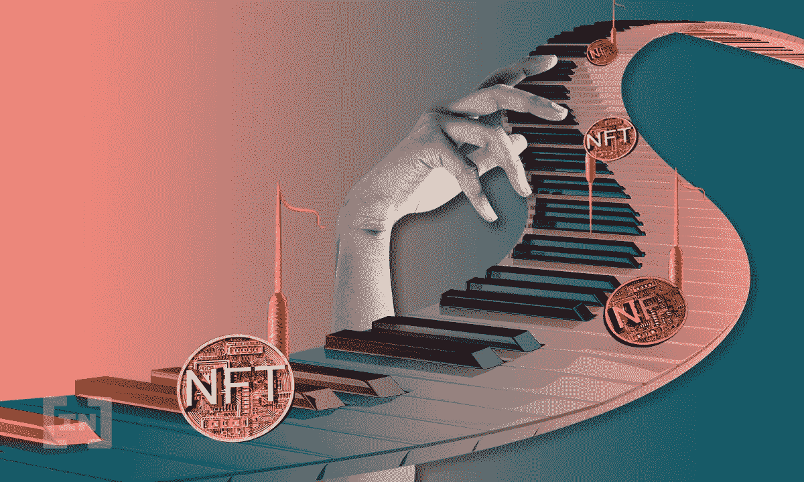
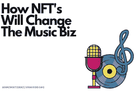
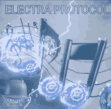

# 为什么 NFT 音乐在最近一段时间有所增长？

> 原文：<https://medium.com/geekculture/how-come-nft-for-music-has-gained-spike-in-recent-times-cf43524081d8?source=collection_archive---------21----------------------->

众所周知，NFTs 可以是任何形状。什么都行！使 NFT 越来越突出的是它们各自所拥有的独特性。这些天来，由于假冒行为的盛行，要求财产所有权变得复杂起来。幸运的是，有了 NFTs 在身边，他们可以保护所有权，进行交易，并获得一定比例的版税。

随着 NFT 被不同的行业所采用，音乐行业也不例外。音乐艺术家正在看到获得作曲、歌词等所有权的概念。，以不可替换标记的绝对形式。这篇博客详细介绍了 NFT 如何吸引音乐艺术家的注意，以及 [NFT 发展服务](https://www.appdupe.com/nft-development-services?utm_source=medium&utm_medium=blog&utm_campaign=Monika&utm_id=nft+development)如何建立你的 NFT 音乐市场。

**NFT 对于音乐意味着什么？**

当涉及到出版一首歌、一张专辑、一张 BGM 或任何与音乐相关的东西时，首先进入画面的是收入的分配。艺术家依靠代理商或音乐出版商推出他们的作品。所以，当音乐出版后，收入在艺术家和出版商之间分配。有时，收入分配会完全不公平，艺术家只获得更少的收入百分比。

为了彻底消除这种收入分配不公的做法，引入了非税收入制度。就像将数字或手绘艺术转化为 NFT 一样，为音乐创作 NFT 也是如此。在这里，艺术家将注册支持音乐相关资产的市场。

基于艺术家进行的前期营销和后期营销，他们的作品将到达观众，并激励他们进行同样的投资。最终，艺术家将拥有出售作品所得收入的全部所有权。而不是抛弃，如果他们的 NFT 被转卖，艺术家将继续收到版税。这正是音乐 NFT 奖的意义所在。

**推出 NFT 的音乐艺术家**

*   Grimes 是一位加拿大音乐家，他的 NFT 专辑非常受欢迎。这位艺术家在 Nifty Gateway 上以 700 万美元的价格出售了一系列藏品。
*   美国制作人兼 DJ 史蒂夫·青木在 Nifty Gateway 上以 425 万美元的价格出售了他的 NFT 系列。在一份声明中，史蒂夫·青木说，他有机会将音乐、艺术和文化结合起来，从而使它变得完全惊人。
*   阿姆(又名斯利姆·沙迪)以 178 万美元的价格卖出了他的第一个 NFT 作品集《沙迪骗局》。
*   印度音乐导演兼歌手 Sonu Nigam 也加入了推出 NFTs 的竞赛。这位歌手曾与数字娱乐和技术导向型公司 JetSynthesys 合作。Sonu Nigam 推出了一套 NFTs，其中包括他的单曲“名人堂”，以及一些由他写下的歌词。

**众筹和音乐人**

当音乐人决定在发行专辑或歌曲的情况下“独立”时，他们可以选择众筹的方式。众筹对各种商业和电影都有效，为什么对音乐人无效？会的。

这里有一个例子，描述了一位瑞典音乐家的众筹成功。瑞典艺术家丹尼·萨瑟决定走独立之路，用众筹的方式发行音乐单曲，并雇佣了他的粉丝。

> 丹尼精心制作了一些社交媒体帖子，张贴出来，并在 48 小时内迅速获得了他的单曲。

艺术家可以将众筹和他们在 NFT 的创业结合起来，在没有中间人和粉丝支持的情况下推出他们的作品。

**如何销售音乐 NFTs？**

与此同时，我们一直在讨论音乐 NFTs 的定义和迄今为止发生的流行销售。让我们快速进入销售音乐 NFT 的洞察力。

*   准备推出自己作品的音乐人必须选择平台。例如，他们可以选择专用市场，即只对交易音乐 NFT 开放的市场。否则，他们可以选择任何通用市场。
*   选择之后，他们必须完成注册手续，包括通过支付一定的费用来初始化他们的账户，最重要的是，将他们的钱包与他们选择的交易平台相集成。
*   在成功完成上述初始步骤后，他们可以开始上传他们的收藏。接下来，在提出请求时，铸造过程将开始(添加与 NFT 相关的所有细节)。
*   一旦铸造完成，艺术家就可以着手固定价格，这可以基于拍卖或固定价格。此外，他们还必须提及他们希望从收藏中获得的版税百分比。
*   当任何买家喜欢该系列并要求购买时，智能合同(与 NFT 相关的程序，很像传统协议)将被触发，买家必须同意。如果他们同意，为 NFT 指定的金额(加密货币的类型将由艺术家提及)应转移给艺术家。

加密货币交易成功后，音乐 NFT 将被转让给买家。

 [## 十大 DeFi Exchange 克隆脚本-全面的专业知识

### 从匿名性到稳健性再到丰厚的收益，DeFi 交换平台一直吸引着…

www.appdupe.com](https://www.appdupe.com/blog/top-10-defi-exchange-clone-scripts/) 

在任何一个 NFT 音乐市场，购买是如何运作的？

*   买家可以选择销售音乐 NFT 的平台。他们可以选择任何流行的平台，如 OpenSea、Nifty Gateway、Opulous 等。在决定平台后，他们将注册并集成一个数字钱包来存储他们的密码。
*   然后，潜在买家将浏览列出的系列，并挑选任何一件商品。根据藏品的销售是通过拍卖还是简单的固定价格，买家可以同样进行。

他们需要的只是一个数字钱包和钱包内所需的加密货币。

**最后的想法**

当代需要投资于被大肆宣传的、不可改变的不可替代的代币。NFT 开发解决方案的数量很多，而音乐 [NFT 市场开发解决方案是一个很受欢迎的解决方案](https://medium.datadriveninvestor.com/get-to-know-on-how-nfts-are-empowering-the-real-estate-industry-acfeb18162da?source=your_stories_page&utm_source=medium&utm_medium=blog&utm_campaign=Monika&utm_id=nft+development)。利用有价值的 NFT 发展服务，让你的音乐市场得到发展，并深入到 **NFTs 和 NFTs 的海洋！打断一条腿！**