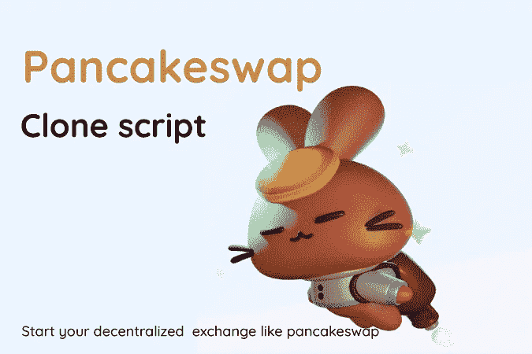
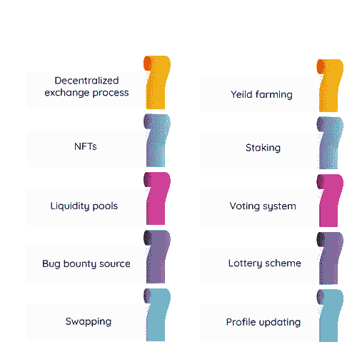
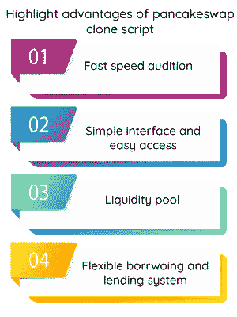

# 为什么 Pancakeswap 克隆脚本是一个值得大肆宣传的解决方案？

> 原文：<https://medium.com/geekculture/how-come-pancakeswap-clone-script-is-a-hype-worthy-solution-9074913a109c?source=collection_archive---------11----------------------->

pancakeswap 克隆脚本是 DEX 克隆脚本中的一个分散财务领导。它执行一个运行在币安智能链上的高质量交换平台，并呈现原始平台 pancakeswap 的所有基本功能。Pancakeswap 克隆是一个分散的交换 ERC-20 代币平台。Pancakeswap 的总交易量已经超过 700 万美元，是一个以食品为主题的领先交易空间。

最近，分散金融已经成为密码领域值得大肆宣传的趋势，许多初创公司和密码创业者正计划推出 dex 克隆脚本。这是一个创收的概念，随着市场的探索，产生一个新的商业模式。

Defi 代表分散金融交易所，为初创公司和投资者提供大量有益的计划，以启动他们的业务，并可以为那些寻求扩大业务的人提供多种选择。如果您不知道像 pancakeswap 克隆脚本这样的 DEX 克隆脚本如何为企业带来好处，请通读全文。

# **启动 pancakeswap 克隆软件有什么好处？**

DEX clone script 是一个即时解决方案，用于在与原始交易所相同的新平台上执行分散式金融交易所的功能。Pancakeswap 是一个著名的去中心化交易平台，拥有超过 400 万用户和很高的交易量。推出一个可以满足想法和要求的交流平台是丰富您的加密业务的一个新的开始。

创建一个连贯的路线图，将您的想法推向市场，加速您的 pancakeswap 克隆开发之旅。下面是 [**的一些亮点好处 pancakeswap 克隆脚本**](https://radindev.com/pancakeswap-clone-script/) 。

作为高级支付网关的附加功能可以给用户更多的自由。

克隆人 pancakeswap 将通过其降低被改变、篡改和伪造的风险的本质来确保读数的安全性。

用户可以把他们的加密令牌放在钱包里，并获得不同的奖励。

在平台上部署智能合约可以确保交易的安全性，因为它可以监督交易的全过程。

pancakeswap 克隆市场可以支持各种可以存储资产的数字钱包。

该平台是由自动做市商开发的，可以直接进行交易。

通过 pancakeswap 克隆交易所可以轻松交易和互换。

# **如何创建 pancakeswap 克隆软件？**

使用克隆脚本启动分散式 exchange 平台是一个明智的想法，但即使使用像 pancakeswap 克隆脚本这样的高级现成平台，也无法消除您在开始部署 pancakeswap 脚本克隆之前必须采取的步骤。下面提到的是启动 dex 克隆脚本的重要因素。

1.有明确的战略

2.做市场分析和研究

3.检查法律可行性和你所在国家的司法管辖权

4.确定您计划启动 pancakeswap 克隆的位置

5.选择区块链技术

6.为你的 DEX 设计一个用户友好的界面

7.使严密的安全系统可用

8.验证您的交换质量

9.进行测试

10.将您的克隆脚本部署到市场上

11.考虑一个单独的营销渠道来推广你的 Defi

因此，在运行 pancakeswap 克隆脚本之前，要有一个精确的策略和适当的计划来启动一个像 pancakeswap 这样运行良好的分散式交换。有了创建克隆 pancakeswap 的明确计划，你就能以适中的成本和全功能推出你的优秀交易所。pancakeswap 克隆软件开发成本受您业务的紧急需求影响。

# 克隆在重建去中心化交易中起什么作用？

Pancakeswap 是产量农业中广受欢迎的交易所之一，它提供了大量可以优化产量农业的产品。自动做市范式可以实现吸引大量用户的市场流动性。Pancakeswap 在提供简单的界面和易于使用的功能的同时，已经达到了很高的用户数量和总交易量。

克隆 pancakeswap 是创建原始平台的完整副本的技术过程，该副本可以执行相同的操作并对其进行定制。通过 pancakeswap 克隆脚本开发，您可以开发和部署一个完全分散的、透明的、功能完善的交易平台，如 pancakeswap。在币安智能链上构建克隆 pancakeswap 可以提供快速而简单的加密令牌交易。

Pancakeswap 克隆开发是克隆 pancakeswap 的突出特征，以呈现功能完善的 DEX 的最终交易性能。煎饼交换以食物为主题。面向食物的代币在币安智能链(BSC)上运行。pancakeswap 克隆人的开发是为了提供一个友好的交易体验。

# **pancakeswap 克隆软件有什么特点？**

赌注和收益耕作:Pancakeswap 克隆脚本通过在流动性池中包含加密令牌来执行收益耕作，以便它们可以为其他交易者提供流动性。pancakeswap 的流动性代币支持交易期间的收益耕作。

抽奖方案:通过农业或其他方式持有煎饼令牌的参与者可以在平台上参与基于抽奖方案的交流。参与抽奖的要求是拥有至少一个煎饼代币。

NFTs: NFTs 有独特的交易选项，帮助用户适应 BSC。

分散的交易过程:一个类似 DEX 的 pancakeswap 克隆脚本被设计和开发来呈现一个提供无限交易和交换的自动化做市商。

交换:交换允许用户与其他加密货币令牌持有者交换 ERC-20 令牌或其他加密令牌。

流动性池:用户可以将他们的加密令牌存入流动性池，并对交易所发生的每笔交易收取费用。

投票系统:令牌持有者需要对发生的问题和即将到来的平台更新拥有完全的投票权。

Bug 赏金来源:允许用户发现平台的 bug 并获得奖励。

配置文件更新:用户可以创建一个配置文件并更新它，以便在 pancakeswap 克隆脚本中处理事务。

# **为什么要像 pancakeswap 一样启动 Defi exchange？**

我们的分散式金融平台(包括 pancakeswap 克隆脚本)的开发和部署具有高度的安全性和透明性，用户可以体验无障碍交易和访问。加密货币交易商可以在没有任何流量和问题的情况下进行加密交易。pancakeswap 克隆被开发得功能良好且没有错误。

将加密钱包或元掩码集成到我们的分散式 exchange 克隆脚本中。

在 pancakeswap 克隆版中，交易者可以决定是用加密开始交易，还是从流动性池中获得代币，然后开始交易。

参与流动性池的加密交易员将获得 LP 代币作为额外奖励。

选择掉期或池交易占据重要位置。

# **一家企业如何从 pancakeswap 克隆脚本中创收？**

互换费用

pancakeswap 克隆中发生的每个活动都可以向用户收费，这在所有分散式交换中是常见的。在 pancakeswap 克隆中交易和交换代币可以向用户收取交易的一小部分作为费用，这可以在交易量增加时增加。例如，它可以是最终价格的 2.5%。

广告

在 pancakeswap clone script 这样的平台上，广告是一种普遍的创收方式。一旦你的 Defi 交易所风靡全球，就会有第三方愿意在你的平台上发布他们的广告。你可以按小时收费在你的平台上显示广告。

已识别的飞行物(identified flying object)

IFO 代表初始农场运营，许多初创公司熟悉其工作流程，如果不熟悉，他们很快就会熟悉，因为这是一种新的创收方式。这是一个秘密的众筹平台，向投资者出售新推出的代币。通过在您的平台上启用此功能，您可以向那些愿意在您的平台上出售其新推出的令牌的人收取费用。

立桩标界

这将帮助用户在 pancakeswap 克隆脚本中解锁市场的加密令牌一段时间。您的用户可以在糖浆池中下注本地代币，这是您必须考虑创收的地方。你在市场上有代币，所以你可以把它们作为公用事业服务来使用。

# **pancakeswap 克隆软件的盈利因素**

Pancakeswap 是一个著名的去中心化平台，拥有超过 400 万用户，其赌注额飙升至 1200 万美元。pancakeswap 的交易量大约是一个月 51 笔交易。除了交易和赌注之外，这个 Defi 交易所的另一个收入来源是 pancakeswap creator spring。这个平台出售和购买一种产品，这种产品可以吸引用户加入平台，并将他们的内容货币化。

所有提到的利润的一个即时解决方案是 pancakeswap 克隆脚本，它导致许多密码创业者在目睹所有这些利润后投资推出克隆 pancakeswap。

有许多以食物为基础的主题平台，但并不是所有的都受欢迎。pancakeswap 克隆脚本如此知名的原因是它运行在币安智能链区块链(BSC)上，与 pancakeswap 的竞争对手相比，其交易费用较低。Pancakeswap 还执行和呈现诸如彩票、NFT 奖励、赌注、农业和巨大的支持数字钱包等选项。

奖励制度

惊艳的菜单栏

安全支付网关

高效的流动性门户

定制良好的用户界面仪表板

改进的投资组合

逐级整合

## **Defi 交易所的结构化组件**

区块链技术的丰富强化机制

高度安全的过程

互换机制过程

加密货币钱包集成

支付交易网关

安全 exchange APIs

高效的流动性池

支付交易网关

智能合同系统

# **凸显 pancakeswap 克隆的优势**

Fast-speed audition 优化了 pancakeswap 克隆脚本中的审计，以确保以最佳顺序完成交易。

灵活的借贷系统和贷款支付工具带来更好的用户体验。

用户可以将他们的资产借给流动性池，获得流动性代币，并押注以获得更多利润。

与其竞争对手相比，Pancakeswap 有一个简单的界面，非常容易使用，他们不需要任何使用分散式交换的经验。

# **结论**

Pancakeswap 克隆软件优先考虑更好的性能和提供的功能，因此，许多人可能会选择克隆 pancakeswap 而不是其他 dex 克隆脚本。pancakeswap 中的流动性水平类似于 [**uniswap 克隆脚本**](https://radindev.com/uniswap-clone-script/) ，但在 pancakeswap 中，交易发生得更快，成本更低。白标 pancakeswap 克隆脚本已上市，并可定制，具有大量强大的功能特性。用户交易可以通过智能合约协议及其高度安全的原则自动执行。白标 pancakeswap 克隆是一个聪明的解决方案，跳上加密列车创收和扩展您的业务。