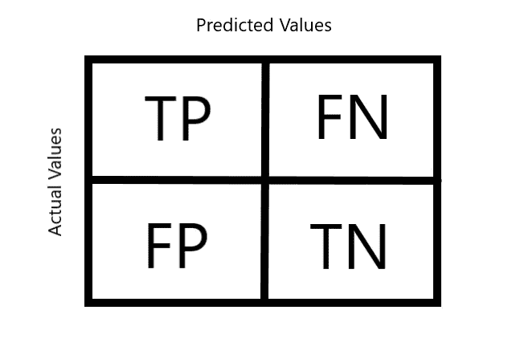
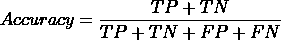
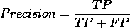
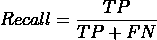
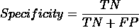
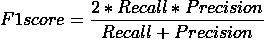

# 混淆矩阵在机器学习中如何有用？

> 原文：<https://medium.com/geekculture/how-confusion-matrices-are-useful-in-machine-learning-9893f88b0283?source=collection_archive---------58----------------------->

## 混淆矩阵，顾名思义，可能会令人困惑，但是在解决分类问题的过程中，它们可以用来消除你的困惑。


Image by <a href=”[https://pixabay.com/users/chenspec-7784448/?utm_source=link-attribution&amp;utm_medium=referral&amp;utm_campaign=image&amp;utm_content=5718425](https://pixabay.com/users/chenspec-7784448/?utm_source=link-attribution&amp;utm_medium=referral&amp;utm_campaign=image&amp;utm_content=5718425)">chenspec</a>

混淆矩阵，顾名思义，可能会令人困惑，但是在解决分类问题的过程中，它们可以用来消除你的困惑。混淆矩阵是一个 N×N 矩阵，其中 N 是分类的目标值的数量。

它基本上是一个表格布局，允许我们了解算法的性能，尤其是在分类任务期间。它们有助于对我们的模型所做的分类有一个总体的了解。

可以进一步分析由混淆矩阵完成的子分类，以确定这种模型的各种性能度量。该矩阵包含实际值与模型预测值的比较。



Representation of a Confusion matrix

混淆矩阵的定义和布局有四个子分类:

## *1。真阳性*

考虑有两类(二元分类问题):一类是积极的(或正确的或任何你想要的)，另一类是消极的(或不正确的或与你想要的相反)。

真阳性是被我们的模型正确分类为正确类别的值。这些是我们的模型放在正确盒子里的值。

> 病人被归类为被感染，他们实际上已经被感染了。

## *2。真正的否定*

另一方面，真正的负数是那些被正确分类为第二类的值。这些值被我们的模型放在了正确的框中，但是它们被放在了带有不同标签的框中。

真负值中的负值并不意味着值被错误分类，而是实际上它们被放在了另一个盒子里。因此，它们也被正确地分类，因此被称为“真实的”。

> …另一名患者被归类为没有感染，但他们实际上没有感染…

## 3.假阳性

现在，如果应该放在第二个盒子里的值实际上被我们的分类器放在了第一个盒子里。这是一种错误，更具体地说是一种类型 I 错误，其中负值被错误地分类为正值。

> 该模型预测患者会受到感染，但他们没有受到感染，而且完全健康。假警报。

这种错误不是好事，但也不是完全有害的，因为可以进一步测试错误分类，以验证它们的实际类别。

## 4.假阴性

与假阳性一样，假阴性也表示被错误分类的值。它们显示的值实际上是正的，但却被放在了负框中，造成了第二类错误。

> 患者被感染，但他们被送回家，因为他们被模型测试为阴性。真正的报警，但一点也不报警。

这种错误实际上可能是致命和危险的。可能在医疗、银行或司法领域最危险。

# ***但是我们由此推断出什么呢？***

我们有各种方法来分析模型的性能:

> 准确度或分类准确度:

我们可以计算出正确分类的值占提供给我们模型的总值的百分比。这是我们分类器的精度。



精确度告诉我们模型的表现有多好，但是它的局限性是要求每一类中的观察值数量大致相同。

> 精确

精度告诉我们，在模型放入正类的所有值中，有多少实际上是正的。它告诉我们，我们的模型在对正值进行分类时有多精确。



它告诉我们应该在多大程度上相信我们的模型预测。它也被称为阳性预测值。

> 回忆或敏感度:

如果你仔细想想，假阴性实际上是被误归类为阴性的正值，因此是假阴性。

我们可以使用假阴性和真阳性来确定模型能够从提供给它的全部实际正值中召回多少个正值。



回忆给了我们一个百分比，表示模型对积极结果的确信程度。这也被称为真阳性率。

> 特异性:

这类似于回忆，但不是负面的。它给出了被归类为负值的数值与实际上为负值的数值之比。



特异性为我们提供了模型对负面结果有多大把握的百分比。这也被称为真实负利率。

> F1 分数

F1 得分是精确度和召回率的[调和平均值](https://en.wikipedia.org/wiki/Harmonic_mean)。它从 0 到 1 不等，其中 1 表示最高精度和召回率，0 表示最低可能值。



***如何在 Python 中创建混淆矩阵？***

我们可以使用 Scikit-Learn 的 *metrics* 方法将混淆矩阵导入到我们的代码中。然后，我们可以将测试值和预测值传递到混淆矩阵()实例中。打印的值将是一个嵌套数组，包含四个值，分别是 TP、FN、FP 和 TN。

```
from sklearn.metrics import confusion_matrix
confusion_matrix = confusion_matrix(y_test, y_pred)
print(confusion_matrix)#prints [[TP FP]
#        [FN TN]]
```

此外，我们可以使用 classification_report()创建一个包含精度、召回率和 F1 分数的图表，用于分析我们的模型的性能。

```
from sklearn.metrics import classification_report
classification_report = classification_report(y_test, y_pred)
print(classification_report)#prints a table with columns: precision recall f1-score support
```

## 结论

因此，我们看到了一个简单的混淆矩阵结构如何帮助我们确定模型性能的许多方面，以及如何在未来的代码中实际实现它。

这是机器学习和统计学习系列文章的第一篇。

如果你喜欢它，并且它帮助你学到了一些新的东西，那么把它分享给一个刚刚开始学习数据科学的人，并关注更多这样的内容。

在推特上关注我，我也会解释这些东西: [@AnityaGan9urde](https://twitter.com/AnityaGan9urde)