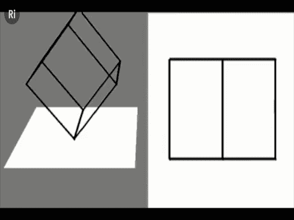

# 为什么每个人对宇宙和人工智能的看法都是错的？

> 原文：<https://medium.com/geekculture/how-could-everyone-have-been-wrong-about-the-universe-and-ai-4e96c869b261?source=collection_archive---------10----------------------->

Photo by [Joel Filipe](https://unsplash.com/@joelfilip?utm_source=medium&utm_medium=referral) on [Unsplash](https://unsplash.com?utm_source=medium&utm_medium=referral)

**宇宙和人工智能**

我最近读到，与微软合作的[物理学家提出理论，我们可能生活在一个自我学习计算机的宇宙中](https://thenextweb.com/news/physicists-working-with-microsoft-think-the-universe-is-a-self-learning-computer)。物理定律可能会随着时间而改变，我们可能永远无法统一它们。

经过几个世纪令人费解的思考，我们可能会重新发现一个古老的真理:即使在最基本的层面上，唯一不变的是……变化。生物物种在进化、变异和适应。也许就像宇宙本身一样。

现实作为一种计算(如果你更喜欢模拟)的概念可以解释与量子力学或无限(不是无限，它不是同一个)宇宙相关的现象。只要你将计算视为一种信息交换，这种信息交换也可能发生在硅基处理器之外。

无限是一种潜力，而不是存在于物质层面的东西。您可以继续添加任意多的实数，但结果永远不会等于无穷大。同样，你可能永远不会到达世界的尽头，但这并不意味着它是无限的。

我耐心地等待另一项工作的结果，它将表明宇宙根本不是在持续膨胀，而是我们有限的感知能力无法感知超过 3 维的一种幻觉。

亲自看看 3D 形状(左)对于一个只能在 2D(右)感知的生物来说是什么样子。它在膨胀，然后收缩。你甚至可以在我们(作为习惯于 3D 的生物)的例子中看到 4D 的形状——在原始视频的后面:

Four Dimensional Maths: Things to See and Hear in the Fourth Dimension — with Matt Parker, YouTube: [https://www.youtube.com/watch?v=1wAaI_6b9JE](https://www.youtube.com/watch?v=1wAaI_6b9JE)

所有这一切都与我毕生的观点产生了共鸣，即如果我们想真正理解大局，就应该尝试涉足多个学科。这种知识应该通过个人经历来增长，而不是简单的传授或训练。

将物理和机器学习结合起来——为什么不呢？神经科学、生物学和(生物)化学也是如此。你永远不知道在哪里可以找到解决问题的方法。

在普遍属性的情况下，我们还有很多需要确认的。但是想一想，如果我们坚持以地球为中心的固定、机械的宇宙的旧教条，会发生什么…

现实往往出人意料。而我们文明的命运只是不断的变化(也希望是进步)。

**顺序学习 vs 平行学习**

发展科学和知识的连续过程有其优点和缺点。显然，我们不需要从头开始，但可以从其他人的工作成果中学习。但是被动阅读和接受信息并不等同于对作者分享的内容进行个人评价。

当然，很难分析所有的事情。但是如果你已经决定学习更多关于某个特定主题的知识，甚至可能把你的工作贡献给某个学科，你应该仔细检查你感兴趣的领域的主要元素是否仍然被认为是最佳的。或者可能需要后退两步才能前进五步。

并行学习提供了这样一种能力。你在多维度上增长了你的知识，然后你可以看到其他人(或者至少你)以前看不到的东西。就像一个 2D 生物突然暴露在额外的环境中。

从不同的角度来看，用自然爱好者的眼光评估计算机算法，或者从机器学习工程师的角度评估物理学。这是真正学习的秘诀，它将新知识嵌入你的记忆深处，而不是简单的复制粘贴。

在许多情况下，它也使学习新事物变得更容易。我记得在学习如何用 HDL 语言设计硬件的同时修补低级神经网络组件，我取得了多么巨大的进步。

从短期来看，这需要时间，但从长期来看，这可以节省时间。广阔的视野和实用的本质支持更快地解决问题。

**机器学习的未来是怎样的？**

自上世纪 40 年代提出概念以来，神经网络作为一个概念已经有了很大的发展。现在它们很深，有很多层，可以做很多有用的事情。

但此时值得一问——我们是想要单一的神经网络，还是拥有多个网络的高能力数字大脑？一个耗能的黑匣子，在大多数情况下能分解出正确的答案，但在其他情况下却是非常错误的？以我们永远不会有的方式。

我们认为 AI 应该由我们来教，还是由经验来成长？吸收我们的知识，像我们一样思考——或者提出我们难以理解的令人兴奋的新概念？

当然，我们希望有更好的东西。那么有没有可能把一个转化成另一个呢？

前一段时间，我遇到了[神经支持决策树](https://bair.berkeley.edu/blog/2020/04/23/decisions/)的概念。在这个概念中，树的决定因素是基于(通常相当简单)神经网络的。这提供的是清楚地解释 AI 系统的决策过程的能力——一步一步地，而不切断通常与深度网络相关联的原始感觉数据处理的好处。

听起来很棒。但是我们不要就此打住。除了能够访问比决策树更好、更灵活(非常不寻常)的数据结构之外，我和我的团队正在探索数据表示的概念。与分布式系统相反，分布式系统中的所有东西都混合在一起，这是大多数深度学习解决方案的特征。

因此，我们可以整合局部的、渐进的变化，并消除灾难性遗忘或模型退化的问题。我们可以很容易地在不同的大脑之间传递知识——当然是作为评估的假设。不是终极真理的来源。质疑一切的规则也适用于机器。

我们不再需要反向传播了。就像使用[液态神经网络](https://blog.roboflow.com/liquid-neural-netowrks/)一样，该解决方案能够实时适应现有条件。我们不需要单独的再培训阶段。你打开机器，它一边工作一边学习。

但是作为真正雄心勃勃的人，在过去的几年里，我们的目标是创造一个数字化的大脑。因此，我们不仅设计透明/可解释的机器学习算法，还设计节能、自动化和自我学习的算法。

我们为我们的算法配备了管理自己目标的能力，使用想象力模拟真实事件，甚至理解情绪(你好，生物化学！).在没有输入数据的情况下诱发神经活动——看到可能是什么而不仅仅是什么。

如果我说这很容易，那我是在撒谎。它不在任何部分。很难为我们所做的事情获得初始资金，将神经科学、生物化学、机器学习和其他学科结合起来令人疲惫不堪。但最终的问题总是:你的目标是什么？

是为了 5%的改进还是把事情推向另一个层次？

**通往 AGI 的道路**

2021 年，我们终于开始从零开始开发一个新的机器学习框架，用于在物理世界中运行的机器——基于我们独特的 3D 神经网络，形成了一个相当于数字大脑的东西。无论是在复杂性还是容量方面，它都不同于您以前见过或使用过的任何东西。

它具有神经元、神经胶质细胞、新皮层和皮层下组件、神经调质和(目前简单的)意识的等价物——能够使用高级结构将简单的低级元素组合成更复杂的概念、任务和目标。

我们迫不及待地想与世界分享我们的工作成果，但要做到这一点，我们需要花更多的时间来准备使用它，也让其他人使用。以易于理解的方式测试、改进和记录。

在 agi cortex——我们有一条通往人工智能的现实之路，以及在未来几年实现我们目标的战略。

如果你害怕它会接管世界——不要太认真地对待电影。缺乏理解会点燃恐惧。AGI 将比任何人类思维都更加透明。

让我们一起期待更积极的未来。我们将探索以前无法探索的事物。

我确信关于宇宙和人工智能还有很多东西要学。但这正是这次旅行如此有趣的原因。

我们永远都不应该停止学习，永远都要接受新的观点。这样，我们就能更少犯错。