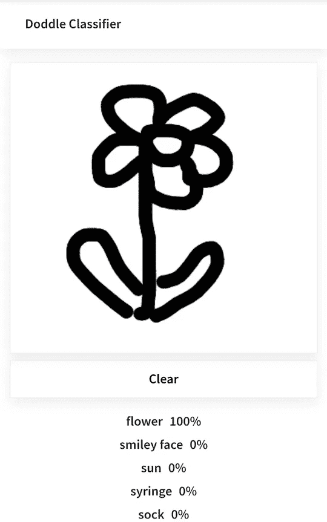
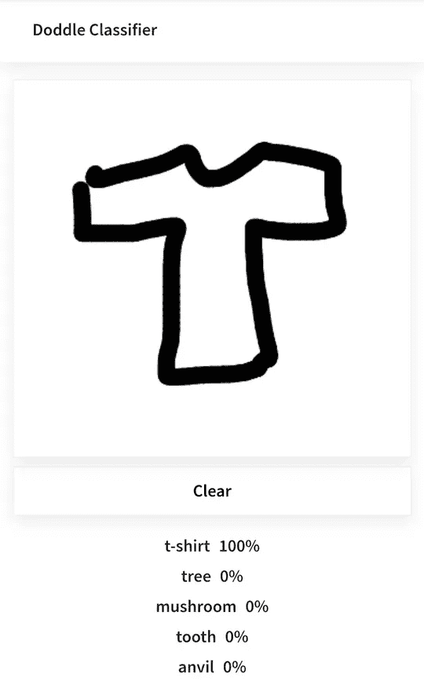
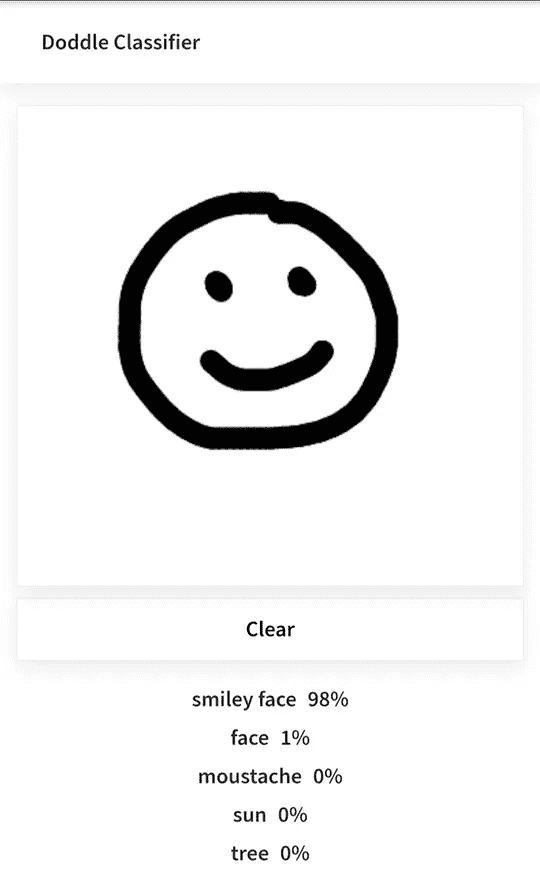
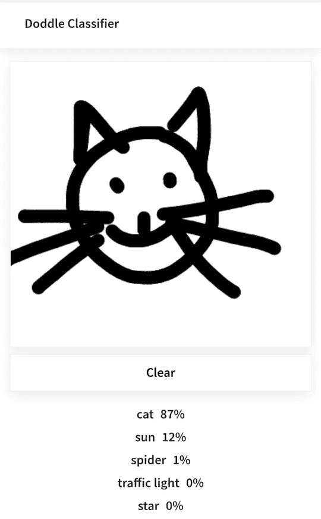
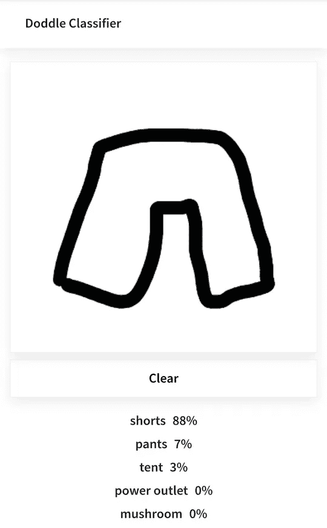
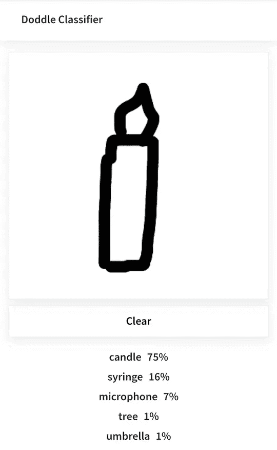
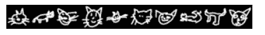
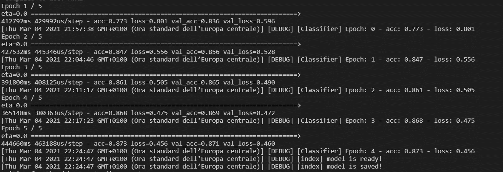

# 如何用 Tensorflow.js 创建绘图分类器

> 原文：<https://medium.com/geekculture/how-create-a-drawing-classifier-with-tensorflow-js-1258ed78afe?source=collection_archive---------5----------------------->

你玩过[快速抽奖](https://quickdraw.withgoogle.com/)吗？如果没有，这是谷歌创造的一个游戏，它要求玩家画出一个物体的图像，然后它使用神经网络的人工智能来猜测这幅画代表什么。

谷歌还提供了整个[数据集](https://github.com/googlecreativelab/quickdraw-dataset)，该数据集由 345 个类别的 5000 多万幅图画组成。游戏玩家的图画丰富了数据集。

我的目标是看看是否有可能完全用 Javascript 创建一个更小但效果很好的类似的东西。

# **现场演示和代码**

这里有一个活生生的[例子](https://doddle-classifier.herokuapp.com/)，[为型号](https://github.com/ricio91/doddle-classifier-model)的代码，[为 app](https://github.com/ricio91/doddle-classifier-app) 的代码。

在实例中，该模型已经被训练(2 个时期)超过 100 个类别，其中每个类别包括 20.000 个图像。模型的准确率为 87%。

# **示例**

# **下载数据**

数据以不同的格式提供:

*   简化的绘图文件(。ndjson)
*   二进制文件(。bin)
*   Numpy 位图(。npy)

因为图像的渲染(28x28 **灰度**位图)我选择使用。npy 格式，即使这种格式通常在 Python 中使用。

# **如何理解和显示**的**数据**

让我们看看如何理解数据以及如何表示数据，在浏览器上显示 10 幅图像。

首先，我将图像作为二进制数据加载，并删除了前 80 个字节，因为它们是头。

然后为了在画布中显示图像，我创建了一个包含像素值数组的`ImageData`对象。每个像素由四个单字节值(RGBA)组成。正如我上面说的，图像是灰度的，所以 R，G 和 b 使用相同的值。

在接下来的段落中，将有可能看到 Tensorflow.js 提供 API 来执行这种操作。

终于有了结果。

# **CNN 型号**

该项目的下一步是创建一个卷积神经网络。关于 CNN 如何工作的更多细节，请看这篇文章。

在构建模型之前，让我们看看如何加载数据。

[生成功能](https://developer.mozilla.org/en-US/docs/Web/JavaScript/Guide/Iterators_and_Generators#generator_functions) `*dataGenerator`允许准备接下来要处理的图像。这个函数是上面代码中最重要的部分。

我为每个类别设置了一个图片限制(每个类别 20.000 张图片)，以简化流程。

80%的数据被指定用于训练模型，剩余的 20%用于验证。

每个图像都经过了**归一化**，即每个像素都被转换为 0 到 1 之间的值。

之后，将创建一个包含标准化值(xs)的对象和一个表示图像标签的数组(ys)。

最后，我定义了模型架构。

`train`函数使用生成函数加载数据，然后数据被混洗并分组为一批，每批 200 个元素。

流量准备好了，大家一起放吧！

请耐心等待，一旦模型完成并保存，就可以在应用程序中使用了。

Example of a training on 20 classes

# **应用**

现在的目标是画一些东西，让模型猜它画的是什么。

在这个应用程序中，我使用了 Angular，当然同样的逻辑也可以在其他框架/普通 JS 上实现。

让我们开始导入模型并创建预测绘图的方法。

`model.predict`返回包含每个类别概率的数组，所以我选择了较高的值。

现在是时候在画布中绘制并从中检索数据了。

首先，我已经为桌面和移动画布添加了事件监听器，这样我就可以获得鼠标坐标来显示绘图路径。

第二步是将画布中的图像转换成与模型被训练时相同的格式。

因此，我将图像加载为 imagedata(只有一个通道)，然后使用 [tf.image.resizeBilinear](https://js.tensorflow.org/api/latest/#image.resizeBilinear) 将其调整为 28x28。

然后，我已经标准化的图像，但请注意，该模型是训练为黑色背景和白色中风的图像，而不是在这里是相反的。

最后，我可以做出预测，并在浏览器上显示出来。

还有…就这些了:)

如果您觉得这篇文章有用，👏非常感谢您的评论。