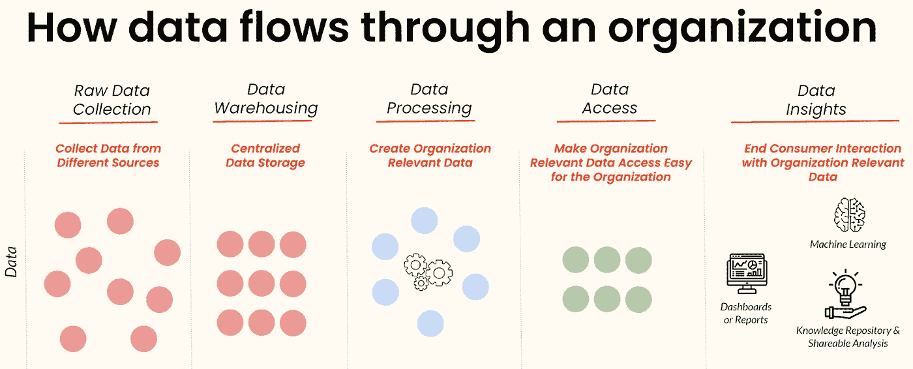
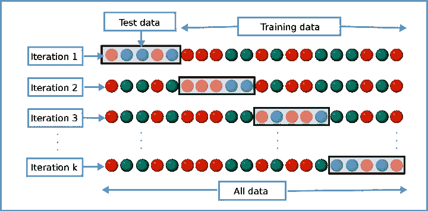

# 数据产品中交叉验证的工作原理

> 原文：<https://medium.com/geekculture/how-cross-validation-works-in-data-products-85a5d58c3756?source=collection_archive---------12----------------------->

当今世界，企业为了在竞争环境中生存，最重视数字化转型。使用数据提供对未来的见解和预测，在帮助企业做出健康的数据驱动型决策方面发挥着至关重要的作用。在这一点上，将数据定义为今天的黄金不会错。因此，可以清楚地看到，大多数投资都是在这一领域进行的，我们也可以通过基于数据分析的企业数量来了解这一点。

然而，这种转变可能会导致一些不利的情况。根据设计数据管道时的选择，利用数据构建端到端应用程序以生成核心见解和关键发现可能会非常耗时或成本高昂。

设计和构建端到端的机器学习应用，从数据科学的角度来说，也称为数据产品。在本文中，我们将重点讨论什么是数据产品，为什么要在我们的生产环境中使用它们，以及数据产品中交叉验证的工作逻辑。

# 什么是数据产品？

在数据分析领域，我们可以将所有流程分为三个阶段，即数据工程、报告和机器学习。数据工程包括将各种来源的原始数据吸收到数据湖或数据仓库中，在原始数据中执行 ETL(提取、转换和加载)作业，并将处理后的数据插入到任何类型的分析数据库中，以便为机器学习或报告阶段提供聚合数据。

在报告阶段，应通过任何 [**商业智能工具**](https://www.heavy.ai/learn/bi-tools) 有效地可视化汇总数据，以找到关键见解并做出更好的数据驱动决策。

另一方面，机器学习阶段主要涉及从聚合数据中提取新特征，设计关于业务问题的正确假设，通过最大化预测的准确性来构建成功的机器学习模型，将其部署到生产环境中，以及监控管道以确保数据质量和工作流。

**Figure 1: End-to-end Data Products**

总之，任何建立从摄取数据到数据可视化或机器学习阶段的管道的软件服务或工具都可以称为数据产品。

# 为什么要使用数据产品？

数据团队应用数据维护的过程，编写提取-转换-加载(**)作业，通过分析数据为更好的机器学习模型设计假设，并在日常工作中多次部署新版本的模型，解决所面临的问题可能是具有挑战性和耗时的。在执行这些常规流程时，您还需要确保数据的一致性、可靠性和质量。**

**在这一点上，数据产品通过自动化、监控和调试端到端管道来成功管理整个过程。它们使维护系统变得更容易，并节省您的大部分时间。除了这些优势，数据产品还可以提供原始数据、经过处理的聚合数据、作为机器学习服务的数据以及作为洞察输出的数据。**

# **什么是数据产品中的交叉验证？**

**在机器学习管道中，最常见的困难之一是数据偏差，它会导致模型预测的巨大失败。在训练-测试分割过程之后选择结果机器学习模型，训练-测试分割过程是为生产环境寻找最佳执行模型的评估技术。许多公司和组织有一个巨大的数据集，这个数据集应该被均匀地分成训练测试部分，以防止偏差问题。**

**机器学习中的交叉验证是一种统计技术，通过在每次预测中将数据集的不同部分分成测试侧，来评估许多独立机器学习模型的平均估计性能。这意味着您可以通过获得最小、最大和平均估计性能来了解训练模型的详细性能统计。**

**得益于这种统计方法，数据团队可以获得对最终模型的限制的重要见解，该模型将作为服务部署到生产中。除此之外，团队获得了向客户和利益相关者提供健康反馈和结果的能力。**

****

****Figure 2: Process of Cross-Validation****

# **数据产品中交叉验证的工作原理**

**根据工作逻辑，交叉验证主要有两个子组，即穷举和非穷举方法。在穷举方法中，数据产品通过将数据分成训练和测试来评估所有可能的对。另一方面，非穷举方法并不计算划分训练测试集的所有方式。我们可以列出五种常见的 [**类型的交叉验证**](https://towardsdatascience.com/understanding-8-types-of-cross-validation-80c935a4976d) ，分别是保持法、K 重交叉验证、分层 K 重交叉验证、留 p-out 交叉验证和留 1-out 交叉验证。**

**在交叉验证的一般工作逻辑中，数据将按照一定的比例被拆分为训练集和测试集，这个比例是来自 [**帕累托法则**](https://www.investopedia.com/terms/p/paretoprinciple.asp) 的%80-%20。在分割过程之后，将使用训练集对数据进行建模，并使用测试集对其性能进行评估。在每次迭代中，数据点的不同组合将被用作预测的测试集。最后，将从每次迭代的结果中评估平均精度，并且可以通过这种方式为生产环境选择性能最佳的模型。**

**过程如上所述，根据迭代次数，流水线可能太复杂，并且可能需要太长时间才能工作。这意味着应该有足够的计算资源来执行所有系统。因此，我们需要将数据产品集成到我们的管道中。**

# **结论**

**大多数组织一直在继续开发以数据为中心的项目，以支持业务决策，交叉验证将继续成为该系统的一部分。我希望这篇文章对您有所帮助，并帮助您理解什么是交叉验证以及它在数据产品中是如何工作的。**