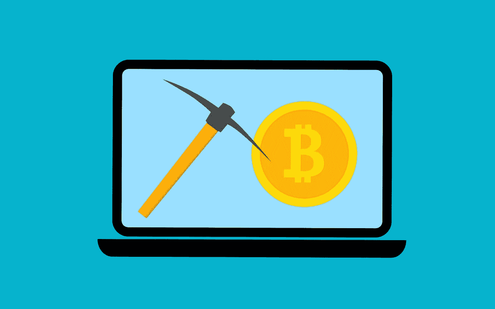
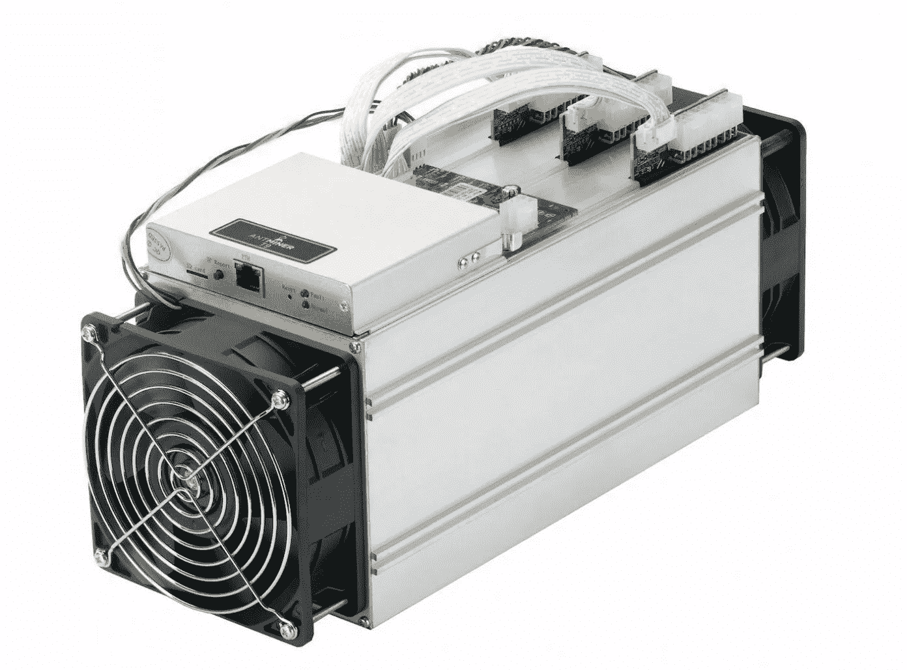

# 密码挖掘如何工作:简单解释。

> 原文：<https://medium.com/geekculture/how-crypto-mining-works-simply-explained-59050034ba42?source=collection_archive---------10----------------------->

Image by: Mohamed Hassan [Pixabay](https://pixabay.com/users/mohamed_hassan-5229782/)

自从我发布了关于[区块链科技](/geekculture/what-is-blockchain-technology-simply-explained-3e71d56ae415)的博客后，很多人问我关于加密采矿的问题，由于大众的需求，这将是另一个关于加密采矿如何工作的简单解释指南。

## 工作证明

工作证明是一种技术，其中一方向另一方证明一定量的计算值已被更改。这个概念最初是由*辛西娅·德沃克*和*莫尼·诺尔*在 1993 年发明的，作为一种阻止拒绝服务(DoS)攻击和网络上其他服务滥用的方法，要求服务请求者做一些工作，通常意味着计算机的处理时间。马库斯*雅各布松*和*阿里·朱尔斯*在 1999 年的一篇论文中首次创造了“工作证明”这一术语。

工作证明后来被中本聪推广，成为区块链和加密货币共识的基础，在加密货币中，矿工们竞相在区块链中添加新的区块，并在安全和及时的情况下铸造新的货币。这就是比特币如此安全的原因，也是比特币和以太坊等加密货币被广泛接受为实际货币的原因。

## 采矿是如何工作的

矿工基本上是有足够的计算能力来计算工作证明和验证区块链中的交易的人，他们被奖励少量的新区块和/或交易费。

*中本聪*担心计算硬件每年都在增长，所以当比特币被发明时，他想出了一种算法，无论区块链上的矿工数量有多少，大约 10 分钟就能铸造一个新区块，如果开采区块链的人多，这种算法就会增加开采难度，如果开采的人少，就会降低难度。这是为了确保有稳定的新硬币流入区块链，同时也是为了应对通货膨胀。

## 矿业发展

在比特币的早期，大多数挖掘工作都是由中本聪在个人电脑的简单 CPU 上完成的，但是随着需求越来越大，挖掘难度也变得越来越大。后来人们发现他们的图形卡(GPU)非常适合处理算法，因为这些计算机组件实际上是为了处理 3D 和物理渲染的方程而构建的，类似于区块链算法中的方程。

2013 年，ASIC(专用集成电路)矿工诞生。由于 GPU 的高功耗，矿工们想出了只处理采矿的改进型 CPU，其性能比传统 CPU 好得多，传统 CPU 用于处理各种任务，例如控制扬声器音量，这对于采矿是不必要的。

- ASIC — AntMiner L3

## 采矿池

随着近年来比特币和以太坊的流行，个人电脑挖掘几乎是不可能的，因为事实上有些人拥有沃尔玛大小的 ASIC 农场。是的，想象一下你的小型个人游戏或工作电脑与沃尔玛大小的电脑对抗…祝你好运。

话虽如此，但这并不意味着个人电脑采矿在 2021 年无利可图。这个想法很简单，如果我不能用一台游戏电脑挑战沃尔玛，如果我让所有的同行都加入我会怎么样？

依靠数量优势的概念和通过互联网传输计算数据的能力，开发人员已经开发出一种软件，它可以收集池中每个人的所有 GPU 能力，并使用它来验证工作证明，就像大多数大型时间仓库大小的 ASIC 农场一样快，并根据计算工作量的多少奖励池中的每个人。

## 收益性

那么 2021 年开矿还盈利吗？答案很复杂。首先，我想说我是一个游戏爱好者，我买了一张 2019 年上市的 RTX 2070 超级显卡，零售价为 499 美元，该卡的以太坊采矿速度为 35MH/s。
MH 代表 megahash，是卡计算算法的速度。
根据我在 Ebay 上的研究，今天同样的显卡价值在 900 美元到 1300 美元之间。

自 COVID19 疫情以来，由于各种原因，GPU 的价格一直在飙升，例如:

*   人们需要电脑来工作，因为他们被困在家里
*   游戏作为一种爱好的兴起
*   更多加密矿工

也就是说，我几乎一天 24 小时都在使用我的电脑。我只在星期天关掉电脑，这也是我的休息日。这是我的电脑工作时间表:

上午 9 点到下午 5 点:在线学习/编码实践

下午 5 点到 7 点:游戏时间或采矿时间

晚上 7 点到 10 点:采矿 ETH

晚上 10 点到 12 点:游戏时间

上午 12 点到 9 点:采矿 ETH

大致来说，我通过我的矿池平均每天开采 12-14 个小时，我每个月得到大约 0.05 ETH 的回报，按照今天的 ETH 值，这相当于 113.70 美元，在每月支付 20 美元的电费后，我每月净得大约 90 美元。

## 结论

所以简而言之答案是肯定的！2021 年密码开采依然盈利！我已经赚回了我花在电脑上的钱，当我的电脑不在使用时，我就在一个池子里随便采矿。GPU 现在很难得到，人们正在哄抬价格，但如果你能以一个合适的价格获得一个 GPU，或者你像我一样是一个游戏玩家，并且已经有了一个显卡，那么我的朋友就走了。

