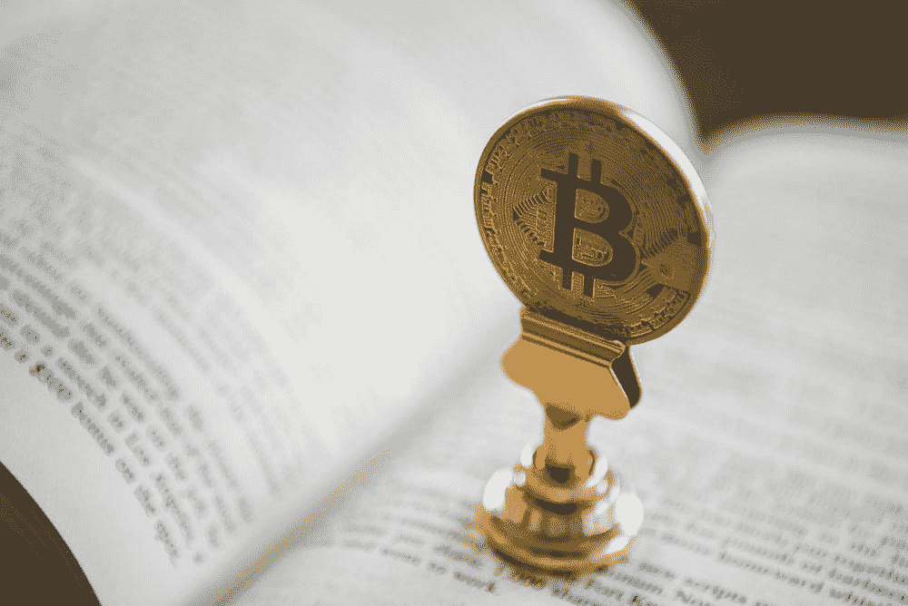

# 加密货币如何缩小贫富差距

> 原文：<https://medium.com/geekculture/how-cryptocurrency-can-close-the-wealth-divide-a964aa58f41d?source=collection_archive---------29----------------------->

人们对区块链交易越来越感兴趣，以及它如何能够对抗日益扩大的贫富差距，这是一个好消息

**Credits:** [Unsplash](https://unsplash.com/photos/uw3VwkDHiMI)

2017 年，比特币的价格成为最热门的话题之一，并导致了数百万次谷歌搜索，因为比特币的价格从 2016 年的数百美元上升到第二年年底的近 2 万美元。实际上，普通大众中没有人有…