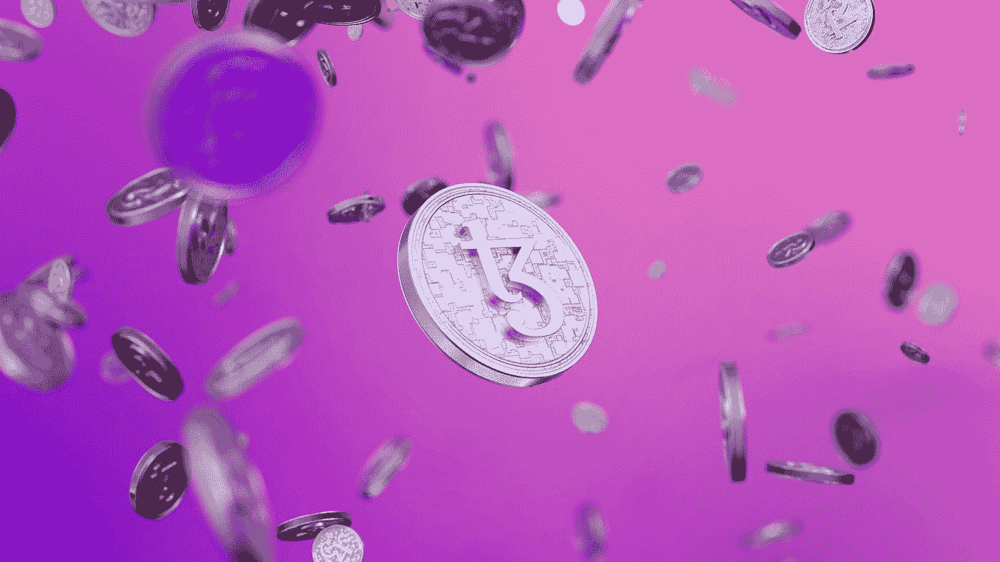

# 道氏将如何改变 2022 年的市场？

> 原文：<https://medium.com/geekculture/how-daos-will-change-the-market-in-2022-a8383d553b8c?source=collection_archive---------11----------------------->

Photo by [Tezos](https://unsplash.com/@tezos?utm_source=medium&utm_medium=referral) on [Unsplash](https://unsplash.com?utm_source=medium&utm_medium=referral)

在 DeFi 的世界里，分散自治组织一直是一个众所周知的工具。目前，它是一个收集特定项目投资的年轻工具。辛迪加希望简化这种投资，并为此将以太坊钱包作为一种简单的投资工具。

# 辛迪加——投资的未来？