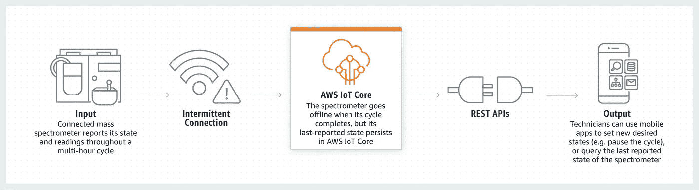
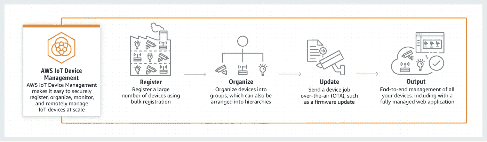
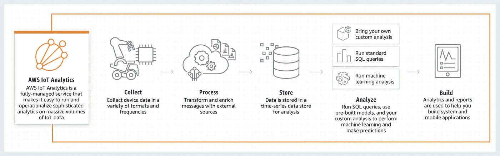
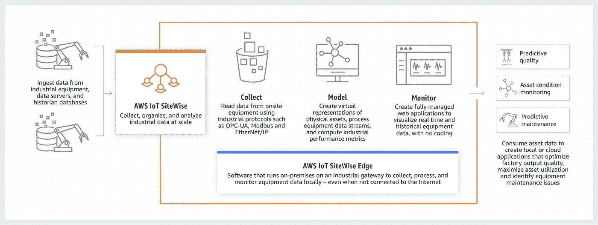

# 在 AWS 堆栈中开发和部署物联网如何增加您的利润！

> 原文：<https://medium.com/geekculture/how-development-and-deployment-of-iot-in-aws-stack-can-increase-your-profit-65a7a11b4689?source=collection_archive---------39----------------------->

物联网(Iot)或物联网(internet of things)可以定义为在没有人工干预的情况下，通过嵌入式芯片或传感器在无线网络上实现物理设备和软件之间的连接和数据交换。个人或商业的可能性是无限的。物联网系统由通过某种连接与云“对话”的传感器/设备组成。一旦数据到达云端，软件会对其进行处理，然后可能会决定采取行动，例如发送警报或自动调整传感器/设备，而无需用户参与。但是如果用户输入是需要的或者如果用户只是想在系统上签到，用户界面允许他们这样做。然后，用户做出的任何调整或动作都会通过系统以相反的方向发送:从用户界面到云，然后返回到传感器/设备以进行某种改变。

亚马逊网络服务的使命是确保你能够知道你所有设备上所有东西的状态，你可以在这些数据的基础上进行推理，并成功地解决业务问题。设备的激增需要多种解决方案来连接、存储和分析这些不断增长的数据。

AWS 物联网一直在提供多种解决方案，无论是工业解决方案中针对质量、维护和远程操作的物联网应用，还是互联家庭解决方案中针对家庭自动化、安全、监控和联网的应用，以及商业解决方案中针对交通监控、健康监控和公共安全的商业应用。

**设备软件**

**自由操作系统**

作为一个开源的实时操作系统，FreeRTOS 有助于小型、低功耗的边缘设备(即控制两个网络之间数据流的硬件)安全地连接到 AWS 物联网核心或更强大的 AWS 物联网 Greengrass 等 AWS 云服务。

**AWS 物联网 Greengrass**

AWS 物联网 Greengrass 通过两种方式帮助您加快上市时间，首先，它让您构建一个具有强大运行时间的智能软件设备，其次，它让您远程部署和管理软件。Greengrass 提供本地处理、ML 推理、组件来促进应用程序开发、消息传递和数据管理。它还创建了您的边缘设备与任何 AWS 服务以及第三方服务的无缝连接。

**连接和控制服务**

**AWS 物联网核心**

AWS 物联网核心帮助物联网设备连接到 AWS 云，而无需管理服务器，应用程序保持与设备的连接，即使在设备未连接时也能进行通信。AWS 物联网核心简化了 AWS 和 Amazon 服务的使用，如 Amazon CloudWatch、AWS CloudTrail、Amazon QuickSight 和 Alexa Voice Service，以构建物联网应用程序来收集、处理、分析和处理连接设备生成的数据，而无需管理任何基础设施。AWS 物联网核心使用 Message Broker 安全地从所有物联网设备向应用程序发布和订阅消息，具有低延迟。设备阴影有助于存储已连接设备的最新状态，以便可以随时读取或设置，这使您即使在断开连接时也能获得设备的最新状态。

[Mirror Device State](https://d1.awsstatic.com/IoT/diagrams/AWS%20IoT%20Core%20-%20Read%20and%20Set%20Device%20State.928a7cef76201ff96589cd9eddeafe6983aebc15.png)

用于 LoRaWAN 的 **AWS 物联网核心**允许客户通过将自己的 LoRaWAN 设备和网关连接到 AWS 云来创建私有的 LoRaWAN 网络。

**AWS 物联网设备管理**

通过与 **AWS 物联网核心**集成的 **AWS 物联网设备管理**，可以安全跟踪、监控和管理数百万台部署的设备，以确保设备与云和其他设备的轻松连接，从而实现远程管理。 **AWS 物联网设备防御**审核、监控设备群，并在检测到与正常行为的偏差时发送警报，当您对这些警报采取行动时，AWS 物联网设备管理会采取缓解措施，如推送安全修复程序。

[Working of AWS IoT Device Management](https://d1.awsstatic.com/reInvent/re20-pdp-tier2-3/Spyglass/product-page-diagram-AWSIoTDeviceManagement_Spyglass@2x.8d552dfa457b3b90f5aaef0c7b1e469d81d75767.png)

**分析服务**

**AWS 物联网分析**

我们经常使用的工具产生的指数级数据

不一致、嘈杂和可变的数据使企业难以从中获得价值，这就是 **AWS 物联网分析**发挥作用的地方。它收集、清理和分析物联网数据，帮助企业和设备制造商获得运营洞察力。核心用户是收集、准备和存储用于分析的数据的数据工程师，数据分析师通过探索和可视化数据来提供见解。该架构由三个部分组成。第一个是**收集，**，它包括为分析准备数据。通道是物联网分析使用 MQTT 主题过滤器从所有设备中提取消息来监听设备的方式。接下来是处理**，**当所有消息都在流动时，管道被用于处理消息，使用来自 AWS 服务的转换、过滤和浓缩将它们转换成有用的数据，之后**数据存储**提供一个休息场所来存储准备好的数据，以备分析。第三个领域是**分析**，物联网分析允许用户对其数据进行切片，以快速获得洞察力。

[How AWS IoT Analytics Works](https://d1.awsstatic.com/IoT/diagrams/product-page-diagram_AWS-IoT-Anayltics_how-it-works.a5019170e9ea35fbcec683cf4a394d7a5daa6644.png)

**AWS 物联网站点级**

AWS IoT Sitewise 是一项托管服务，收集和组织来自工厂车间的数据，生成实时指标，以帮助客户做出更好的数据驱动型决策。它从多个站点提供远程监控。AWS IoT Sitewise 包含名为 **Sitewise edge** 的软件，允许连接和从设备或数据库读取数据。客户首先使用评估数据创建他们的设备、设施等的表示，以及他们的性能指标。一旦在云中建模，Sitewise Edge 使用相同的模型来组织和处理云环境和本地环境中的数据，从而减少重复、工作量和开发成本。然后，客户可以选择处理和使用他们的机器数据，将其发送到物联网 Sitewise 或云上的工业数据湖，以供进一步分析。AWS IoT Sitewise 帮助客户专注于了解和优化运营，而不是收集内部数据收集和管理应用程序。

[How IoT Sitewise Works](https://d1.awsstatic.com/reInvent/re20-pdp-tier2-3/EdgeRunner/product-page-diagram_AWS-IoT-Sitewise-Edge_How-It-Works@2x%20FINAL.2.d75e7516b556d30f5c6483ef9d8d69f4c119bb28.png)

**AWS 物联网图形**

不同的物联网应用正在为智能家居、工业自动化、能源管理等广泛的用例而构建，这给开发人员带来了困难，因为他们必须编写长串代码来将所有设备和所需的网络服务连接在一起。这就是 **AWS 物联网图形**的来源，它提供了一个拖放接口，用于连接和协调设备与 web 服务之间的交互，以构建物联网应用。AWS 物联网事物图为相机、运动传感器、开关等常见设备以及亚马逊简单存储服务(S3)或亚马逊 Rekognition 等网络服务预建了模型，或者创建了您的定制模型。