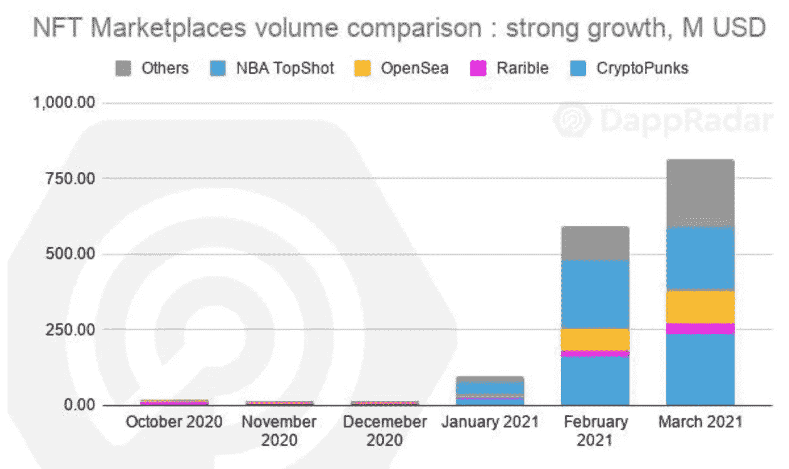
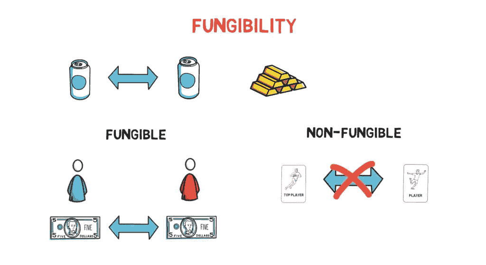
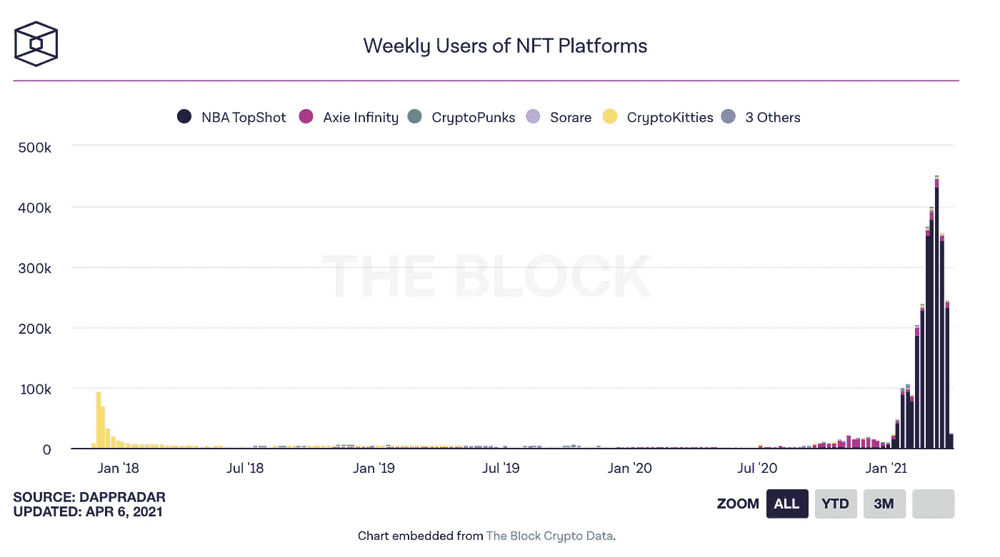
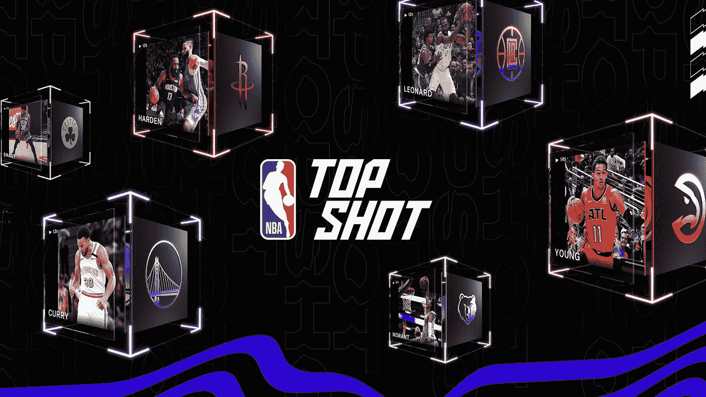
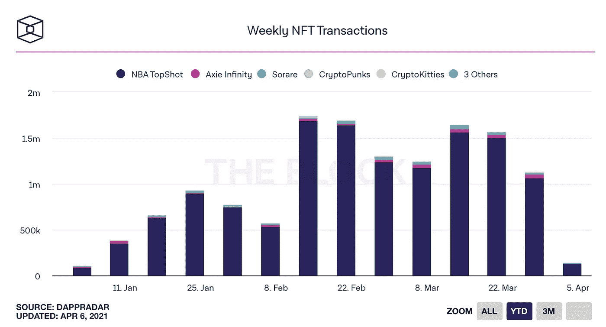
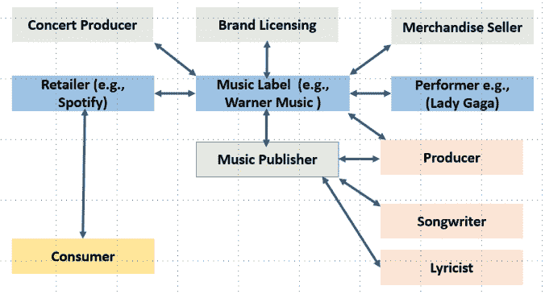
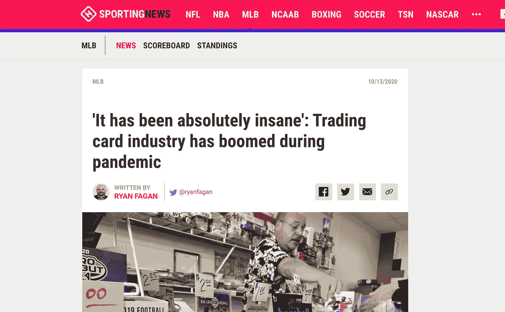

# NFTs 是如何变得如此流行的？

> 原文：<https://medium.com/geekculture/how-did-nfts-become-so-popular-f894eea22f90?source=collection_archive---------2----------------------->

## Q1 2021 与 NFT 进入主流的简要回顾

Cryptokitties, one of the first NFTs. Source from [Aidan Breen](/@aidobreen/how-does-cryptokitties-co-work-e5071c0abf73)

*免责声明:我假设这篇文章的读者对加密有基本的了解(例如，你知道什么是比特币和以太坊)。如果不是这样，你可能会在这篇博客中引用很多术语。此外，这是为了寓教于乐的目的，而不是财务建议。永远做你自己的研究。*

不可替代代币(NFT)在 2021 年的 Q1 奥运会上大放异彩。

我是说，*字面上的*没有人知道不可替代到底是什么意思，现在像[威肯](https://twitter.com/theweeknd/status/1378404573325352960?s=20)、[帕丽斯希尔顿](https://twitter.com/ParisHilton/status/1379495228357275649?s=20)和[天线宝宝](https://twitter.com/TeletubbiesHQ/status/1377572244398936066?s=20)这样的人正在日常对话中使用它。

我说的是与 Q1 2020 相比，销量同比增长[26 倍，销售额为 15 亿美元。](https://dappradar.com/blog/nfts-generate-record-1-5-billion-transaction-volume-in-q1-2021)

Source: DappRadar

我说的是数码艺术家毕普和著名拍卖行佳士得的 6900 万美元的拍卖，以及流入这个领域的数亿风险投资。

我甚至在谈论一个 SNL 的关于 NFTs 的小品，它本身被塑造成了一个 NFT…

在这一片疯狂中，外行人四处张望，大喊“泡沫”，而创作者和艺术家声称这是下一种货币化形式。

那么，是哪一个呢？

# NFT 概述

好的，哇——让我们踩刹车。

在我们进入 NFT 爆炸和该技术的下一步之前，让我们设定一个术语的基线理解(加密兽医，跳到下一节)。

NFT 代表不可替代的令牌。

…这毫无意义，因为这是技术上的胡言乱语。

让我们来分解一下:可替代的——根据谷歌的说法——意思是“(指没有具体样本的合同商品)能够替换或被另一个相同的商品替换；相互可互换"

所以基本上是可以复制和替换的东西。类似比特币的东西。

我拥有哪个比特币对我来说并不重要，我只关心我拥有一个 T2 比特币。

不可替代的意思正好相反:你不能用另一个来复制或替换它。很独特。

token 的意思是——嗯——token:就像比特币是一种代币，或者奶酪币是代币。这是某种价值的表现。

所以 NFT 拥有独特的价值。

Source: [Finematics](https://www.google.com/url?sa=i&url=https%3A%2F%2Ffinematics.com%2Fwhat-are-nfts-and-how-can-they-be-used-in-defi%2F&psig=AOvVaw3EyVZSf9HJHZQXL24H1fjB&ust=1617840290986000&source=images&cd=vfe&ved=0CA0QjhxqFwoTCICExfPq6u8CFQAAAAAdAAAAABAD)

此外，NFT 是在区块链，从简单的意义上来说是分布式分类账，分类账中的条目必须正确，因为，嗯…数学、博弈论和激励。(如果你真的对它的工作原理感兴趣，请在[推特](https://twitter.com/0xjim)上给我发消息)。

这意味着，任何 NFT 都必须是独一无二的，因为它受到其潜在的区块链教的制约。任何复制上述 NFT 的企图都将被认为是“错误的”,不能在分布式账本中持续存在。

**TLDR；NFT 是具有价值的唯一对象(例如，绘画)的不可变的、经验证的表示。**

# NFTs 是如何变得如此流行的

NFT 创建于 2013/2014 年，当时人们意识到他们希望在比特币区块链上交易资产——以及后来的收藏品——而不是比特币。

以太坊的出现导致了这些以比特币为中心的项目被移植到以太坊的虚拟机上，利用了其智能合约层的更多功能。

当 [CryptoPunks](https://thecryptopunks.com/) 和后来的 [CryptoKitties](https://www.cryptokitties.co/) 在 2017 年末出现时，NFT 的场景爆炸了，并引起了媒体的关注。

> 随着 CryptoKitties NFTs 成为主流。CryptoKitties 是一款基于区块链的虚拟游戏，允许玩家收养、饲养和交易虚拟猫。猫，在区块链上！—安德鲁·斯坦沃尔德

(要全面回顾 NFT 的历史，请阅读这篇由安德鲁·斯坦沃尔德撰写的精彩文章👇)

 [## 不可替换令牌(NFT)的历史

### 什么是不可替换令牌(NFT)？

medium.com](/@Andrew.Steinwold/the-history-of-non-fungible-tokens-nfts-f362ca57ae10) 

CryptoKitties 是如此受欢迎——由于可爱和人们通过翻转它们赚了一大笔钱的结合——它最终堵塞了以太坊区块链。

但是后来，用户采用沉寂了几年…直到现在。

Source [the Block](https://www.theblockcrypto.com/post/100240/did-we-already-see-the-peak-of-the-nft-boom)

老实说，这部分的标题有点误导，因为我不知道为什么 2021 年 1 月是世界集体决定非功能性测试是有史以来最酷的事情的月份。

如果有什么不同的话，NFTs 的爆炸性流行确实向我展示了新技术的不可预测的采用曲线——因为这项技术几年前就出现了。

我记得当 CryptoKitties 在 2017 年问世时，我完全将其视为一种时尚和对以太坊平台的糟糕使用。许多人和我在同一条船上，因为 NFT 的使用在 2018 年年中后基本上不存在，直到最近的激增。

我一直固执地持有这种信念，直到今年 1 月，当我看到 NFTs 在赋予艺术家权力方面的力量，以及围绕技术在 Twitter 和 Clubhouse 上形成的紧密团结的社区。

所以我不知道为什么 2021 年 1 月是 NFT 月，但我知道几个因素的结合是点燃非功能性传播疾病进入主流心理的完美干粉。

**1/自 2017 年以来，比特币疯狂上涨至历史最高水平的 3 倍**

聪明的投资者总是追逐收益，在疫情驱动的低收益环境中，许多人都涌向了加密。

越来越多的散户投资者对加密技术感兴趣，导致其他替代性加密相关投资(如 NFTs、集中交易、采矿场)的表现甚至超过了 BTC。

相反，NFT 在流行文化中的份额增加也导致许多好奇的观众投资于 crypto。

**2/出现的** [**NBA 顶级投篮**](https://medium.com/r?url=https%3A%2F%2Fnbatopshot.com%2F)

CryptoKitties 的创造者 Dapper Labs 在 NBA top shot[发布了一款令人惊叹的产品，凸显了 NFTs 作为数字收藏品载体的力量。](https://nbatopshot.com/)

Topshot 与 NBA 合作，是购买和收集 NBA 赛季独特时刻的权威场所。

NBA Topshot sells highlight videos of moments in the NBA season. Source [NBA.com](https://www.google.com/url?sa=i&url=https%3A%2F%2Fca.nba.com%2Fnews%2Fwhat-is-nba-top-shot-explaining-the-blockchain-nba-highlight-collectables%2F18nram5ye1ub01hres3lkk3xvd&psig=AOvVaw38IOEnAJKR7lXu-0gxzWKG&ust=1617834709854000&source=images&cd=vfe&ved=0CAMQjB1qFwoTCNiA-ovW6u8CFQAAAAAdAAAAABAN)

迄今为止，Topshot 一直是 NFT 市场销量的第一来源。

Source [the Block](https://www.theblockcrypto.com/post/100240/did-we-already-see-the-peak-of-the-nft-boom)

**3/数字内容(包括音乐和视频)错综复杂的货币化结构**

粗略地看一下音乐界，就会发现一个难以置信的复杂网络，涉及内容的货币化。

Music value chain. Source: [25iq](https://25iq.com/2018/09/01/lessons-from-chance-the-rapper-value-chains-and-profit-pools/)

哪里有复杂性，哪里就有创新的空间。

NFT 允许艺术家以一种新的方式将他们的作品货币化，让他们能够摆脱攫取金钱的中间人，并与他们的支持者和粉丝建立直接关系。

**4/不断增长的数字收藏品市场——尤其是在 covid 疫情期间**

懒得去找确切的数字，但在谷歌上搜索“棒球卡 covid”，你会看到大量关于疫情期间人们对收集[棒球卡的兴趣复苏的新闻报道。](https://www.milforddailynews.com/story/sports/2021/03/06/sports-card-hobby-explosion-fueled-covid-19-downtime/4527779001/)

Source [Sporting News](https://www.sportingnews.com/us/mlb/news/trading-card-industry-has-boomed-during-pandemic/10t850qdlc24c101eezddjxibg)

NFT 已经破解了数字稀缺的[问题](https://www.coindesk.com/nft-emotion-as-a-market-force)，使得创作者有史以来第一次能够准确定价并安全地在线分发他们的作品。

因此，有效地创造数字收藏品和跳跃的 IRL 趋势，兴起于疫情。

我将在后续文章中深入探讨另外两个宏观趋势:元宇宙和网络 3

关于这些的更多信息将在后面提供；)

# NFT 绝对是一个泡沫

老实说，我认为所有对 NFTs 的批评都是有根据的。

这是荷兰郁金香狂热部分的泡沫。我的意思是，一个红色像素永远不会卖超过近 100 万美元。杰克·多西的第一条推文也不应该卖到 300 万美元。

我认为人们对什么是非功能性测试有一个误解。它们是验证某物真实性的数字收据——无论是推文、视频、艺术品还是其他。它们本身并不是内容。

NFT 是契约，但不是真正的房子。它们是古驰商店的打印收据，不是真正的鞋子。

所以当人们推测艺术品的价值时，他们需要知道他们不是在区块链上购买艺术品。他们买的是艺术品，收据在区块链上是不可更改的。

在我们能够在区块链上实际存储内容之前，还需要更多的创新。

# 那如果是泡沫呢？

因此，非功能性技术是一个泡沫，它们是向最终消费者过度承诺的不完整技术。

那又怎样？这并不意味着底层技术有缺陷。事实上，因为这些原因而忽视 NFT 将意味着错过一项可能改变世界的革命性技术。

我说改变整个世界并不夸张。

更多关于我为什么这样想的后续文章:)

内在因素很重要。

如果我以每股 5000 美元的价格购买亚马逊股票，你会否认该公司的内在价值吗？不，你会因为我这个投资者做了那样的购买而惩罚我。

此外，艺术品不可替代，只能由买家定价。除了买家自己，还有谁能决定一个人的支付意愿？

让时间来评判吧。

谁能说什么是合理的投资？比特币在 2017 年是一个泡沫，但现在以 19K 美元的价格购买 BTC 绝对是便宜的(在撰写本文时是 58K 美元)。

我要说的是:让它流行起来，让噪音消失，让底层技术的建设者们继续努力。

就像网络时代，就像 2017 年。

一如既往，如果你有任何问题或想详细讨论这些话题，请在 LinkedIn 或 T2 Twitter 上给我发消息。我喜欢和人们谈论加密和广泛的生活:)