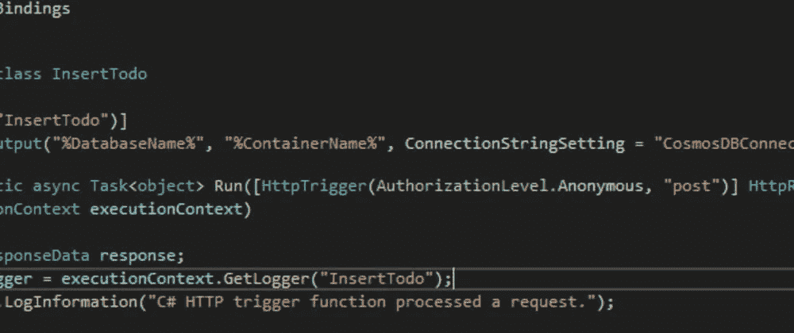
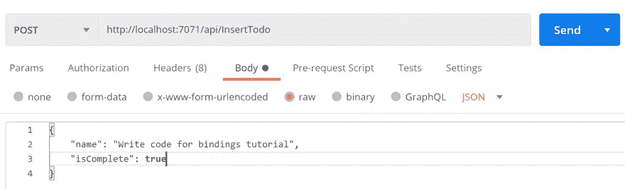
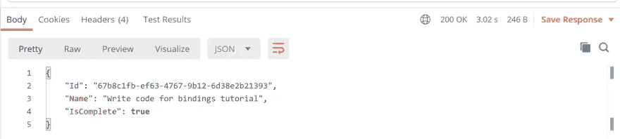
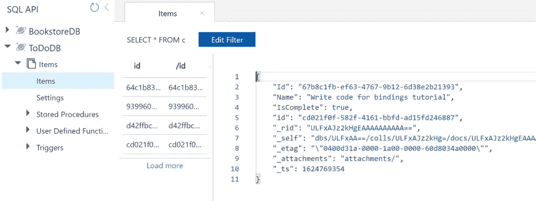

# 绑定如何在独立的进程中工作？NET Azure 函数？

> 原文：<https://medium.com/geekculture/how-do-bindings-work-in-isolated-process-net-azure-functions-d0a902de0fc2?source=collection_archive---------8----------------------->

## 在独立的流程函数中，我们可以使用输出绑定将函数的输出写入，但它们的工作方式略有不同



在我的上一篇文章中，我谈到了我们如何在一个隔离的进程中运行我们的 C# Azure 函数。NET，我们希望从 Azure Functions Runtime ⚡的版本中使用它

如果你没有读过那篇文章，你可以看看下面的内容:

[](https://dev.to/willvelida/developing-net-isolated-process-azure-functions-8lg) [## 发展中。NET 隔离进程 Azure 函数

### 我们可以在一个独立的进程中运行我们的 C# Azure 函数，将。我们在函数中使用的. NET

开发到](https://dev.to/willvelida/developing-net-isolated-process-azure-functions-8lg) 

在那篇文章中，我没有提到的一件事是绑定如何在独立的流程函数中工作。

在这篇文章中，我将解释 Azure 函数中的绑定是什么，它们目前如何与进程内函数一起工作，以及对于隔离函数，它们的工作方式有所不同。

# 什么是绑定？

在 Azure 函数中，我们使用绑定作为连接资源和函数的方式。我们可以使用输入和输出绑定，来自绑定的数据作为参数提供给我们的函数。

我们可以灵活地使用绑定！我们可以使用输入和输出绑定的组合，或者根本不使用(使用依赖注入)。

输入绑定将数据传递给我们的函数。当我们执行函数时，函数运行时将获得绑定中指定的数据。

输出绑定是我们编写函数输出的资源。为了使用，我们为函数方法定义了一个输出绑定属性。

# 它们是如何在类库函数中工作的

在类库函数中，我们可以通过使用 C#属性修饰函数方法和参数来配置绑定，如下所示:

```
[FunctionName(nameof("FunctionName"))]
public async Task Run([EventGridTrigger] EventGridEvent[] eventGridEvents,
[EventGrid(TopicEndpointUri = "TopicEndpoint", TopicKeySetting = "TopicKey")] IAsyncCollector<EventGridEvent> outputEvents,
ILogger logger)
{
    // Function code
}
```

在上面的代码中，我们得到了一个由事件网格触发的函数，它使用事件网格输出绑定将事件发布到。传入事件被绑定到 EventGridEvent 的数组，输出被发布到 event grid event 类型的 IAsyncCollector。

参数类型定义了这个函数的输入数据的数据类型。

# 它们在独立的流程功能中有何不同

像类库函数一样，绑定是通过在参数、方法和返回类型中使用属性来定义的。

绑定在。NET 独立项目是不同的，因为它们不能像 IAsyncCollector 那样使用绑定类。我们也不能像 DocumentClient 一样使用从 SDK 继承的类型。相反，我们必须依赖字符串、数组和 POCOs(普通的旧类对象)。

让我们用一个例子来说明这一点。我已经创建了一个函数，它接收 HTTP POST 请求并将文档持久化到 Cosmos DB。

这是我们的功能代码:

```
using System;
using System.IO;
using System.Net;
using System.Threading.Tasks;
using Microsoft.Azure.Functions.Worker;
using Microsoft.Azure.Functions.Worker.Http;
using Microsoft.Extensions.Logging;
using Newtonsoft.Json;

namespace IsolatedBindings
{
    public static class InsertTodo
    {
        [Function("InsertTodo")]
        [CosmosDBOutput("%DatabaseName%", "%ContainerName%", ConnectionStringSetting = "CosmosDBConnectionString")]
        public static async Task<object> Run([HttpTrigger(AuthorizationLevel.Anonymous, "post")] HttpRequestData req,            
            FunctionContext executionContext)
        {
            HttpResponseData response;
            var logger = executionContext.GetLogger("InsertTodo");
            logger.LogInformation("C# HTTP trigger function processed a request.");

            try
            {
                var request = await new StreamReader(req.Body).ReadToEndAsync();

                var todo = JsonConvert.DeserializeObject<TodoItem>(request);
                todo.Id = Guid.NewGuid().ToString();

                return todo;
            }
            catch (Exception ex)
            {
                logger.LogError($"Exception thrown: {ex.Message}");
                response = req.CreateResponse(HttpStatusCode.InternalServerError);
            }

            return response;
        }
    }
}
```

这个函数使用 Azure Cosmos DB 输出绑定。我们将 binding 属性应用于函数方法，该方法定义了如何向 Cosmos DB 服务编写 POST 请求。

为了使用 CosmosDBOutput 绑定，我们需要安装以下软件包:

```
Microsoft.Azure.Functions.Worker.Extensions.CosmosDB
```

因为在隔离进程中运行的函数使用不同的绑定类型，所以我们需要使用一组不同的绑定扩展包。我们可以在这里找到完整的名单:[https://www.nuget.org/packages?q =微软。azure . functions . worker . extensions](https://www.nuget.org/packages?q=Microsoft.Azure.Functions.Worker.Extensions)

在类库函数中，我们将在方法属性中定义我们的输出绑定，在这里我们将定义输出类型并将我们的函数输出写到该绑定，如下所示。

在隔离函数中，我们的方法返回的值是将被写入我们的 Cosmos DB 输出绑定的值。因此，在我们的函数中，我们发出一个 POST 请求，其中包含我们希望写入 Cosmos DB 的 Todo 项，当它从我们的函数返回时，它将被写入 Cosmos DB。

让我们来测试一下！我使用 Postman 发出以下请求:



当我们的函数启动时，我们应该得到一个本地端点来发送 POST 请求，如下所示:

```
http://localhost:7071/api/InsertTodo
```

当我向该端点发出 POST 请求时，我收到以下响应:



让我们进入我们的 Cosmos DB 帐户，我们应该看到我们的文档已成功写入:



# 最后的想法

就个人而言，当连接到其他资源时，我通常选择在函数中使用依赖注入，而不是使用输出绑定。

但是如果我们想快速简单地做一些事情，输出绑定对于完成工作是非常有用的。希望在本文中，您可以看到，尽管在隔离的流程函数中使用绑定与在类库函数中使用绑定有一些小的不同，但它们本质上是以相同的方式工作的。

如果您想了解更多关于。NET 隔离进程的工作原理，请查看本文:

[](https://docs.microsoft.com/en-us/azure/azure-functions/dotnet-isolated-process-guide) [## 。NET 独立进程指南。Azure 函数中的. NET 5.0

### 本文是关于使用 C#进行开发的介绍。NET 隔离的进程函数，这些函数在…

docs.microsoft.com](https://docs.microsoft.com/en-us/azure/azure-functions/dotnet-isolated-process-guide) 

编码快乐！☕💻