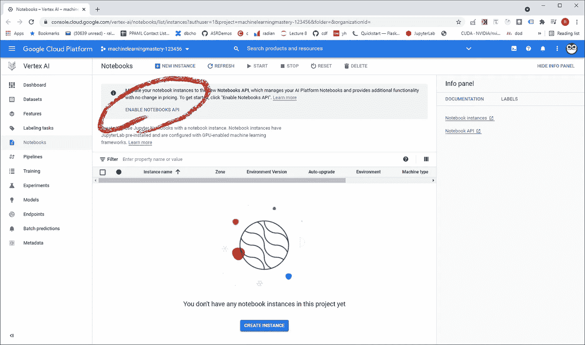
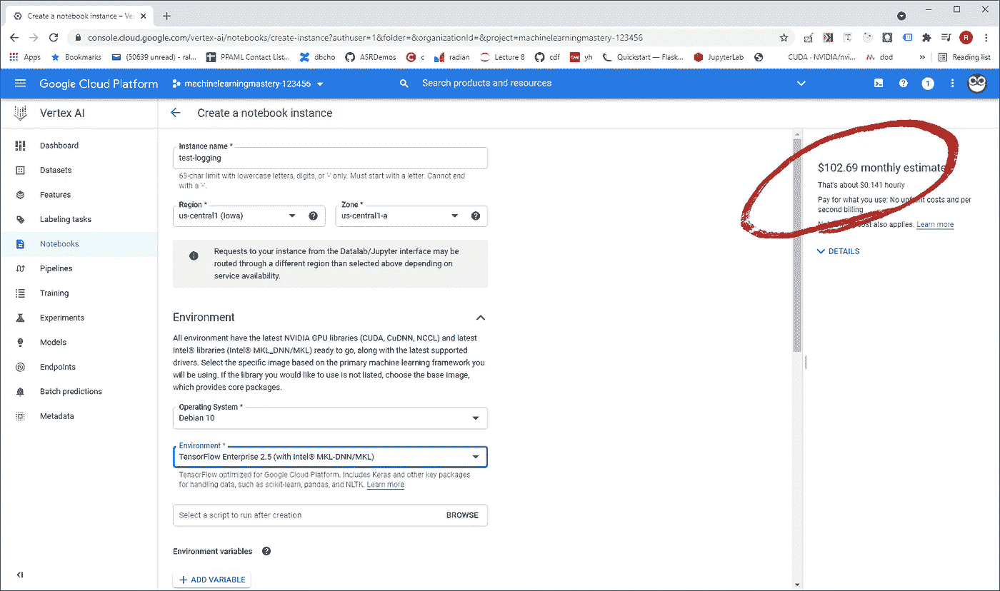
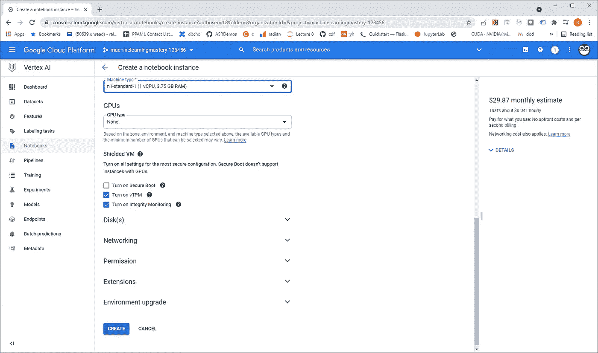
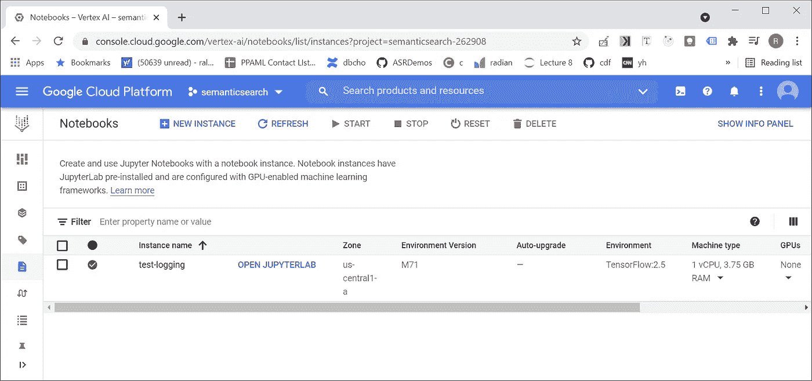
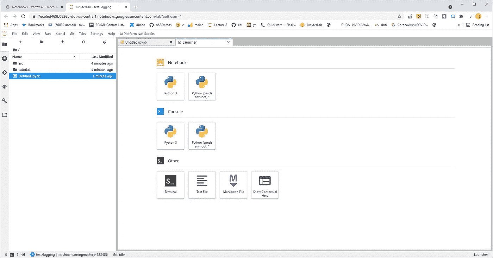

# 如何在谷歌云中用 Vertex AI 生成日志

> 原文：<https://medium.com/geekculture/how-do-i-create-logs-in-google-cloud-with-vertex-ai-8b6da73b70c2?source=collection_archive---------40----------------------->

使用 Vertex AI 笔记本与 Google Cloud 中的集中登录进行通信。

Vertex AI 在 Google I/O 2021 上公布。这不仅仅是谷歌人工智能平台的品牌重塑，这一产品开始将许多不同的 API(包括 AutoML)统一在一个产品下。谷歌在一份新闻稿中表示，这使得公司可以更容易地开始实施 MLOps。

在这篇博客中，我们将使用 Vertex AI 平台为数据科学做相当于“Hello World”的事情。简而言之，我们准备用一台 Vertex AI“Jupyter”笔记本与谷歌云的日志服务进行交流。可以把笔记本想象成一种以迭代方式运行 Python 代码的方式，这种方式允许您在运行过程中捕捉结果。

# TLDR——给我看看代码！

如果你使用 Vertex AI 笔记本，你可以很容易地在 Google Cloud 中测试用于云日志的 [python 库](https://googleapis.dev/python/logging/latest/usage.html#writing-log-entries)。在[https://www . whiteowleduction . com/using-Logging-in-a-vertex-ai-notebook/](https://www.whiteowleducation.com/using-logging-in-a-vertex-ai-notebook/)的完整文章中可以找到测试云日志记录所需的笔记本

# **先决条件**

为了完成本博客中的步骤，您需要具备以下条件:

1)你需要有一个谷歌云账号。如果你还没有账户，看一下这个视频[如何建立账户。](https://courses.whiteowleducation.com/courses/machine-learning-mastery/lectures/30703728)

2)需要启用云日志 API。设置好账户后，你可以在[https://console . cloud . Google . com/APIs/API/logging . Google APIs . com](https://console.cloud.google.com/apis/api/logging.googleapis.com)找到关于启用该 API 的详细信息。

3)你需要去 https://console.cloud.google.com/vertex-ai/notebooks。如果您看到相应的警告，请启用笔记本 API。

Image courtesy of [https://www.whiteowleducation.com](https://www.whiteowleducation.com)

# **创建顶点 AI 笔记本**

在 Vertex AI 控制台中，我们需要做的第一步是创建一个笔记本实例。这个实例将由 CPU 支持，所以关键是要运行这个练习，完成后，一定要删除笔记本实例，这样就不会产生额外的费用。

Make sure to delete the notebook instance after you get done using it. This is important to manage costs.

如上所示，我在 us-central1 中创建了一个名为 test-logging 的笔记本(您应该在离您很近的地方创建您的实例)。我用 TensorFlow 和 Pandas 等通常用于数据科学的库创建了这个笔记本，我通过选择 TensorFlow Enterprise 2.5 环境来完成这个任务。

If we are just examining logging, I am minimizing CPU usage to manage costs.

点击 create 后，您将看到 test-logging 笔记本出现在控制台中，点击“OPEN JUPTYERLAB”以继续。

一旦你进入 JupyterLab，点击 Python [conda env:root]打开一个笔记本进行实验。

现在继续吧…

查看[https://www . whiteowleduction . com/using-logging-in-a-vertex-ai-notebook/](https://www.whiteowleducation.com/using-logging-in-a-vertex-ai-notebook/)了解本文的其余内容，包括:

# Python 日志记录代码

# **验证结果**