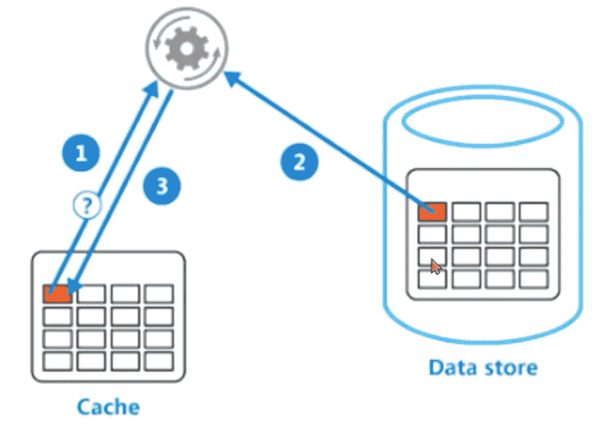

# 如何使用 InMemoryCache？网络核心

> 原文：<https://medium.com/geekculture/how-do-i-use-inmemorycache-in-net-core-b79202ddaf0c?source=collection_archive---------5----------------------->

在本文中，我们将关注缓存

我们可以从一个简单的问题开始！为什么我们需要缓存？

因为应用程序处理数据，而数据通常来自应用程序之外。有了高速缓存，这可以非常快速地执行。

在本文中有两种类型的缓存，我们将重点讨论内存缓存。这个缓存数据存储在应用服务器内存中。实际上，我们可以说它在内存中。



让我们开始写一些代码。

在这个例子中，我使用了。Net Core 6 和 Mvc 应用程序。创建后，我们可以创建新的控制器，命名为**内存控制器**。之后，我们需要给**程序**文件添加内存缓存服务

```
builder.Services.AddMemoryCache();
```

现在我们可以通过依赖注入来使用内存缓存服务。

```
private readonly IMemoryCache _memoryCache;public MemoryController(IMemoryCache memoryCache)
        {
            _memoryCache = memoryCache;
        }
```

借助 get set 方法，我们可以读写缓存。

```
public IActionResult Index()
        {
            _memoryCache.Set<string>("Time", DateTime.Now.ToLongTimeString());
            return View();
        }public IActionResult Show()
        {
            ViewBag.Time = _memoryCache.Get<string>("Time");
            return View();
        }
```

当你运行内存控制器时，它会用 set 函数设置缓存，然后用 show page 你会看到缓存的时间。

```
var value = _memoryCache.GetOrCreate("Time", entry =>
            {
                return DateTime.Now.ToLongTimeString();
            });
            return View();
```

**GetOrCreate** 可以用于 get 或 set。i̇f 我们用这个代替 get 和 set 方法。我们不需要检查我们的键是否存在于数据中。

AbsoluteExpiration:这是我们的数据将留在缓存中的时间。例如，如果我们设置 5 分钟。它将在内存中停留 5 分钟。比它移除的还要多。这也是我们的缓存时间，但区别在于。例如，我们将缓存中的数据设置为 5 分钟。如果有人在 5 分钟内到达数据，它将刷新时间。并将再次启动 5 分钟计时器。i̇f:不，然后它会移除

```
var value = _memoryCache.GetOrCreate("Time", entry =>
            {
                entry.AbsoluteExpiration = DateTime.Now.AddSeconds(100);
                entry.SlidingExpiration = TimeSpan.FromSeconds(20);
                return DateTime.Now.ToLongTimeString();
            });
```

**优先级**:内存有限制。因此，随着内存的使用，数据将填满 ram。根据优先级，我们可以设置 daha 将首先移除哪个。

```
entry.Priority = CacheItemPriority.NeverRemove;
```

RegisterPostEvictionCallback:当缓存数据发生问题时运行。当我们缓存原因时，我们可以了解为什么我们的数据被删除。是过期还是内存不足。

```
entry.RegisterPostEvictionCallback((key, value, reason, state) =>
                {
                    _memoryCache.Set("CallBack", $"{key}--> {value} : reason:{reason}");
                });
```

缓存对于应用程序来说非常重要。我们可以缓存各种类型。但是不要忘记在内存中缓存使用 ram。如果我们把不必要的对象放到 rem 中，它就会填满内存。这可能会有一些副作用。

本文是缓存的第一部分。在第二部分，我将试着解释一下 redis 缓存