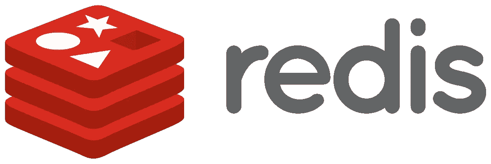
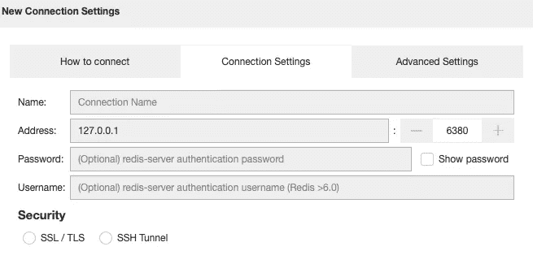
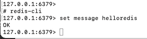
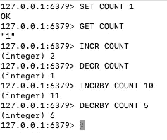
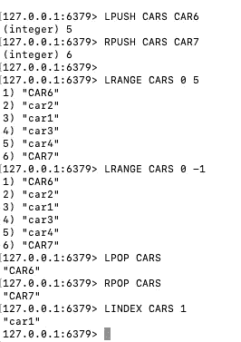
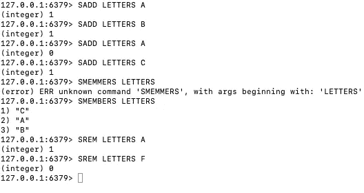
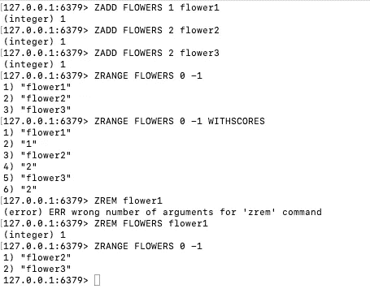
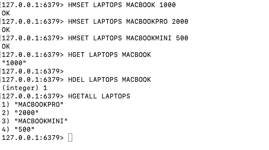

# 我如何使用 Redis？网络核心

> 原文：<https://medium.com/geekculture/how-do-i-use-redis-in-net-core-2c8160608a2d?source=collection_archive---------7----------------------->

Redis 是一个 NoSQL 数据库。它不仅仅是一个键值类型的数据库，它还有类型支持。它还支持一致性。



先说安装；

根据您的操作系统，您可以从 Redis 的官方页面遵循这些步骤。

但是对于本文，我们将使用 docker。因此，我们需要打开 docker hub 并从那里搜索 Redis。

```
docker run -p 6380:6379 --name some-redis -d redis
```

上面的命令将检查我们的系统是否有 Redis 映像，它将打开该映像，如果没有，它将下载最新版本的 Redis，然后运行它

我们需要 redis 桌面管理器来查看 redis 中的内容。这是付费版本，但你可以通过这个[链接](https://resp.app/)注册试用版。

```
docker exec -it 0ef sh
```

运行上面的命令后，你就可以打开桌面管理器了。您需要设置连接配置。



点击确定按钮后，您将看到。雷迪斯数据库。让我们试一试。再次打开命令提示符并键入..



当您返回并刷新桌面管理器时，您将看到您的第一条消息。


现在我们可以看到数据类型。redis 中可以使用哪种数据类型？

**字符串**:我们可以将字符串保存在 Redis 中。如果是数值，可以增加或减少



**List** :像数组一样保存数据。它类似于链表



**设置**:喜欢列表。但是数据必须是不同的，我们不能选择写入数据的位置



**排序列表**:保持数据排序。我们可以定义它们的分值。像集合一样，值应该是唯一的。



**Hash** :像字典一样保存数据。我们可以定义它们的分值。像集合一样，值应该是唯一的。



预知知识到此结束:)我们写点代码吧

创建新的 web 应用程序。然后借助 nuget 拿下**微软。extensions . caching . stackexchangeredis**包。

*   使用 redis 服务器的端口向 program.cs 文件添加服务

```
builder.Services.AddStackExchangeRedisCache(options =>
{
    options.Configuration = "localhost:6380";
});
```

*   创建一个控制器并通过依赖注入得到 **IDistrubutedCache** 接口。
*   编写索引方法来设置数据

```
public IActionResult Index()
        {
            DistributedCacheEntryOptions cacheOptions = new DistributedCacheEntryOptions();
            cacheOptions.AbsoluteExpiration = DateTime.Now.AddMinutes(1);
            _redisCache.SetString("RedisCache", "Hello", cacheOptions);
            return View();
        }
```

*   然后将数据写入显示方法

```
public IActionResult Show()
        {
            ViewBag.Message =  _redisCache.GetString("RedisCache");
            //to remove data from cache
           _redisCache.Remove("RedisCache");
            return View();
        }
```

这只是字符串操作。对于复杂的对象，请遵循以下步骤。

*   创建方法名称可以是“复杂的”。

```
public async Task<IActionResult> Complex()
        {
            DistributedCacheEntryOptions cacheOptions = new DistributedCacheEntryOptions();
            cacheOptions.AbsoluteExpiration = DateTime.Now.AddMinutes(20);
            Car car = new Car { Id = 1, Age = 2, Model = "Audi" };
            string jsonCar = JsonConvert.SerializeObject(car);
            await  _redisCache.SetStringAsync("car:1", jsonCar, cacheOptions);
            return View();
        }
```

*   对于读取操作

```
public IActionResult CDataShow()
        {
            string jsonCar = _redisCache.GetString("car:1");
            Car c = JsonConvert.DeserializeObject<Car>(jsonCar);
            ViewBag.Name = c.Model;
            return View();
        }
```

*   文件缓存:缓存文件或图像。

其实很简单。只需用 set 函数将文件转换成二进制。将二进制字符串发送到缓存。

```
public IActionResult ImageCache()
        {
            string path = Path.Combine(Directory.GetCurrentDirectory(), "wwwroot/images/image.png");
            byte[] imageByte = System.IO.File.ReadAllBytes(path);
            _redisCache.Set("image", imageByte);
            return View();
        }public IActionResult ShowImage()
        {
            byte[] imageByte = _redisCache.Get("image");
            return File(imageByte, "image/png");
        }
```

我上面说的是 redis 上的简单缓存。对于简单的缓存，我们可以使用 IDistrubutedCache 接口。让我们看看如何使用脚本开头的命令和 **StackExchange** 。

对于 StackExchange，我创建了一个新的 MVC 应用程序。加上 StackExchange 就行了。Redis 包。我想在一个班级中管理所有与 Redis 相关的员工。为此，我创建了一个服务类。这个类的初始版本如下。

```
public class RedisService
    {
        private const string Server = "localhost";
        private const string Port = "6380";private ConnectionMultiplexer _redis;
        public IDatabase db { get; set; }public void Connect()
        {
            var connectionSetting = $"{Server}:{Port}";_redis = ConnectionMultiplexer.Connect(connectionSetting);
        }public IDatabase GetDb(int db)
        {
            return _redis.GetDatabase(db);
        }
    }
```

让我们看看那个服务是怎么回事。ConnectionMultiplexer 来自 nuget (StackExchange。Redis)包。有了这个，我们可以连接我们的 Redis 服务器。GetDb 方法给了我们想要连接的数据库。

是的，但是我们想在某个地方打电话联系。这是一个程序文件。首先，我们需要用 singleton 添加我们的 RedisService。因为我们想得到 redis 的对象。所以从应用程序开始工作是很好的。

也许我们可以为它编写定制的中间件，但这篇 redis 文章将重点介绍这一点。所以程序文件如下。

```
builder.Services.AddSingleton<RedisService>();

var redisService = app.Services.GetService<RedisService>();redisService.Connect();
```

我将分享项目代码。如果您的代码不起作用，请不要惊慌:)

是的，下一步…让我们看看**字符串**方法

使用 Exchange Api 非常容易。对于字符串操作，有太多的方法可以尝试使用。

```
public IActionResult Index()
        {

            _db.StringSet("Data", "Barkın Kızılkaya");
            _db.StringSet("Count", 500);
            return View();}public async Task<IActionResult> Show()
        {
           var value =  _db.StringGet("Data");
            _db.StringIncrement("Count", 1);
            await _db.StringDecrementAsync("Count", 5);
            _db.StringLength("Data");
            if(value.HasValue)
            {
                ViewBag.value = value;
            }
            return View();
        }
```

最后我们可以看看列表方法。

```
public IActionResult Index()
        {_db.ListRightPush("List", 1);return View();
        }
    }
```

实际上，使用 exchange API，您可以做更多的事情，但是没有时间处理所有的方法。如果你使用这个 API，那么你会从做 API 文档中得到。

祝你有美好的一天继续编码