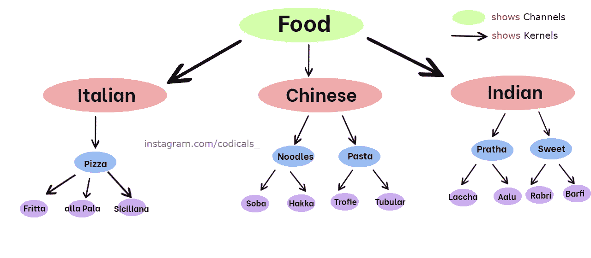

# 计算机视觉中的图像处理

> 原文：<https://medium.com/geekculture/how-do-images-get-processed-in-computer-vision-c9f1707b58af?source=collection_archive---------53----------------------->

在本文中，我解释了两个基本组件，它们是了解如何从图像中提取信息的基础。我的解释不会是技术语言，所以如果你是新手，不要担心，你也会理解的。

我解释过的两个概念是**通道**和**内核。**

让我们用一个简单的例子来理解它们。

Channels and Kernels with an example of cuisine ([https://www.instagram.com/codicals_/](https://www.instagram.com/codicals_/))

你想从食品配送网站订购*客家面条。你将如何寻找它？所以食物是我们的通道。如果 ***我们拿一个*** 狗的图像做同样的上下文，我们在图像中找到一只狗，那只狗就是我们的通道。简单来说，**通道就是我们在图像**中寻找的信息。*

但是*我们想要客家面条，我们怎么去那里呢*？我们*开始过滤食物*，第一个过滤器会选择中餐，然后从中餐中过滤面条，之后我们会过滤面条并选择客家面条。如果 ***我们拿一张*** 狗的图像做同样的上下文，我们要识别它，我们会用它的鼻子、耳朵、尾巴、嘴巴作为过滤器来识别那张图像是不是狗。简单来说，**内核是过滤图像并给出重要和想要的信息的过滤器**。

敬请关注，继续学习。