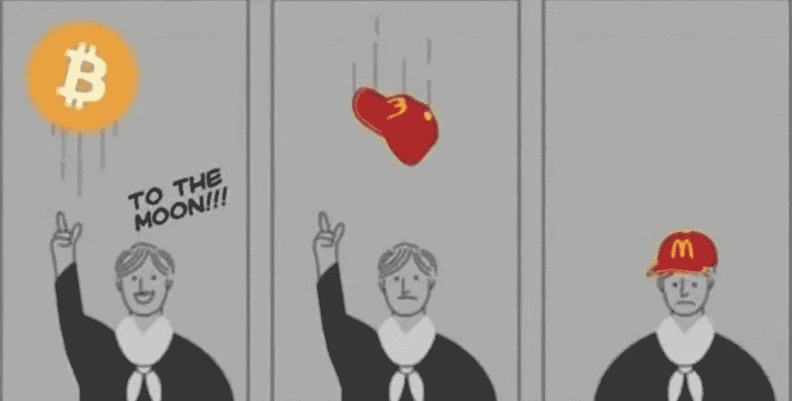

# NFT 骗局是如何运作的？筹集数百万资金的循序渐进指南。

> 原文：<https://medium.com/geekculture/how-do-nft-scams-work-a-step-by-step-guide-to-raising-millions-752157db5948?source=collection_archive---------4----------------------->

## 创建(或者更好，避免)加密骗局的权威指南。

每次我听到地毯拉或者密码崩溃，我都会想起同一个迷因:

Popular Internet meme.

我自己是一名软件工程师，我理解并相信区块链的优势。但是我不喜欢密码兄弟。