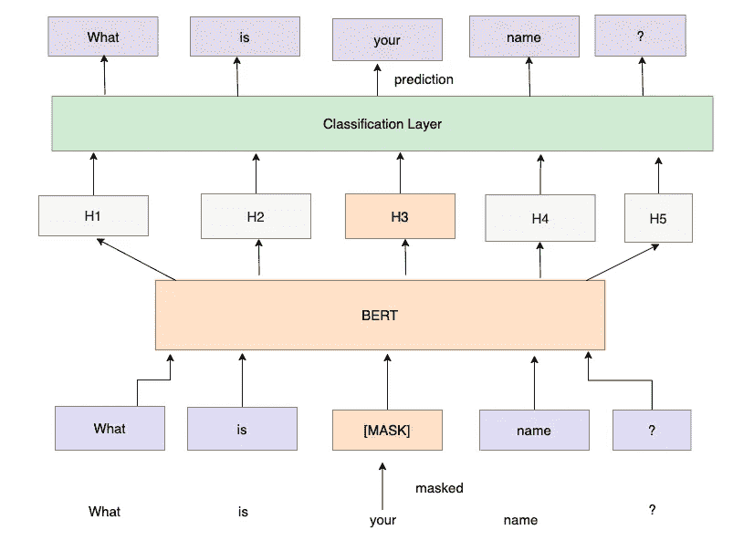
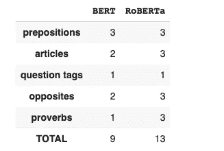

# 变形金刚在语法考试中表现如何？

> 原文：<https://medium.com/geekculture/how-do-transformers-fare-on-a-grammar-test-d3b7b26e5004?source=collection_archive---------6----------------------->

## 看看伯特和罗伯塔如何处理语法测验中的问题


Photo by [Ben Mullins](https://unsplash.com/@benmullins?utm_source=medium&utm_medium=referral) on [Unsplash](https://unsplash.com?utm_source=medium&utm_medium=referral)

# 概观

1.  略谈 BERT 及其对完形填空的训练。
2.  罗伯塔和它如何不同于伯特
3.  拥抱脸和填充面具管道
4.  比较 BERT 和 RoBERTa 使用语法测验中的问题预测介词、冠词、问题标签、反义词和流行谚语的能力。(英文)

*如果你只是来看看结果，并且已经了解了 transformer 模型，请随意跳到第 4 部分。*

# 伯特与完形填空

来自变压器的双向编码器表示(BERT)是由 Google AI 语言创建的最先进的 NLP 模型。下面是 [**论文**](https://arxiv.org/pdf/1810.04805.pdf) **原文链接。**该模型在一个巨大的语料库上进行训练(稍后将详细介绍)，然后这个预训练的模型可以用于几个下游任务(主要与自然语言理解相关)，如文本分类、提取问题回答和命名实体识别。更正式地说，BERT 使用 Vaswani 等人在最初的 [**变形金刚论文**](https://arxiv.org/abs/1706.03762) 中描述的编码器模型。

BERT 的词汇由在训练期间学习的维度为 768 的**向量表示。伯特接受了两项特殊任务的训练。**

1.  **蒙面语言造型(MLM)**
2.  **下一句预测(NSP)**

## 蒙面语言模型(MLM)

在训练时，每个句子都一次性输入到模型中，这与以前的 seq2seq 模型(LSTMs 和 RNNs)不同。然而，句子中的 15% 的标记被特殊标记**【屏蔽】**屏蔽，并且模型必须预测被屏蔽的标记。请注意，训练是以半监督的方式大规模进行的。在这种情况下，我们不需要手动标注巨大的数据集，鉴于 BERT 被训练的语料库的大小，这是不可能的，而是将各种批次的屏蔽句子馈送给模型，并且模型学习预测随时间推移的屏蔽标记。这被正式称为**完形填空任务。**

这给了 BERT 解释其上下文的能力，这也正是我们在测试问题模型时要用到的。

这是 MLM 的样子。这张图片来自拉尼·霍雷夫在 BERT 上的一个 [**优秀博客**](https://towardsdatascience.com/bert-explained-state-of-the-art-language-model-for-nlp-f8b21a9b6270) ，我强烈推荐阅读它以更好地理解这个模型。



How an input mask is predicted (Image by Author)

**正如你在这里看到的，单词“你的”在句子被输入模型之前被屏蔽，模型预测一个对应于该屏蔽的标记。**

## 下一句预测(NSP)

这是 BERT 的另一个训练目标，它接收成对的句子，并且必须预测第二个句子是否跟随第一个句子。我不会深入探讨这个问题，因为 Roberta 完全放弃了这个目标，并且在一些任务中表现得更好。

# 罗伯塔对伯特

RoBERTa 代表稳健优化的 BERT 预训练方法，遵循与 BERT 相似的架构。It 员工进行了一些重大调整，这使得它比 BERT 更适合某些任务。

1.  **丢弃下一句预测训练目标**。与伯特不同，罗伯塔不使用 NSP 物镜，根据这篇论文，只有在 MLM 物镜上训练才能取得更好的成绩。
2.  **与 BERT 不同，RoBERTa 使用动态屏蔽**。在 BERT 中，屏蔽在数据预处理步骤中执行一次，产生一个静态屏蔽。为了改变被屏蔽的令牌，训练数据被复制和屏蔽 10 次，每次在 40 个时期内使用不同的屏蔽策略，因此有 4 个时期使用相同的屏蔽。在动态遮罩中，每次在将序列输入模型之前都会生成不同的遮罩。作者发现，这对于更多的训练数据和更多的时期更有效。
3.  **最重要的是，RoBERTa 是在一个大规模的语料库上接受训练的**(好像 BERT 的训练语料库还不够大)，而且接受训练的时间比 BERT 长得多。更具体地说，BERT 接受的是 16GB 文本数据的训练，而 RoBERTa 接受的是 160GB 文本数据的训练！
4.  RoBERTa 还执行了其他一些小的调整，比如改变 Adam 优化器的超参数，以及使用更长的序列进行训练。 [**原文**](https://arxiv.org/pdf/1907.11692.pdf) 更详细，值得一读。

# 拥抱脸和填充遮罩管道

拥抱脸是一个惊人的枢纽，托管各种变压器模型的实现。他们提供了这些模型的抽象版本，因此用户可以毫不费力地利用变压器的能力。

填充-屏蔽管道是用于屏蔽语言建模任务的抽象管道。我们只需要输入一个带有掩码标记的句子(BERT 用 **[MASK]，RoBERTa 用<掩码>)，它会给出可能的单词来替换掩码标记。**

***注意:拥抱脸，每个序列只能屏蔽一个令牌。***

这是一个例子的样子。检查输出，它包含 5 个可能的建议。每个建议都是一个字典，具有诸如**分数(预测的置信度)、序列(填充了掩码的完整序列)、标记(标记 id)以及最后的标记(预测的单词)等特征。我们将在下一节讨论详细的代码，您将会看到它是多么简单！**

# 语法考试！

对于这个测试，我从 5 个类别中选择了 3 个问题——介词、冠词、问题标签、反义词和谚语。这总共得了 15 分。这些问题来自一些流行的在线测验(免费使用)。让我们看看伯特和罗伯塔的表现。

## 设置

下面是在 Google Colab 中设置和安装 transformers 库的代码。

```
!pip install transformers
```

和单一进口

```
from transformers import pipeline
```

然后，我们通过选择**填充掩码任务并提及模型名称，为 BERT 和 RoBERTa 创建一个管道。请注意，BERTs 的预测不区分大小写，而 RoBERTa 的预测区分大小写。**

```
unmasker_BERT = pipeline('fill-mask', model='bert-base-uncased')unmasker_ROBERTA=pipeline('fill-mask', model='roberta-base')
```

这是测试中的问题

## 介词

介词表示句子中其他单词之间的关系。这对于两个模型来说都是一个简单的任务，并且两个模型都正确地预测了所有的答案。

## 文章

文章由 **a、**和**an 组成。**冠词通常用来确定一个名词是具体的还是概括的。

请注意这两个模型是如何预测特殊情况的。 虽然 one-bedroom 以元音开头，但由于单词的发音 **，我们必须**使用“a one-bedroom”而不是“an one-bedroom”。****

伯特错过了一篇文章，而罗伯塔预测都是正确的。注意 RoBERTa 是如何将第二句中预测的单词大写的，因为它是句子中的第一个单词。

## **问题标签**

这些把一个陈述变成一个问题。它们经常被用来检查我们认为我们知道是真实的信息。

这就是这两个模型开始出现问题的地方。这些模型不能很好地处理否定，只能正确预测一个答案。

## 对立面

这完全出乎我的意料，因为我没想到模型会从上下文中预测相反的情况。这只能继续显示这些模型是多么强大，以及他们所经历的全面训练。这里罗伯塔得到所有正确的，但伯特错过了一个。

## 《箴言》

谚语是流行的说法。罗伯塔的表现再次让我惊讶，因为预测谚语的单词是一项艰巨的任务，这需要模型在训练中看到类似的句子。罗伯塔在这里明显胜过伯特，并且正确预测了所有的谚语。我猜罗伯塔训练的巨大语料库与此有关。

## 最终分数

这是两人在每一部分的表现以及他们的总分。很明显，RoBERTa 在这次测试中表现更好，以 13 比 9 击败了 BERT！



Final Scores (Image By Author)

# 结论

我们可以通过这个测试看到变形金刚有多强大，尤其是看到它们在反义词和谚语上表现得如此之好。令人瞩目的是，语言模型已经从仅仅是统计预测器发展到可以在如此庞大的语料库上训练而无需人工注释的深度复杂模型。这个测试也显示了罗伯塔在完形填空方面有多强。

如果你喜欢这篇文章，这里有更多！

[](https://towardsdatascience.com/scatter-plots-on-maps-using-plotly-79f16aee17d0) [## 使用 Plotly 在地图上散布图

### 了解如何用很少的代码创建交互式散点图来表示数据中的多个要素

towardsdatascience.com](https://towardsdatascience.com/scatter-plots-on-maps-using-plotly-79f16aee17d0) [](https://towardsdatascience.com/regex-essential-for-nlp-ee0336ef988d) [## 正则表达式对 NLP 至关重要

### 理解各种正则表达式，并将其应用于自然语言中经常遇到的情况…

towardsdatascience.com](https://towardsdatascience.com/regex-essential-for-nlp-ee0336ef988d) [](https://towardsdatascience.com/powerful-text-augmentation-using-nlpaug-5851099b4e97) [## 使用 NLPAUG 的强大文本增强！

### 通过文本增强技术处理 NLP 分类问题中的类别不平衡

towardsdatascience.com](https://towardsdatascience.com/powerful-text-augmentation-using-nlpaug-5851099b4e97) [](https://towardsdatascience.com/effortless-exploratory-data-analysis-eda-201c99324857) [## 轻松的探索性数据分析(EDA)

towardsdatascience.com](https://towardsdatascience.com/effortless-exploratory-data-analysis-eda-201c99324857) [](https://towardsdatascience.com/representing-5-features-in-a-single-animated-plot-using-plotly-e4f6064c7f46) [## 使用 Plotly 在一个动画情节中表现 5 个特征

### 使用单个动画气泡图来分析数据和观察趋势。

towardsdatascience.com](https://towardsdatascience.com/representing-5-features-in-a-single-animated-plot-using-plotly-e4f6064c7f46) 

查看我的 [**GitHub**](https://github.com/rajlm10) 其他一些项目。可以联系我 [***这里***](https://rajsangani.me/) ***。*** 感谢您的宝贵时间！