# Docker BuildKit 和 GitLab Runner 如何填充 Kubernetes 中的存储空间

> 原文：<https://medium.com/geekculture/how-docker-buildkit-and-gitlab-runner-fill-up-storage-in-kubernetes-fix-it-a839c841bf95?source=collection_archive---------0----------------------->


Photo by [amirali mirhashemian](https://unsplash.com/@amir_v_ali?utm_source=medium&utm_medium=referral) on [Unsplash](https://unsplash.com?utm_source=medium&utm_medium=referral)

> Docker 层就像汉堡的配料。你不想把它弄得太乱，所以总是寻找令人愉快的口味平衡。
> 你想在你的汉堡中间拉出一种配料吗？
> 你开始从顶部去掉几层，放下辣椒，然后浪费掉去掉的几层，重新装上汉堡。

在简要介绍了如何制作一个好的汉堡包之后，是时候介绍如何在您的笔记本电脑或 Kubernetes 集群中的 worker 节点上使用 docker 和 BuildKit builder 来填充磁盘了。

我将解释如何识别和解决问题。
还有一个临时的变通方法，我将深入研究 docker 源代码，了解 docker 垃圾收集频率是如何工作的。

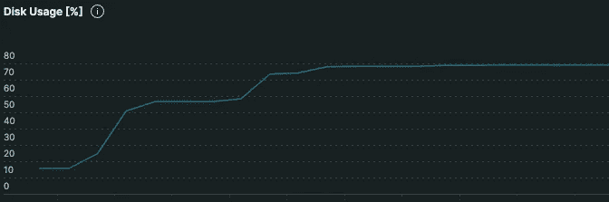

Worker node disk usage constantly growing

*免责声明:
然而，docker 中的 docker 会带来安全问题，而你的盒子中有更好的工具，例如 Kaniko。*

非常感谢任何掌声、关注或评论！

# 我是否在某处使用了 docker BuildKit？

要验证是否在启用 BuildKit 的情况下使用 docker，您必须使用:

*   Docker ≥ 18.09
    `$ docker version`

和*以下选项中的至少一个*:

*   您配置环境变量`DOCKER_BUILDKIT=1`
*   你运行`[docker buildx build](https://docs.docker.com/engine/reference/commandline/buildx_build/)`来构建你的 docker 文件
*   在守护进程配置`/etc/docker/daemon.json`中，您已经默认启用了 BuildKit

```
{
  "features": {
    "buildkit" : true
  }
}
```

*   运行`docker system df`并查看最后一排`Build Cache`并检查尺寸/可回收性

```
❯ docker system df
TYPE            TOTAL     ACTIVE    SIZE      RECLAIMABLE
Images          177       3         46.54GB   45.69GB (98%)
Containers      13        0         39.39MB   39.39MB (100%)
Local Volumes   0         0         0B        0B
Build Cache     660       0         177GB     130GB
```

*Ref:*[*https://docs.docker.com/build/buildkit/#getting-started*](https://docs.docker.com/build/buildkit/#getting-started)

`buildx`和`BuildKit`有什么区别？

*   `BuildKit`是一种形象塑造引擎
*   `buildx`是控制发动机的命令。

所以`BuildKit`是发动机，`buildx`是方向盘⎈.

**git lab Runner 如何与 Kubernetes 集群交互？**

在下图中，我创建了一个使用 Kubernetes 执行器的 Gitlab Runner 的高级图。我故意简化了它，因为我没有详细介绍这一部分，GitLab 中有很多文档。
*Ref:*[*https://docs.gitlab.com/runner/#runner-execution-flow*](https://docs.gitlab.com/runner/#runner-execution-flow)。

标准步骤是:

1.  Kubernetes Executor 作为部署部署在 Kubernetes 中。
2.  executor pod 不断询问特定的轮询周期，是否有挂起的作业。
3.  如果有一个未完成的任务，它会根据之前配置的*容错/节点选择器/关联规则来调度一个新的 pod。*

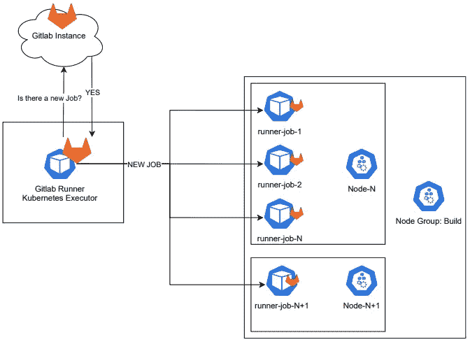

假设作业正在运行`docker build`，并且配置了一个环境变量`DOCKER_BUILDKIT=1`。您可以在 Gitlab Runner 中通过在`config.toml`中配置一个环境变量来启用它，如下所示:

```
config.toml
...
     [[runners]]
      name = "Kubernetes Builder"
      executor = "kubernetes"
      environment = ["DOCKER_DRIVER=overlay2","DOCKER_BUILDKIT=1"]
...
```

有了这个配置，我们将使用新的 BuildKit builder。

# 如何验证一个**工作节点**的磁盘使用情况？

如果不配置特定的策略，Docker 垃圾收集会考虑构建缓存的清理。

要确定谁在消耗空间，您必须运行一个 pod，在这里使用这个[清单](http://bit.ly/3iclPhO)，然后在`/host`下将挂载 worker 节点文件系统。
根据磁盘已被填满的程度，您可以尝试以下命令:

`apk add ncdu` → `ncdu` *(如果你有很多文件/文件夹就不行)*

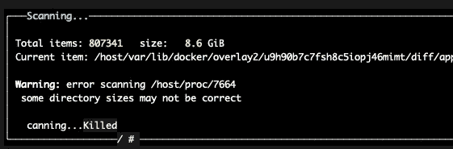

ncdu

*   `df -hi`它显示了高级文件系统的使用情况。
*   `du -shc /host/var/lib/docker/overlay2/*/diff | tee disk_usage.log`

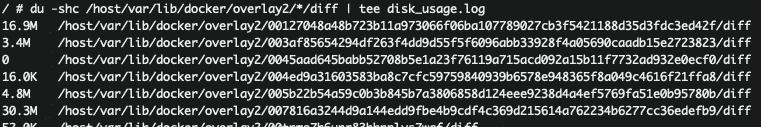

du -shc example

*   耐心点，这需要一些时间

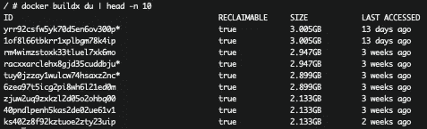

`docker buildx du`

*   耐心点，这需要一些时间

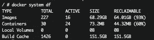

`docker system df`

在`docker system df`的输出中，行`Build Cache`指的是 BuildKit 使用的空间。

此时，我开始钻研 BuildKit 和 Docker 的源代码，验证`Build Cache`是如何评估的。

在 moby/docker 的源代码中，这个公共函数`DiskUsage`使用的`controlapi.DiskUsageRequest{}`是 BuildKit 包的一部分。

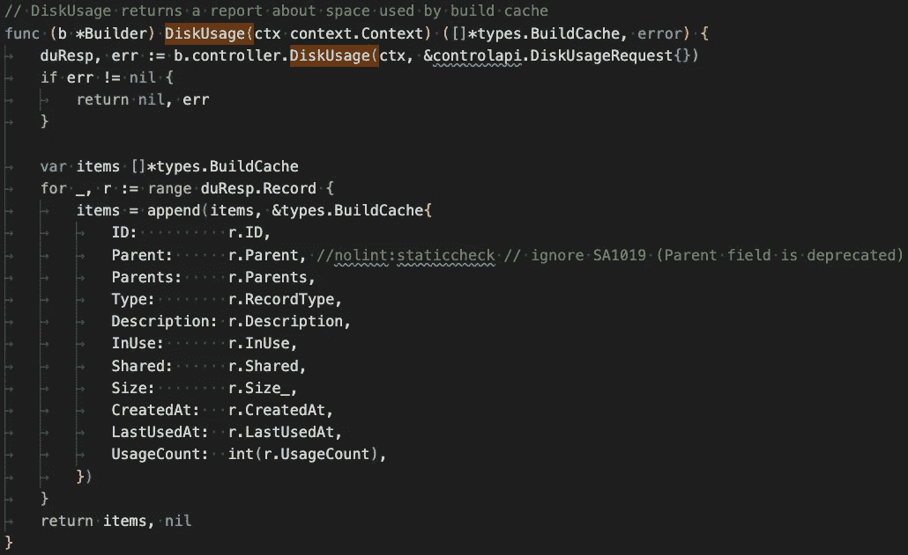

[Link to the source code](https://github.com/moby/moby/blob/4651269dc8466b5aa11507385ccd06883665d1e7/builder/builder-next/builder.go#L122)

# BuildKit 正在填满磁盘

磁盘正在被填满，因为`kubelet`(也称为工作节点的队长)和`dockerd`都没有清理 BuildKit 缓存。

在`kubelet`中，您可以配置两个标志来根据阈值清理 docker 图像:

*   `--image-gc-high-threshold=60`
*   `--image-gc-low-threshold=50`

但是这不会为您清理 BuildKit 缓存，默认情况下，BuildKit 垃圾收集是禁用的。
为此，`dockerd`不打算自动清理缓存。

# **如何配置 BuildKit 垃圾收集**

以下内容在您的 docker 守护进程上启用默认 GC:

```
"builder": {
    "gc": {
      "enabled": true
    }
  }
```

您必须将该零件添加到`/etc/docker/daemon.json`中，如下所示:

```
{
  ...
  "builder": {
    "gc": {
      "enabled": true,
    }
  },
  "features": {
    "buildkit": true
  }
}
```

*Ref:*[*https://docs . docker . com/build/building/cache/garbage-collection/*](https://docs.docker.com/build/building/cache/garbage-collection/)

如果你想了解更多先进的政策，我建议你去[看看这个即将发布的拉动式需求](https://github.com/docker/docs/pull/16032)。

对于高级策略示例:

```
{
  ...
  "builder": {
    "gc": {
          "enabled": true,
          "policy": [
                {"keepStorage": "20GB", "filter": ["unused-for=168h"]},
                {"keepStorage": "50GB", "all": true}
            ]
        }
}
```

上面的配置显示垃圾收集是打开的，并且它遵循两个规则。

1.  如果构建缓存超过 20GB，则删除超过 7 天(转换为天数)的每个未使用的构建缓存
2.  如果第一个规则不足以将缓存降低到 20GB，它将跳转到下一个规则，在那里它应该删除所有的构建缓存数据，直到保持存储达到 50GB。

对于每一个状态，一旦该条件意味着，它将终止，不会移动到另一个条件。

*Ref:g*[*arbagecollection _ config . MD*](https://github.com/docker/cli/pull/2864/files#diff-7b562fc47002a9f485902c4cc0ed6c0f288fe586ce9597b3c51c6e49a340c82d)

# 解决 Kubernetes/Laptop/VM 中的问题:

在您的 worker 节点中，您需要在`/etc/docker/daemon.json`中设置`builder.gc.enabled = true`，如下所示:

```
{
  "bridge": "xxx",
  "log-driver": "xxx",
  "log-opts": {
    "xxxx" : "xxx"
  },
  "builder": {
    "gc": {
          "enabled": true
  }
  "live-restore": true
}
```

不幸的是，这个参数**需要 docker 守护进程重启**，因为这里没有列出:

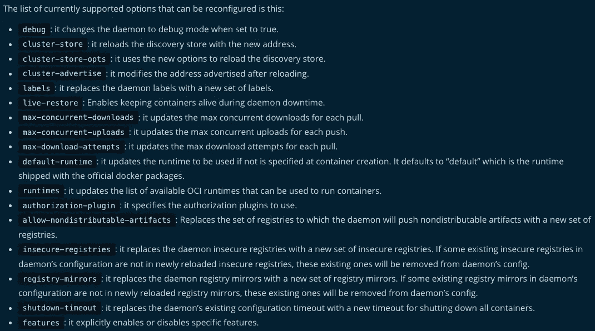

[*https://docs.docker.com/engine/reference/commandline/dockerd/#daemon-configuration-file*](https://docs.docker.com/engine/reference/commandline/dockerd/#daemon-configuration-file)

所以选择是:

*   重启 docker 守护进程，注意`live-restore`为真。
    这可能是一个颠覆性的解决方案，不是我的选择。
*   创建/覆盖 worker 节点映像，提供新的`/etc/docker/daemon.json`
    这里是一个 EKS 示例:[https://AWS . Amazon . com/premium support/knowledge-center/eks-worker-nodes-image-cache/](https://aws.amazon.com/premiumsupport/knowledge-center/eks-worker-nodes-image-cache/)

## 鉴于第二个选项需要一点时间，在文章的最后我提供了一个快速的解决方法来缓解这个问题。

你知道 docker 中垃圾收集器的周期性是哪个吗？

*   1 小时？
*   1 分钟？

# 让我们想出频率

为了找到垃圾收集器的频率，我启用了`dockerd`日志并设置了`defaultKeepStorage=1MB`(需要重启*docker 来抓取那些*):

```
{
  "builder": {
    "gc": {
      "enabled": true,
      "defaultKeepStorage": "1MB"
    }
  },
  "features": {
    "buildkit": true
  },
  "debug": true
}
```

我们用 docker 文件构建任何 docker 映像来创建大于 1 MB 的缓存。

```
$ docker buildx build .
$ docker system df
TYPE            TOTAL     ACTIVE    SIZE      RECLAIMABLE
Images          177       3         46.54GB   45.69GB (98%)
Containers      13        0         39.39MB   39.39MB (100%)
Local Volumes   0         0         0B        0B
Build Cache     661       0         65.23MB   65.23MB
```

在这个例子中，我有一个 65MB 的`Build Cache`。

我们根据操作系统打开存储在特定路径[https://docs.docker.com/config/daemon/#read-the-logs](https://docs.docker.com/config/daemon/#read-the-logs)中的`dockerd`日志，最多 1 分钟后，我们应该会看到下面的日志:

```
time="2022–11–23T21:37:05.XXXX" level=debug msg="gc cleaned up 65220352 bytes"
```

现在我们可以再次构建，并再次等待日志来计算差异:

```
time="2022-11-23T21:38:05.XXXX" level=debug msg="gc cleaned up 65220352 bytes
```

比较这两个日志，**垃圾收集每 1 分钟进行一次**。

## 但是为什么是 1 分钟？

下面是实现链接 GC 的控制器的 moby/docker 的源代码。
在第 75 行有一个方法`throttle.After(time.Minute, c.gc)`

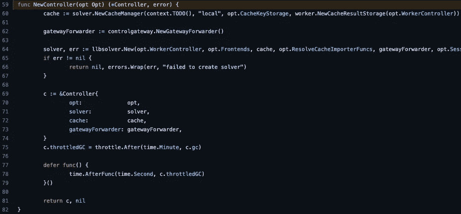

[Reference link](https://github.com/moby/moby/blob/23a27d4c8acb9743892e27087993cfdf2667dcc3/vendor/github.com/moby/buildkit/control/control.go#L59)

这个方法返回一个带有互斥和实际睡眠的函数。

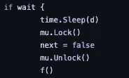

`c.throttledGC`由于 Defer (#77)而启动，Defer 用于延迟函数或语句的执行，直到附近的函数返回。

# —临时工作区—

解决方法是创建一个 cronJob 或 DaemonSet，在每个节点上运行`docker buildx prune`命令。

```
docker buildx prune --filter until=168h --verbose --force
```

上面的命令会清除超过 7 天的缓存，并输出每个删除的图层。

要在集群中运行上面的命令，这里的[http://bit.ly/3V43DVQ](http://bit.ly/3V43DVQ)有一个创建 DaemonSet 的舵图表。
每个完成`docker buildx prune`命令的 pod 都将永远处于睡眠状态，以避免 DaemonSet 控制器的无限重启。

想法是在 CI 中启用 DaemonSet 等待 1h —然后禁用它。这个临时的解决方法允许我在 1 小时内删除 10tb 的缓存。

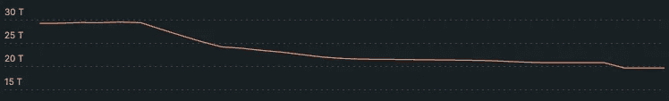

非常感谢任何鼓掌、关注或评论！


> [关注我](https://pie-r.medium.com/)和[订阅](https://pie-r.medium.com/subscribe)来获取这个系列和下一个系列的更新！


Photo by [Pablo Merchán Montes](https://unsplash.com/@pablomerchanm?utm_source=medium&utm_medium=referral) on [Unsplash](https://unsplash.com?utm_source=medium&utm_medium=referral)