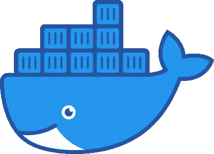

# 锁定你的依赖 Docker:这如何拯救我的旧项目反应原生 Android 构建

> 原文：<https://medium.com/geekculture/how-docker-saved-my-old-project-react-native-android-build-1edf3fe02f4b?source=collection_archive---------23----------------------->


Photo by [Kelly Sikkema](https://unsplash.com/@kellysikkema?utm_source=medium&utm_medium=referral) on [Unsplash](https://unsplash.com?utm_source=medium&utm_medium=referral)

> “编程是关于管理复杂性的:问题的复杂性，取决于机器的复杂性。由于这种复杂性，我们的大多数编程项目都失败了。”~ [布鲁斯·埃凯尔](https://www.goodreads.com/author/quotes/40523.Bruce_Eckel)

我们都有这样的噩梦，一个老项目因为某种原因从坟墓里回来了。

几天前，我接到一个从未支付过维护费用的客户的电话，要求“*做一个简单的编辑*”。这很简单，我只需要编辑一个正则表达式并触发一个构建。

在这个简单的编辑之后，等待的是 Android Studio 版本。一旦我按下那个按钮，我所有的问题就开始了。

上一次提交项目是在一年多以前，即 19 年 9 月。根据 npm 资料库，该项目有:20 个主要更新，12 个次要更新和 6 个补丁。

更新所有东西不是一个选项:客户不想为此付费。所以我必须想办法以最快的方式完成这个项目。

# 重建 919 环境

这是一个挑战，在不破坏现有设置的情况下重建我在 19 年 9 月的设置。



[Docker](https://www.docker.com/): Package Software into Standardized Units for Development, Shipment and Deployment

最近不到 3 个月，开始用 docker。我真的很想学习 Docker 和容器化是如何工作的，但是我没有足够的时间，所以我接受了“先使用，后学习”的理念。

我从来没有考虑过用它来做 Android 开发，但是…为什么不呢？

我不是一个码头工人，所以我开始在谷歌上搜索，我发现了一个有趣的 Github 库，来自 react-native-community。

我从存储库中抓取了`Dockerfile`并把它放在我的项目中。

这是一个起点。现在我需要调整:

*   我不需要巴克，所以我把它拿掉了。
*   我不需要 NDK，也扔掉了。
*   依赖版本不是我需要的，所以我改变了它们。

经过这些调整，我没有改变任何东西。

现在构建容器并运行它！

```
**docker build -t** *project-android-build .*
```

在我的环境中，WSL2 上有 4 个内核和 2048MB 内存，需要 816.3 秒。

```
**docker run** **--name=***running_container* **-v** *F:\Projects\my-app:/app* **-it** *project-android-build*
```

我有我的 919 环境！

# 是时候建造了

一切都准备好了。我需要安装与`yarn install`的依赖关系，并触发我的项目的构建

```
**cd** *android* **&& ./gradlew** *clean* && **cd ..** && **npx jetify** && **cd** *android* && **./gradlew** *bundleRelease*
```

如果你像我一样幸运，你最终会准备好你的包裹。

# 关于码头工人的最后一点思考


Photo by [Ugur Peker](https://unsplash.com/@ugurpeker?utm_source=medium&utm_medium=referral) on [Unsplash](https://unsplash.com?utm_source=medium&utm_medium=referral)

嗯，如果我必须用几句话来总结我的想法，我会说“*太棒了*”。

Docker 提供了一个简单的一次性开发环境，你可以在任何需要的时候使用它，最后，在需要的时候反复使用。这很神奇，因为即使这个项目暂时被搁置，下次我需要编辑另一个正则表达式时，我可以再次旋转容器并重新构建。如果每面镜子都保持不动，我甚至可以删除图像并重建它。这就是，在我看来，docker 的真正力量，设置你的环境，改变你的项目！