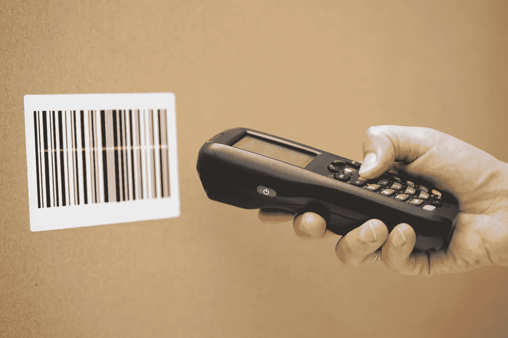
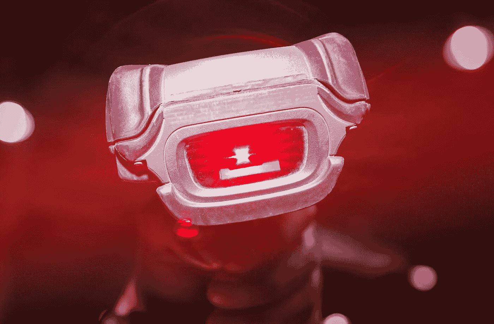

# 条形码扫描仪是如何工作的？

> 原文：<https://medium.com/geekculture/how-does-a-barcode-scanner-work-14d80ddaac7f?source=collection_archive---------17----------------------->

## 数字和线条背后的科学

A Barcode Scanner

你可能想不到，但我们每天都在使用条形码扫描仪。无论是在商店、活动、电影、旅行、广告，甚至是在图书馆。你可能不知道，但我们每天都在使用条形码扫描仪。下次你去杂货店使用自助结账时，看看条形码扫描仪。你有没有看到任何吸引你眼球或引起你兴趣的东西？

你可能认为条形码是一个由线条、空格和数字组成的盒子。你可能不知道，条形码扫描仪不仅仅是看上去那么简单。该系统跟踪库存和所需的其他重要信息。

【1974 年 6 月，箭牌公司的口香糖是第一个拥有条形码系统的产品。让我们来分解代码的含义。在代码的底部，你会注意到 12 个数字。前六个数字是制造商识别号。后面的五个数字是代表这个想法的项目编号。序列中的最后一个数字是校验位。这使得扫描器能够看到代码是否以正确的方式被扫描。

条形码扫描仪由三部分组成。这些是照明系统、解码器和传感器。扫描仪用红光“扫描”黑白线条；然后，这被发送到解码器。解码器解释信号，分解数字，并将其转换为文本。然后，文本被发送到保存所有销售信息的计算机软件。

有两种类型的条形码扫描仪，2D 和线性。我们看到的，也是最常见的，是线性码。你可能会忽略的另一种条形码是 QR 码。每条黑线之间的空间是存储数据的地方，它记录了售出的商品。

现在，如果你看看条形码扫描仪，你会注意到一些事情。

Up close of Bar Code Scanner

你在玻璃后面看到的镜子是精确的。这被称为第一表面镜。这是一个非常[的“高精度超平面镜，玻璃表面有涂层以确保精度。”简单的普通镜子效果不好，因为它有双重反射。反射面上的双重反射称为重影。](https://firstsurfacemirror.com/barcode-scanner/#:~:text=If%20you%20look%20closely%20behind,the%20glass%20to%20ensure%20accuracy.)

标准的镜子可以工作，尽管它会给顾客带来很多挫折。扫描仪不会读取代码，甚至根本不会读取。除非需要，制造商从不使用标准镜子。在高精度光学镜的帮助下，扫描仪可以从各个角度读取代码。这对于客户自己扫描条形码的满意度很有帮助。扫描仪拍下条形码的照片，然后发送出去。

然而，要扫描条形码，扫描仪需要看到整个代码。[“但是，由于交互环境中的空间有限，成像仪无法始终正确定位在条形码的正前方”。](https://firstsurfacemirror.com/barcode-scanner/#:~:text=If%20you%20look%20closely%20behind,the%20glass%20to%20ensure%20accuracy.)