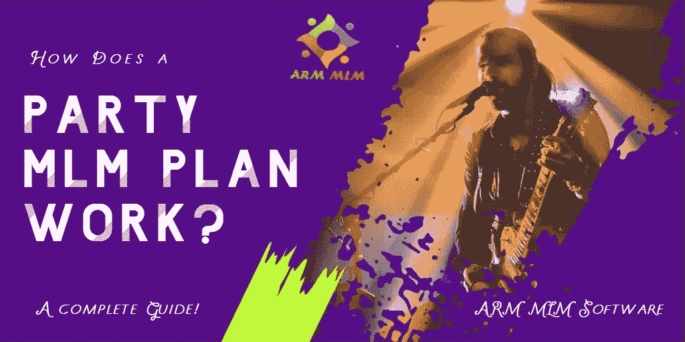

# 派对 MLM 计划是如何运作的？完全指南

> 原文：<https://medium.com/geekculture/how-does-a-party-mlm-plan-work-a-complete-guide-5ebfc1559add?source=collection_archive---------14----------------------->

许多以产品为导向的公司使用党 MLM 计划来促进或营销他们的产品。这项计划的主要重点是社交活动，如聚会、聚会、家庭聚会或任何聚会。在这样的活动中，公司的产品被展出以吸引更多的人和增加销售。

一般来说，[派对计划](https://en.wikipedia.org/wiki/Party_plan)与任何其他 MLM 计划一样有效，但这里的重点是通过更小的活动吸引更多人并促进销售。这种方案通常用于在有限的时间内推出带有优惠或特殊折扣的新产品。此外，该计划可用于向客户介绍现有产品及其用途或相对于其他产品的优势。

举办一个邀请客人的聚会是提高人们认识的有效方法。而且参加聚会的人都被认为是潜在客户，所以他们可以和你的公司建立更好的关系。他们甚至可以在聚会结束时购买产品。因此，它也有助于您的网络成员立即和方便地营销产品。

## **MLM 党的计划是如何运作的？**

[MLM 派对计划](https://www.armmlm.com/mlm-party-plan-software/)的运作始于公司寻找有影响力且社会地位良好的人。这些人被推荐担任公司的销售人员，提供销售产品的佣金。

网络营销公司为他们提供了举办派对所需的基本协助。有时，他们还可能提供促销材料，如带有品牌名称的帽子、小册子、徽章或其他印刷营销材料。组织者举办派对来推广公司的产品，并通过他们认识的社会关系邀请人们。一旦聚会进入高潮，他们可能会向聚集在一起的人推销产品。

一般聚会计划给你的产品销售收益更多，收益会更稳定。如果一个会员推荐了一个新人进入这个网络，他们将根据被雇佣者的销售额获得佣金。这就是所谓的直接赞助奖金。此外，该计划还有额外的奖金，如快速启动，排名，世代奖金等。党 MLM 计划软件可以有效地管理所有这些奖金，付款，佣金计算，以及其他方面。

在某种程度上， [ARM MLM 软件](https://www.armmlm.com/)有助于轻松参与和管理您的家庭聚会业务。我们的软件有许多最新的功能，如复制网站，多种支付方式，家谱视图，佣金&奖金计算器，以及进一步定制选项，以满足您的业务需求。因此，利用我们的党 MLM 计划软件会给你带来最好的结果。因此，我们请求您拥有一个免费的软件演示，以便更深入地了解我们软件的特性和功能。