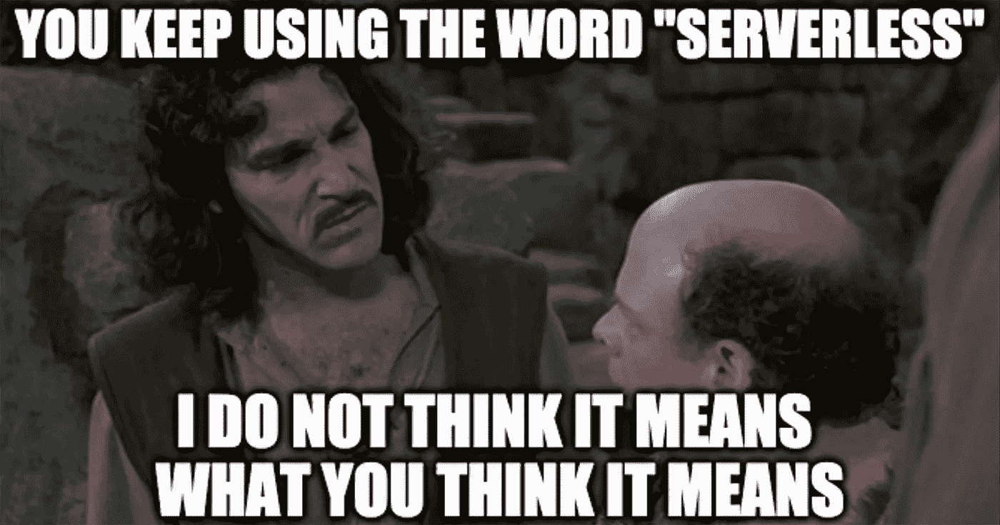
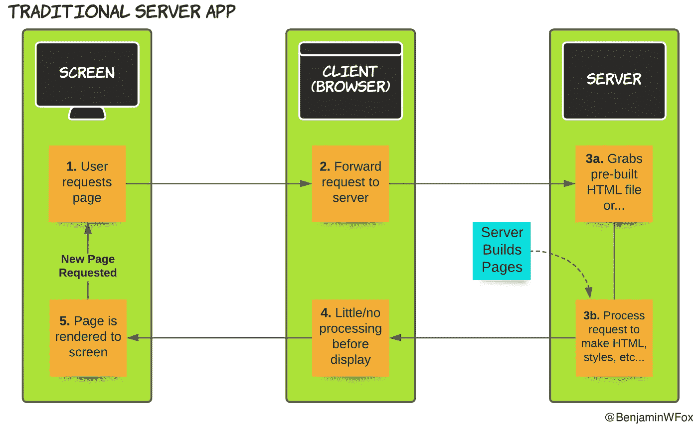
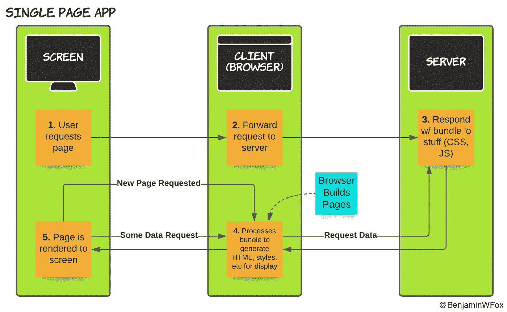
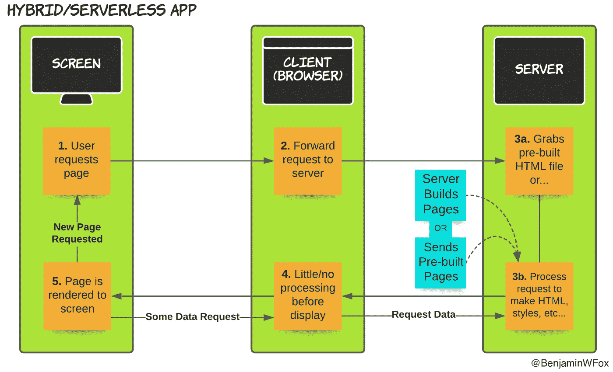

# 一个网站如何获得数据，为什么它很重要？

> 原文：<https://medium.com/geekculture/how-does-a-website-get-its-data-and-why-does-it-matter-212e94601c81?source=collection_archive---------63----------------------->

## 从服务器到无服务器再到无服务器，有什么区别？它如何影响客户端获取数据的方式？

# 服务器到无服务器到无服务器

一开始，有服务器。

服务器在野外漫游，等待客户端和它们的连接，当服务器收到连接时，它会猛扑过去。服务器喜欢这些连接，并紧紧抓住它们，保护它们。

于是传统的 web app 诞生了。

但是客户对服务器感到厌倦了，因为服务器是贫穷的，而且不知何故既粘人又古怪。

“把人脉还给我们！”委托人喊道，“按照我们的条件！”

“我们会在需要的时候停下来拿所有的东西，”客户们继续说，“这就是我们真正需要的。”

因此，单页应用程序诞生了。

但是客户变得孤独了。他们没有人可以倾诉秘密，也没有人可以帮忙重新摆放家具。

"也许我们可以做一个有利益关系的朋友？"客户们沉思着。

服务器对此很感兴趣。

于是 Next.js 诞生了。

# 现在说什么？

好吧，如果创世史诗故事没做到，那我们再用图片试试。

我已经做了很长时间的网站建设，但我最近还没有回顾过网站如何运作的基础知识。在过去的一年里，我一直在使用 Next.js，我想我应该写一些笔记来回忆一下我的网站过去是如何工作的，以及它们现在是如何工作的。

每个应用程序都有三个主要参与者:

*   屏幕(或其他界面)来驱动客户端上的输入
*   客户端(浏览器)与服务器交互以获取数据
*   服务器向客户端发送数据

客户端向服务器发送一些东西的请求。服务器将这些内容发送回客户端。客户对它做了一些事情，然后 ***嘭*** 就可以显示在屏幕上了。

每个步骤的具体情况会有所不同，这取决于您是在讨论传统的单页面应用程序，还是混合/无服务器(如 Next.js)应用程序。

让我们深入了解一下这些差异是什么。在所有情况下，前两步和最后一步是相同的:

1.  屏幕触发页面请求
2.  客户端向服务器发送页面请求
3.  ??
4.  ??
5.  利润！屏幕显示页面

因此，让我们具体看看每个应用程序的第 3 步和第 4 步！

# 传统服务器应用

3.服务器抓取或构建所请求的页面
4。客户端接收准备显示的页面

这个过程每次都会重复。请求新页面，完成新请求。在传统的应用程序中，服务器*和*通常是有状态的，因此可以记住关于请求之间的特定连接*的细节，并使用每个连接的存储信息来构建后续请求的页面。*

页面加载可能会很慢且未优化，并且所有转换的 UI 都会刷新。AJAX 提供了一些额外的灵活性，但是它实现起来很笨拙，而且很难让人感觉像是一等公民。

# 单页应用程序

3.服务器抓取一堆东西(像 JavaScript 和 CSS)
4。客户端接收&处理捆绑包以构建页面

从一开始，客户就抓住了*T4 需要的一切，不管是好是坏。对于页面*，不再需要向服务器发出请求*，这些页面都将从浏览器现在控制的包中构建。其他数据请求可能来自同一个服务器或其他 API。*

包可能会变得非常大，增加加载时间并降低用户体验。束分裂是这个问题的一个解决方案，但是它可能会变得复杂，并且即使实现了，也常常是很差的。

# 混合/无服务器(Next.js)应用程序

3.服务器抓取或构建请求的页面
4。客户端收到一个可能需要一些处理的页面

首先注意一下*无服务器*，这仅仅意味着服务器由第三方运行和维护。该术语通常与混合应用程序一起使用，但它只是指它们的部署方式。不管怎样，仍然有服务器参与其中。

混合应用程序就像传统应用程序一样，从服务器请求新的页面，但是有更多的灵活性，因此有“混合”的名称。获取新数据有一流的支持。服务器上可用的页面类型有明确定义的选项，可以完全是现成的，也可以在请求时生成。

与单页面应用程序一样，Next.js 等混合应用程序中的页面也可能有很大一部分需要在客户端处理。

这种灵活性伴随着复杂性的增加，与传统的应用程序不同，这个服务器不是*有状态的。除了传入请求中提供的内容之外，它对连接一无所知。*

# 最后

这些方法没有一种天生比其他方法更好或更差，不要让任何人告诉你其他的方法。都有利弊。对于一个特定的用例，一个可能比另一个更好，但是这将取决于项目特定的需求，所以一旦你确定了它们是什么，你就必须做你的功课。

你应该 ***明确*** 预先确定你的需求！😉

我第一次游说用 Next.js 建立一个网站时，一个月后我就退出了🤦‍♂️:很明显，实际上只有一个页面，页面的不同部分在特定时间会发生变化，所以我回到了单页应用程序！

# 进一步阅读

如果你刚刚开始使用 Next.js，可以看看我关于如何在 Next.js 中思考的想法。

如果你正在建立一个新项目，查看我的教程 [Next.js 设置测试，林挺，和绝对导入](https://benjaminwfox.com/blog/tech/nextjs-setup-config-testing-linting-absolute-imports)。

祝你好运，编程愉快！

# **有问题吗？评论？**

在 Twitter [@BenjaminWFox](https://twitter.com/BenjaminWFox) 上关注我，了解更多技术和领导力内容，并提出任何想法或问题！

*最初发表于*[*https://benjaminwfox.com*](https://benjaminwfox.com/blog/tech/how-does-website-get-data-why-it-matters)*。*