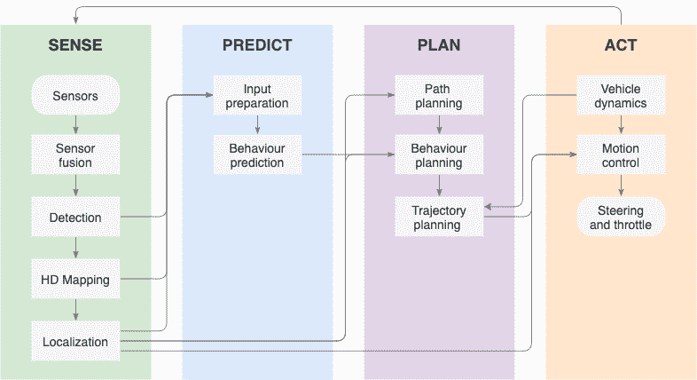
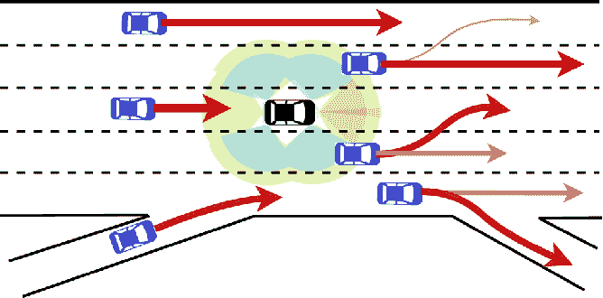
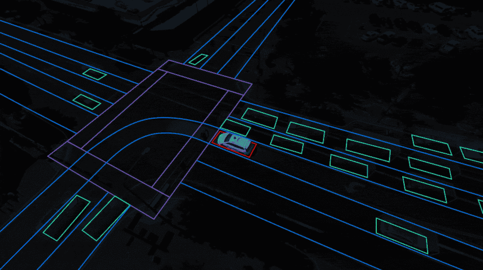
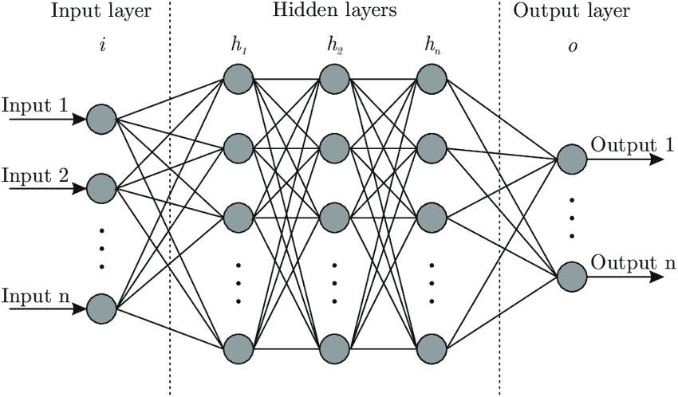

# 自动驾驶车辆如何自动驾驶？

> 原文：<https://medium.com/geekculture/how-does-an-autonomous-vehicle-drive-by-itself-5e1486b6f2d0?source=collection_archive---------33----------------------->

*第 2 部分，共 4 部分*

你有没有想过一辆自动驾驶汽车怎么可能完全自己驾驶？在这一系列文章中，我们深入探讨了自动驾驶汽车背后的技术组件，同时也提供了我们对该技术最新状态的看法。你想加入我们的无人驾驶之旅吗？请继续阅读，与我们一起了解自动驾驶以及使其成为可能的技术。

大多数自动驾驶汽车由四个高级组件构成:

1.  感知周围的事物
2.  预测接下来会发生什么
3.  计划做什么
4.  行动起来做这件事

Schematic representation of the modular components of Autonomous Driving

# 第二步:预测接下来会发生什么

一旦自动驾驶汽车识别出周围物体的类型和位置(在[第一篇文章](https://eduardo-uriarte.medium.com/how-does-an-autonomous-vehicle-drive-by-itself-45cc57d13616)中解释)，在决定汽车如何移动之前还有一个额外的步骤要做。为了让车辆在其环境中安全平稳地导航，它必须了解哪些物体可能会移动以及如何移动(例如，交通灯、标志或房子是静止的物体，而行人、骑自行车的人以及当然还有其他车辆是运动的物体)。

Representation of the surrounding environment of a vehicle in complex traffic conditions (credit: Nachiket Deo, M. Trivedi)

车辆需要预测移动物体的未来位置，以根据所有附近物体的预期行为来预测和调整车辆的运动。自动驾驶汽车使用三个主要信息来源来实现这一点:

*   物体过去的位置轨迹和速度
*   物体的周围环境
*   这些对象的性质和通常预期的行为

过去的驾驶轨迹通常被认为是描述未来驾驶行为的主要信息来源。但是仅仅使用过去的驾驶轨迹来预测未来是不够的，这就是为什么驾驶环境，以及每种类型的物体的性质和预期行为都要考虑在内。

这个复杂的问题最初是通过经典算法解决的，例如基于物理的模型和动作识别。但是，理解和预测环境中每个对象的行为的最常见和最佳方法是混合深度学习方法，该方法利用试探法(或先前已知的信息)和机器学习算法。

使用机器学习方法是有意义的，因为在预测例如附近的行人在不久的将来会如何行动时，需要考虑行为的无限可能组合。这取决于它的立场，它的当前速度，以及它在环境中的位置(例如，在人行横道或人行道上，与其他行人走得很近，等等。).因此，通常训练机器学习算法，考虑在现实生活场景中行驶的大量英里检索的多种情况和场景。

如果我们更深入地了解预测的实际工作原理，可以发现算法中有三个主要部分:

*   输入准备
*   输出表示
*   行为预测

# 输入准备

这表明了设置输入数据的不同可能性以及用作预测算法输入的复杂程度。如上所述，通常用于行为预测的信息有三个主要来源:(1)环境中物体的过去和当前位置、轨迹和速度，(2)这些物体在彼此之间的分布，以及(3)这些物体的性质和通常预期的行为。这三个轴最终建立了对车辆周围场景及其背景的整体理解(例如，包括车辆当前所在的车道、车辆数量、附近可能的十字路口、交通灯、行人交叉路口、标志等。

因此，行为预测算法可以选择使用数据的原始表示(即，原始传感器信息和周围物体的状态)或者考虑了所指示的三个轴的周围场景的简化编码表示。这种方法是 Waymo 选择的方法( [link](https://blog.waymo.com/2020/05/vectornet.html) )，它将各种信息源集成到一个简化的场景中，显示车辆周围每个对象的预期行为。

*Simplified environment representation used by Waymo (credit: Waymo)*

# 输出表示

**操纵意图** 操纵意图预测(也称为意图预测)表示估计车辆在不久的将来打算做什么操纵。例如，在高速公路驾驶中，车辆可能的操纵范围可以是向左变道(向左或向右)、保持在车道上或减速/加速。

**轨迹** 预测轨迹而不是意图或操纵提供了关于车辆未来行为的更精确的信息，同时估计起来也更复杂。通过使用来自先前类似情况的信息(即，给定车辆在道路上的位置和周围环境，车辆如何反应)，可以推断出一组可能的轨迹。对于预测运动的这种表征，有两种主要类型的预测器:

*   单峰轨迹预测器从一组可能的结果中提供最可能的预测轨迹作为输出。
*   为了避免概括复杂的情况，多模态轨迹预测器理解每个时间帧的多个预测轨迹，每个轨迹都给出了发生的概率。以这种方式，车辆旨在适应周围物体可能向不同方向移动的假设。

**占用地图** 这种方法旨在通过在鸟瞰网格地图中划分车辆周围的区域，并研究每个单元在不久的将来的占用演变，来简化道路和附近物体的表示。

# 行为预测

一旦决定了输入和输出表示，并且在输入已经被提取并处理成其选择的格式之后，神经网络就开始分析和预测车辆的环境以及周围物体在不久的将来预期如何移动。虽然可以使用不同的算法进行预测，但最常见和最准确的方法是在其复杂的算法中使用某种神经网络。

简而言之，一个简单的全连接神经网络是多层处理节点的复合。每个节点接收来自前一层节点的输入，并向下一层节点提供输出。给定先前已知的信息(即，来自某个输入的预期输出)来训练这样的网络，使得网络中的参数被更新，直到网络学习并且能够在给定新的输入信息的情况下提供准确的输出估计。

*Representation of a generic fully connected neural network*

将神经网络概念应用于手头的问题，行为预测，有一些特定类型的此类网络优于其他网络，并且主要由自动驾驶中的当前解决方案使用。下面将更详细地解释这些类型。

**全连接神经网络**
将神经网络应用于行为预测挑战的最简单方法是使用全连接网络。这样，车辆仅依赖于其环境的当前状态来预测未来的运动，因此不具有非常高的可靠性和准确性。尽管如此，这种方法的简单性使其适合与其他方法集成，从而实现混合稳健行为建模。

**卷积神经网络(CNN**)
在卷积神经网络中，隐藏层还集成了执行卷积的层，因此具有可学习权重的过滤器在输入(池层)上进行卷积。通过这种方式，并使用被称为二次采样的方法，在网络中每向前一步，输入的维度都被降低，同时将数据的关键特征保持在新的较低维度中。

虽然细胞神经网络最常用于计算机视觉，但它们也用于车辆行为预测，因为它们能够理解类似图像的数据(因此能够适应不同类型的对象或情况，如交通灯或行人或骑自行车者的手势)。

**递归神经网络(RNNs** )
最简单的 RNNs(也称为香草 RNN)通过在其架构中添加一个隐藏状态向量来理解顺序信息，该向量表示基于先前输入/输出的上下文。通过这种方式，RNN 能够处理来自当前时间范围的信息以及来自先前步骤的反馈。
由于顺序性在理解行为中的高度相关性，RNNs 在分析顺序数据方面的优势使其对于理解和预测轨迹和行为非常有用。长短期记忆(LSTM)和门控循环单元(GRU)是高度使用的 RNN 类型，因为它们克服了简单香草 RNN 的弱点，例如长期预测。

**图形神经网络(GNNs)**
图形神经网络通过使用车辆环境的图形结构简化表示作为网络的输入和输出，可以预测异质交通环境中人类驾驶的意图和常见场景。在这种情况下，车辆和它们周围环境之间的相互作用被放在一起形成场景的图形表示，这样图形的节点由环境中的物体形成，而边表示彼此之间的相互作用。

**强化学习(Q-learning)** 目前，Q-learning 和其他强化学习方法正被用于开发新的预测方法，尤其是在交叉路口或复杂的城市环境中。这些方法通常与行为规划相结合，不仅可以预测物体的运动，还可以预测我们的汽车应该如何做出反应。强化学习技术正在释放行为预测和规划方面的重大进展，并引发自动驾驶汽车的下一波成功浪潮。

**其他方法** 为了预测车辆在其环境中的未来行为，目前正在广泛研究各种其他最先进的方法。举几个例子，一些方法通过在混合神经网络中实现复杂的层结构来解决问题，例如混合 RNNs 和 CNN 的能力；而其他人则使用所谓的图形注意力网络(GAT)。

所有这些预测方法都依赖于真实世界环境和情况的大量数据集来训练和测试模型(Lyft 有一个很好的开放数据[预测数据集](https://self-driving.lyft.com/level5/prediction/))。然而，现实世界的数据集仅限于，例如，当时的天气状况和行人行为。如果数据集不够大或不够多样化，当遇到罕见的障碍时，可能会产生不可预测的结果。为了解决这一问题，数字环境下的模拟正在成为测试项目的一个关键部分，能够在道路里程之外训练和测试预测模型。

# **结论**

主要的 AV 玩家总体上同意，行为预测是自动驾驶中最相关和最困难的挑战之一，需要汽车驾驶大量的时间和里程，以便开发足够强大的预测算法，以及大量的投资和资源。不仅如此，试图理解行为的关键社会组成部分使得这一挑战可以说远比物体检测复杂。尽管如此，如果启用，准确的行为预测有能力将自动驾驶从有限和受约束的情况带到安全、平稳和完全自动的移动体验。

由于行为预测，自动驾驶汽车可以“预测”周围的世界会做什么，并做出反应。在此之前，车辆需要“感知”周围的世界，这是我们在本系列的第一篇文章[中讨论的主题。下一步是计划汽车应该如何移动，我们将在即将出版的本系列的第三篇文章中对此进行解释。敬请期待！](https://eduardo-uriarte.medium.com/how-does-an-autonomous-vehicle-drive-by-itself-45cc57d13616)

在他们的 LinkedIn 个人资料中找到更多关于本书作者的信息。

(自己)开车注意安全！