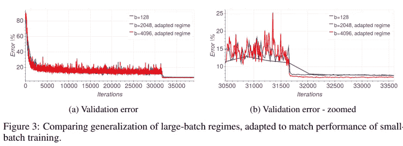
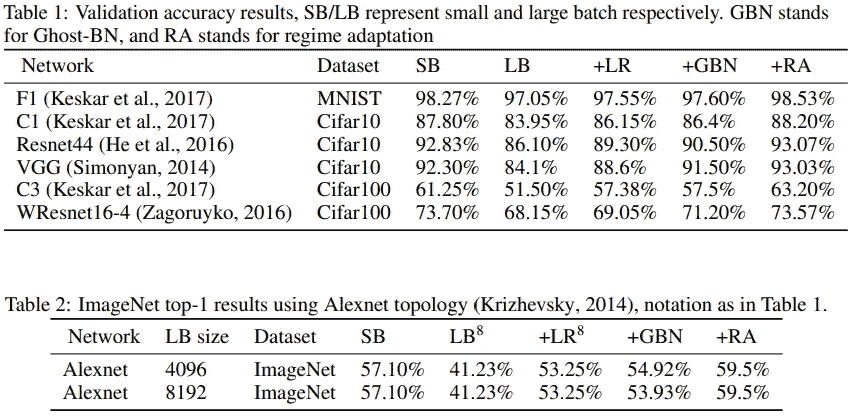
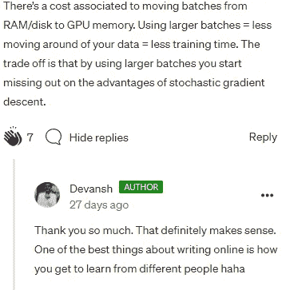

# 批量大小如何影响您的模型学习

> 原文：<https://medium.com/geekculture/how-does-batch-size-impact-your-model-learning-2dd34d9fb1fa?source=collection_archive---------0----------------------->

## 你关心的不同方面

为了帮助我了解您[请填写此调查(匿名)](https://forms.gle/7MfQmKhEhyBTMDUD7)

批量是机器学习中重要的超参数之一。超参数定义了在更新内部模型参数之前要处理的样本数。这是确保您的模型达到最佳性能的关键步骤之一。有很多关于不同的批量大小如何影响 ML 管道的研究，这并不奇怪。本文将总结一些关于批量大小和监督学习的相关研究。为了全面了解这个过程，我们将看看批量大小如何影响性能、培训成本和推广。

# 培训绩效/损失

我们关心的主要指标，批量大小与模型损失有着有趣的关系。用最简单的方法，让我们比较模型的性能，其中唯一变化的是批量大小。

Image is taken from: [https://medium.com/mini-distill/effect-of-batch-size-on-training-dynamics-21c14f7a716e#:~:text=Finding%3A%20large%20batch%20size%20means,all%20about%20the%20same%20size](/mini-distill/effect-of-batch-size-on-training-dynamics-21c14f7a716e#:~:text=Finding%3A%20large%20batch%20size%20means,all%20about%20the%20same%20size).

*   橙色曲线:批量 64
*   蓝色曲线:批量 256
*   紫色曲线:批量 1024

很明显，增加批量会降低性能。但事情没那么简单。当我们增加批量时，我们也应该调整学习速率来补偿这一点。当我们这样做时，我们得到以下结果

Notice both Batch Size and lr are increasing by 2 every time

这里所有的学习代理似乎有非常相似的结果。事实上，增加批量似乎减少了验证损失。但是，请记住，这些性能非常接近，有些偏差可能是由样本噪声引起的。所以对这个读的太深不是个好主意。

《不要降低学习速度，增加批量》的作者对此进行了补充。他们说，增加批量大小会给衰减学习率(行业标准)带来相同的性能。以下是报纸上的一段引文:

> 我们没有降低学习速度，而是在训练过程中增加批量。这种策略在测试集上实现了几乎相同的模型性能，具有相同数量的训练历元，但明显更少的参数更新。我们的建议不需要任何微调，因为我们遵循预先存在的培训计划；当学习速率下降一个因子α时，我们将批量增加一个因子α

他们在具有不同学习速率表的几种不同网络架构上展示了这一假设。这是一篇非常全面的论文，我建议您阅读这篇论文。他们想出了几个步骤，用于在不完全破坏性能的情况下大幅减少模型训练时间。

One of the many architectures they demonstrated their hypothesis on.

**结论:没有显著影响(只要学习率相应调整)。**

# 一般化

泛化指的是当给定新的、看不见的数据时，模型适应和执行的能力。这一点非常重要，因为您的训练数据不太可能具有与其应用相关的所有可能的数据分布。

This graph shows us the sharpness of Large Batch training increases as we train (loss gets lower). The sharpness of Small Batch learners falls. This is thought to cause the generalization gap.

这是我们看到明显差异的领域之一。对于大批量和小批量训练方法之间的泛化差异，已经有了很多研究。传统观点认为:*增加批量会降低学习者的概括能力*。论文的作者“关于深度学习的大批量训练:泛化差距和尖锐极小值”声称，这是因为大批量方法往往会导致模型陷入局部极小值。这个想法是，小批量更有可能推出局部极小值并找到全局极小值。如果你想进一步了解这篇论文，请阅读这篇文章[。](/geekculture/why-small-batch-sizes-lead-to-greater-generalization-in-deep-learning-a00a32251a4f)

然而，这并没有结束。“训练更长，推广更好:缩小大批量神经网络训练中的推广差距”是一篇试图解决推广差距 b/w 批量大小的论文。作者提出了一个简单的主张:

> 根据这一假设，我们进行了实验，以经验表明“泛化差距”源于相对较少的更新次数，而不是批量大小，并且可以通过调整所使用的训练制度来完全消除。

这里的 updates 指的是模型更新的次数。这是有道理的。如果模型使用两倍的批处理大小，则根据定义，它将使用一半的更新遍历数据集。他们的论文非常激动人心，原因很简单。如果我们能够在不增加更新次数的情况下消除泛化差距，我们就可以在看到出色性能的同时节省成本。

在这里，我们看到，一旦作者使用一个适应的训练制度，大批量的学习者赶上了小批量。他们在下表中总结了他们的结果:

We see that once RA is applied, LB methods even start to surpass SB learning

这显然是相当令人兴奋的。如果我们能够在不显著增加成本的情况下，消除/显著减少方法中的泛化差距，意义是巨大的。如果你想要这篇论文的细目分类，请在评论/文本中告诉我。我会把这篇论文添加到我的列表中。

**结论:较大批量→弱泛化。但这是可以解决的。**

# 费用

这就是大型批处理方法翻转脚本的地方。由于它们需要的更新数量较少，因此在计算能力方面往往领先。“Don't Decay LR…”的作者能够将他们的训练时间减少到 30 分钟，并将此作为他们优化的基础之一。

Machine Learning is as much engineering as it is computing

但这不是唯一有所不同的事情。这是我最近才知道的。[在我对现象级报告“将张量流扩展到每秒 3 亿次预测”](/geekculture/learnings-from-scaling-tensorflow-to-300-million-predictions-per-second-333d9488d0c1)的分析中，我对作者的陈述感到惊讶。作者说，通过增加批量，他们将培训成本减半。我问过这个，得到的回应是左派。这绝对有道理。特别是当涉及到大数据时(就像团队正在处理的那个)，这些因素真的会爆炸。

幸运的是，成本方面相对简单。

**结论:更大的批量→更少的更新+移动数据→更低的计算成本。**

# 关闭

我们看到批量大小在模型训练过程中极其重要。这就是为什么在大多数情况下，你会看到不同的批量训练的模型。很难马上知道最适合你需求的批量是多少。然而，有一些趋势你可以用来节省时间。如果成本是重要的，LB 可能是你的事情。当你关心概括并需要快速呕吐时，SB 可能会有所帮助。

请记住，在本文中，我们只关注监督学习。对于其他方法(比如对比学习)，情况会有所改变。对比学习似乎从更大的批次+更多的时代中受益匪浅。[要了解更多相关信息，请阅读此](/codex/learnings-from-simclr-a-framework-contrastive-learning-for-visual-representations-6c145a5d8e99)。ML 是一个复杂的领域，有很多东西需要学习。

If you’re preparing for interviews, this video will help you stand out

如果你喜欢这篇文章，看看我的其他内容。我定期在 Medium、YouTube、Twitter 和 Substack 上发帖(所有链接都在下面)。我专注于人工智能、机器学习、技术和软件开发。如果你正在准备编码面试，看看:[编码面试变得简单](https://codinginterviewsmadesimple.substack.com/)，我的免费每周时事通讯。如果你也有任何有趣的项目/想法，请随时联系我。

以下是我的 Venmo 和 Paypal 对我工作的金钱支持。任何数额都值得赞赏，并有很大帮助。捐赠解锁独家内容，如论文分析、特殊代码、咨询和模拟面试的折扣率:

https://account.venmo.com/u/FNU-Devansh

贝宝:[paypal.me/ISeeThings](https://www.paypal.com/paypalme/ISeeThings)

# 向我伸出手

如果那篇文章让你对联系我感兴趣，那么这一部分就是为你准备的。你可以在任何平台上联系我，或者查看我的其他内容。如果你想讨论家教，发短信给我。

机器学习重要更新的免费每周总结(赞助)-[https://lnkd.in/gCFTuivn](https://lnkd.in/gCFTuivn)

查看我在 Medium 上的其他文章。:【https://rb.gy/zn1aiu 

我的 YouTube:【https://rb.gy/88iwdd 

在 LinkedIn 上联系我。我们来连线:[https://rb.gy/m5ok2y](https://rb.gy/f7ltuj)

我的 insta gram:[https://rb.gy/gmvuy9](https://rb.gy/gmvuy9)

我的推特:[https://twitter.com/Machine01776819](https://twitter.com/Machine01776819)

如果你正在准备编码/技术面试:[https://codinginterviewsmadesimple.substack.com/](https://codinginterviewsmadesimple.substack.com/)

获得罗宾汉的免费股票:[https://join.robinhood.com/fnud75](https://www.youtube.com/redirect?redir_token=QUFFLUhqa0xDdC1jTW9nSU91WXlCSFhEVkJ0emJvN1FaUXxBQ3Jtc0ttWkRObUdfem1DZzIyZElfcXVZNGlVNE1xSUc4aVhSVkxBVGtHMWpmei1lWWVKNzlDUXVJR24ydHBtWG1PSXNaMlBMWDQycnlIVXNMYjJZWjdXcHNZQWNnaFBnQUhCV2dNVERQajFLTTVNMV9NVnA3UQ%3D%3D&q=https%3A%2F%2Fjoin.robinhood.com%2Ffnud75&v=WAYRtSj0ces&event=video_description)