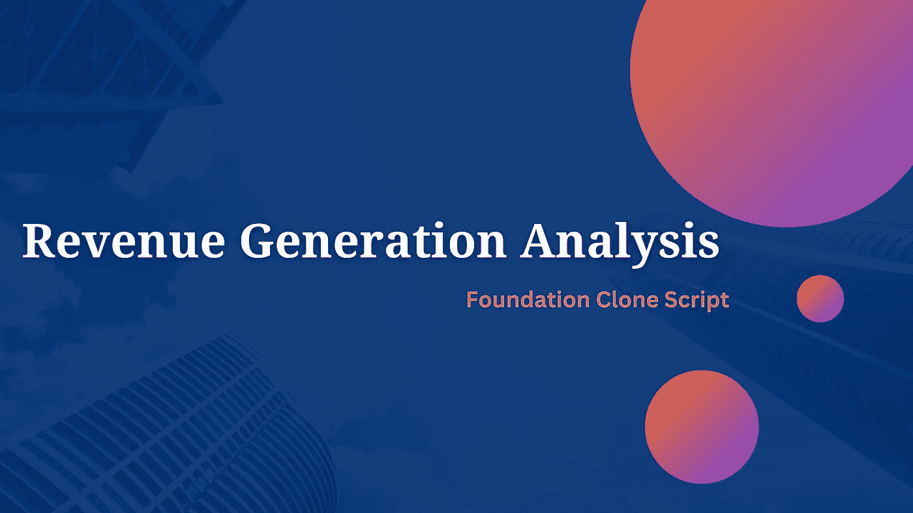

# 创建一个像 Foundation 这样的专属的、对社区友好的市场如何帮助你创造高收入？

> 原文：<https://medium.com/geekculture/how-does-creating-an-exclusive-and-community-friendly-marketplace-like-foundation-help-you-to-c3951bcb60dc?source=collection_archive---------12----------------------->

## 想知道基金会 nft 市场如何产生高收入吗？这个博客是给你的！

NFT 正在成为这个数字时代的新时代资产，比特币最近的下跌将加密爱好者的注意力转向了 NFT。NFT 或不可替代的代币是代表艺术、音乐、视频、游戏配件等数字资产的凭证。区块链网络支持这些不可替换的令牌，并且大多数 NFT 是在以太网中创建的。制造、拍卖和购买 NFT 的地方是 NFT 市场，一些最受欢迎的 NFT 市场是 OpenSea、Rarible、Foundation、SuperRare 和 Solanart。

其中，基金会是一个独特的 NFT 市场，因为它通过产生更多的收入为用户和市场所有者提供了更多的好处。基金会 NFT 市场允许其用户铸造 3D NFTs，这是基金会吸引人的方面之一，他们也有私人销售，推荐加入，以及真实和稀有的 NFT 收藏。这使它们在 NFT 的其他市场中脱颖而出。凭借这些功能，他们每个月都能获得高额收入，与他们平台的创新方面相比，收入模块似乎相当基础。

## **社区友好方面如何有利于基金会 NFT 市场的收入？**

基本上，几乎所有的活动都是在社区的基础上进行的，这样 NFT 市场就建立了忠实的创造者和购买者。通过这种方式，他们在密码业务领域获得了网络优势。这方面的社区建设和网络有助于他们的收入因素。收入的主要来源是一级和二级销售的费用，高达 5%，这笔费用归基金会市场所有者所有。因此，如果一个 NFT 在他们的平台上交易，基金会市场会从每笔交易(一手和二手交易)中收取一定比例的费用，其余部分归创作者所有。在这里，用户和管理员都受益。

基金会还收取一定数量的上市费用，基本上在基金会，如果一个人需要支付一定的费用来列出他们的 NFT，铸造费包括在基金会 NFT 市场的天然气费。大部分收入来自基金会的交易费，这个市场只允许推荐人列出他们的 NFT，使其成为一个非常独家的买卖 NFT 的地方。这影响了许多企业家去创建一个类似于基金会的 NFT 市场，而创建一个类似于基金会的 NFT 市场最聪明的方法就是使用基金会的克隆脚本。

既然你已经知道如何收获 NFT 市场的商业模块，让我们进入如何发展像基金会这样的 NFT 市场的主题。

## 如何创建一个像 Foundation 这样的 NFT 市场？

像基金会这样的 NFT 市场发展最有效的方式就是把[**基金会克隆脚本**](https://www.firebeetechnoservices.com/foundation-clone-script?utm_source=FouCS&utm_medium=geek&utm_campaign=joy) 弄到手。它是预先开发的软件，是原始 Foundation marketplace 中所有可用功能和安全选项的完整包。它的每一个边缘都是可定制的，允许你根据自己的意愿添加或删除功能，这样你就可以建立一个个性化的 NFT 市场。因为它是一个预建的，你可以在 10 天内启动它，它不会花更多的时间。它集成了许多创收功能。让我向您介绍一下基础克隆脚本的特性和安全选项。

## **与基础克隆脚本集成的特性**

*   店面
*   多钱包集成
*   资产分类
*   NFT 铸币厂
*   高级搜索选项
*   不同类型的资产
*   资产列表
*   分析学
*   性能监控器

## **基础克隆脚本的安全选项**

*   多步认证
*   支持 SSL 协议
*   端到端加密
*   传入和传出 API 安全性
*   对数字艺术的全面保护
*   安全交易
*   安全加密钱包集成

是的，基础克隆脚本集成了上述所有功能和安全选项。不仅如此，使用基础克隆脚本来构建你的 NFT 市场还有令人兴奋的好处。

## **基础克隆脚本的优势**

1.  使用克隆脚本，建立类似于基金会的 NFT 市场需要更少的时间。
2.  可定制，取决于企业家的商业偏好和计划。
3.  Foundation clone 脚本包含了激动人心的特性和易于使用的界面。
4.  由于增加了安全措施，基础克隆脚本的安全性显著增强。
5.  现成的特性使部署变得简单，并且成品是无错误的。

## **从哪里获取基础克隆脚本？**

基础克隆脚本可以从市场上的 NFT 市场克隆脚本提供商处获得。在选择合适的克隆脚本提供商之前，您需要确保该提供商在该领域有多年的经验，包括他们的评级、评论、服务成本和投资组合。如果您根据这些标准选择克隆脚本提供商，您将能够为您的 NFT 市场业务挑选出 [**最佳基础克隆脚本提供商**](https://www.firebeetechnoservices.com/foundation-clone-script?utm_source=FouCS&utm_medium=geek&utm_campaign=joy) 。这是正确的时间来开始你的 NFT 市场业务，如基金会，因此做一些分析，选择一个合适的克隆脚本提供商，沟通你的要求，立即开始你的业务。