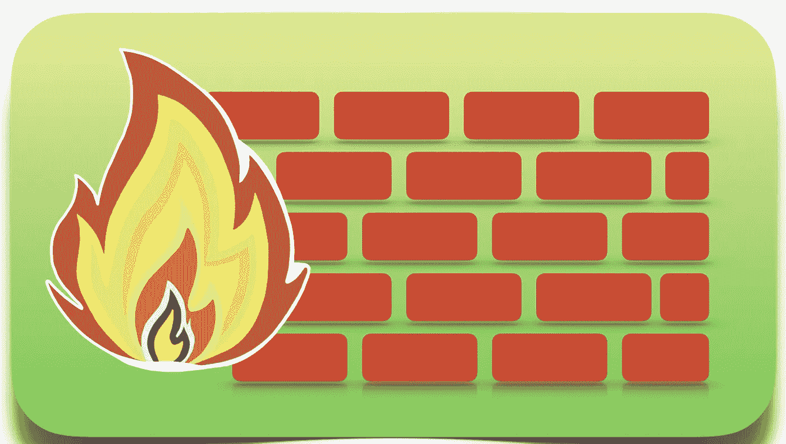

# 包过滤和 IPTables 是如何工作的？

> 原文：<https://medium.com/geekculture/how-does-packet-filtering-and-iptables-work-321ccc56fb40?source=collection_archive---------1----------------------->

## 了解 IP 包过滤的基础知识🔥

Firewall image — sketch by Karthik

*注意* : *这篇文章将解释 IPTables、Chains 和 Rules 是如何协同工作的。如果你是网络领域的人或者了解网络的人，那么你可能会发现这篇文章非常基础。*

# **什么是数据包**