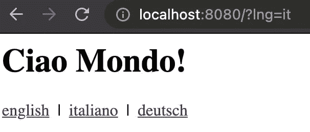
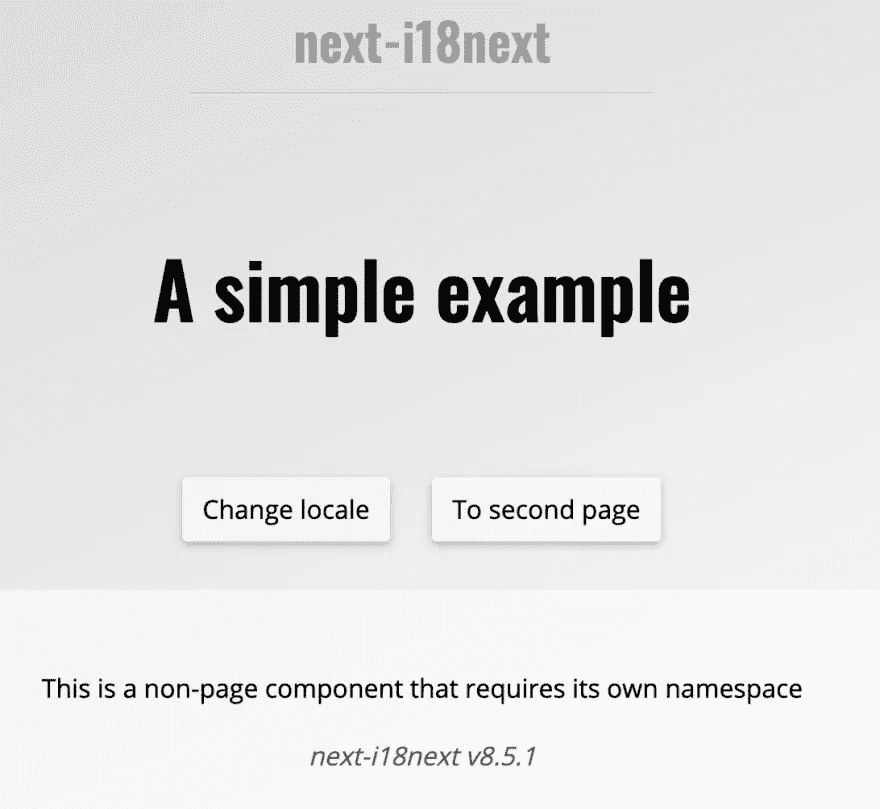

# 服务器端国际化(i18n)是什么样子的？

> 原文：<https://medium.com/geekculture/how-does-server-side-internationalization-i18n-look-like-6ddbd15147b7?source=collection_archive---------18----------------------->


你可能已经知道如何正确地国际化一个客户端应用程序，就像在这个基于 [React 的教程](https://dev.to/adrai/how-to-properly-internationalize-a-react-application-using-i18next-3hdb)，这个基于 [Angular 的教程](https://dev.to/adrai/unleash-the-full-power-of-angular-i18next-4b7o)或者这个基于 [Vue 的教程](https://dev.to/adrai/give-vue-i18n-more-superpowers-12la)中描述的那样。

在这篇博文中，我们将阐明服务器端。

> 为什么我需要在应用程序的后端处理 i18n？

想象一下所有面向用户的内容不直接呈现在您的浏览器中…

*   例如，您正在构建命令行界面(CLI)？
*   你在发邮件吗？
*   或者你用的是服务器端渲染(SSR)？
*   等等。

# 让我们检查一下…

我们将展示一些使用 [i18next](https://www.i18next.com/) 作为 i18n 框架的例子。如果你想知道我们为什么建议 i18next，看看这一页。

# 命令行界面(CLI)

让我们从简单的开始:一个非常小的 CLI 应用程序。对于这个例子，让我们使用最初由 [TJ Holowaychuk](https://twitter.com/tjholowaychuk) 创建的[指挥官](https://github.com/tj/commander.js)。
我们正在定义一个带有可选语言和名称参数的`sayhi`命令，该命令应该以适当的语言回应一个称呼。

```
#!/usr/bin/env nodeconst program = require('commander')program
  .command('sayhi')
  .alias('s')
  .option('-l, --language <lng>', 'by default the system language is used')
  .option('-n, --name <name>', 'your name')
  .action((options) => {
    // options.language => optional language
    // options.name => optional name
    // TODO: log the salutation to the console...
  })
  .on('--help', () => {
    console.log('  Examples:')
    console.log()
    console.log('    $ mycli sayhi')
    console.log('    $ mycli sayhi --language de')
    console.log('    $ mycli sayhi --language de --name John')
    console.log()
  })program.parse(process.argv)if (!process.argv.slice(2).length) {
  program.outputHelp()
}
```

好了，现在让我们创建一个新的`i18n.js`文件，并相应地设置 i18next:

```
const i18next = require('i18next')// if no language parameter is passed, let's try to use the node.js system's locale
const systemLocale = Intl.DateTimeFormat().resolvedOptions().localei18next
  .init({
    fallbackLng: 'en',
    resources: {
      en: {
        translation: require('./locales/en/translation.json')
      },
      de: {
        translation: require('./locales/de/translation.json')
      }
    }
  })module.exports = (lng) => i18next.getFixedT(lng || systemLocale)
```

以及我们的翻译资源:

```
// locales/en/translations.json
{
  "salutation": "Hello World!",
  "salutationWithName": "Hello {{name}}!"
}// locales/de/translations.json
{
  "salutation": "Hallo Welt!",
  "salutationWithName": "Hallo {{name}}!"
}
```

现在我们可以用`i18n.js`那样导出:

```
#!/usr/bin/env nodeconst program = require('commander')
const i18n = require('../i18n.js')program
  .command('sayhi')
  .alias('s')
  .option('-l, --language <lng>', 'by default the system language is used')
  .option('-n, --name <name>', 'your name')
  .action((options) => {
    const t = i18n(options.language)
    if (options.name) {
      console.log(t('salutationWithName', { name: options.name }))
    } else {
      console.log(t('salutation'))
    }
  })
  .on('--help', () => {
    console.log('  Examples:')
    console.log()
    console.log('    $ mycli sayhi')
    console.log('    $ mycli sayhi --language de')
    console.log('    $ mycli sayhi --language de --name John')
    console.log()
  })program.parse(process.argv)if (!process.argv.slice(2).length) {
  program.outputHelp()
}
```

好吧，结果呢？

```
# if we execute the cli command without any parameters...
mycli sayhi
# result: Hello World!# if we execute the cli command with a language parameter...
mycli sayhi --language de
# result: Hallo Welt!# if we execute the cli command with a language parameter and a name parameter...
mycli sayhi --language de --name John
# result: Hallo John!
```

很容易，不是吗？

如果您没有将 CLI 应用程序捆绑在单个可执行文件中，例如通过使用 [pkg](https://github.com/vercel/pkg) ，您也可以使用 [i18next-fs-backend](https://github.com/i18next/i18next-fs-backend) 来动态加载您的翻译，例如:

```
const i18next = require('i18next')
const Backend = require('i18next-fs-backend')
const { join } = require('path')
const { readdirSync, lstatSync } = require('fs')// if no language parameter is passed, let's try to use the node.js system's locale
const systemLocale = Intl.DateTimeFormat().resolvedOptions().localeconst localesFolder = join(__dirname, './locales')i18next
  .use(Backend)
  .init({
    initImmediate: false, // setting initImediate to false, will load the resources synchronously
    fallbackLng: 'en',
    preload: readdirSync(localesFolder).filter((fileName) => {
      const joinedPath = join(localesFolder, fileName)
      return lstatSync(joinedPath).isDirectory()
    }),
    backend: {
      loadPath: join(localesFolder, '{{lng}}/{{ns}}.json')
    }
  })module.exports = (lng) => i18next.getFixedT(lng || systemLocale)
```

*🧑‍💻一个代码示例可以在* [*这里找到*](https://github.com/i18next/i18next-cli-app-example) *。*

# 一个可能的下一步…

下一步可能是使翻译管理专业化。
这意味着翻译将在翻译管理系统(TMS)中被“管理”(添加新语言、新翻译等)，就像 [locize](https://www.locize.com/) 一样，并与您的代码同步。要了解这可能是什么样子，请查看本教程中的 [**步骤 1** 。](https://github.com/locize/react-tutorial#step-1---keep-existing-code-setup-but-synchronize-with-locize)

# 生成电子邮件

另一个需要国际化的典型服务器端用例是生成电子邮件。

为了实现这个目标，通常需要将一些原始数据转换成 html 内容(或文本),以用户喜欢的语言显示。

在这个例子中，我们将使用 [pug](https://pugjs.org/) (以前称为“Jade”，最初也是由 [TJ Holowaychuk](https://twitter.com/tjholowaychuk) 创建的)来定义一些应该用电子邮件中所需的数据填充的模板，并使用 [mjml](https://mjml.io/) 来实际设计电子邮件内容。

让我们创建一个新的`mail.js`文件来完成这个任务。

```
import pug from 'pug'
import mjml2html from 'mjml'export default (data) => {
  // first let's compile and render the mail template that will include the data needed to show in the mail content
  const mjml = pug.renderFile('./mailTemplate.pug', data) // then transform the mjml syntax to normal html
  const { html, errors } = mjml2html(mjml)
  if (errors && errors.length > 0) throw new Error(errors[0].message) // and return the html, if there where no errors
  return html
}
```

`mailTemplate.pug`可能看起来像这样:

```
mjml
  mj-body(background-color='#F4F4F4' color='#55575d' font-family='Arial, sans-serif')
    mj-section(background-color='#024b3f' background-repeat='repeat' padding='20px 0' text-align='center' vertical-align='top')
      mj-column
        mj-image(align='center' padding='10px 25px' src='https://raw.githubusercontent.com/i18next/i18next/master/assets/i18next-ecosystem.jpg')
    mj-section(background-color='#ffffff' background-repeat='repeat' padding='20px 0' text-align='center' vertical-align='top')
      mj-column
    mj-section(background-color='#ffffff' background-repeat='repeat' background-size='auto' padding='20px 0px 20px 0px' text-align='center' vertical-align='top')
      mj-column
        mj-text(align='center' color='#55575d' font-family='Arial, sans-serif' font-size='20px' line-height='28px' padding='0px 25px 0px 25px')
          span=t('greeting', { name: name || 'there' })
          br
          br
        mj-text(align='center' color='#55575d' font-family='Arial, sans-serif' font-size='16px' line-height='28px' padding='0px 25px 0px 25px')
          =t('text')
    mj-section(background-color='#024b3f' background-repeat='repeat' padding='20px 0' text-align='center' vertical-align='top')
      mj-column
        mj-text(align='center' color='#ffffff' font-family='Arial, sans-serif' font-size='13px' line-height='22px' padding='10px 25px')
          =t('ending')&nbsp;
          a(style='color:#ffffff' href='https://www.i18next.com')
            b [www.i18next.com](http://www.i18next.com)
```

现在让我们定义一些翻译…

```
// locales/en/translations.json
{
  "greeting": "Hi {{name}}!",
  "text": "You were invited to try i18next.",
  "ending": "Internationalized with"
}// locales/de/translations.json
{
  "greeting": "Hallo {{name}}!",
  "text": "Du bist eingeladen worden i18next auszuprobieren.",
  "ending": "Internationalisiert mit"
}
```

…并在一个`i18n.js`文件中使用它们:

```
import { dirname, join } from 'path'
import { readdirSync, lstatSync } from 'fs'
import { fileURLToPath } from 'url'
import i18next from 'i18next'
import Backend from 'i18next-fs-backend'const __dirname = dirname(fileURLToPath(import.meta.url))
const localesFolder = join(__dirname, './locales')i18next
  .use(Backend) // you can also use any other i18next backend, like i18next-http-backend or i18next-locize-backend
  .init({
    // debug: true,
    initImmediate: false, // setting initImediate to false, will load the resources synchronously
    fallbackLng: 'en',
    preload: readdirSync(localesFolder).filter((fileName) => {
      const joinedPath = join(localesFolder, fileName)
      return lstatSync(joinedPath).isDirectory()
    }),
    backend: {
      loadPath: join(localesFolder, '{{lng}}/{{ns}}.json')
    }
  })export default i18next
```

所以最后，以上都可以这样用:

```
import mail from './mail.js'import i18next from './i18n.js'const html = mail({
  t: i18next.t,
  name: 'John'
})
// that html now can be sent via some mail provider...
```

这是生成的 html 的样子:


*🧑‍💻一个代码示例可以在* [*这里找到*](https://github.com/i18next/i18next-fs-backend/blob/master/example/fastify/app.js#L14-L19) *。*

# 服务器端渲染(SSR)

我们将尝试两个不同的 SSR 例子，一个是使用 Fastify 和 pug 的经典例子，另一个是使用 Next.js 的流行例子。

# 用泥巴例子固定

对于这个例子，我们将使用我最喜欢的 http 框架 [Fastify](https://www.fastify.io/) (由 [Matteo Collina](https://twitter.com/matteocollina) 和 [Tomas Della Vedova](https://twitter.com/delvedor) 创建)，但是任何其他框架也可以。

这次我们将使用一个不同的 i18next 模块，[i18 next-http-中间件](https://github.com/i18next/i18next-http-middleware)。
可以用于所有 Node.js web 框架，像 [express](https://expressjs.com/) 或者 [Fastify](https://www.fastify.io/) ，也可以用于 Deno web 框架，像 [abc](https://github.com/zhmushan/abc) 或者 [ServestJS](https://github.com/keroxp/servest) 。

正如已经说过的，这里我们将使用我的最爱 [Fastify](https://www.fastify.io/) 😉。

让我们再次从`i18n.js`文件开始:

```
import { dirname, join } from 'path'
import { readdirSync, lstatSync } from 'fs'
import { fileURLToPath } from 'url'
import i18next from 'i18next'
import Backend from 'i18next-fs-backend'
import i18nextMiddleware from 'i18next-http-middleware'const __dirname = dirname(fileURLToPath(import.meta.url))
const localesFolder = join(__dirname, '../locales')i18next
  .use(i18nextMiddleware.LanguageDetector) // the language detector, will automatically detect the users language, by some criteria... like the query parameter ?lng=en or http header, etc...
  .use(Backend) // you can also use any other i18next backend, like i18next-http-backend or i18next-locize-backend
  .init({
    initImmediate: false, // setting initImediate to false, will load the resources synchronously
    fallbackLng: 'en',
    preload: readdirSync(localesFolder).filter((fileName) => {
      const joinedPath = join(localesFolder, fileName)
      return lstatSync(joinedPath).isDirectory()
    }),
    backend: {
      loadPath: join(localesFolder, '{{lng}}/{{ns}}.json')
    }
  })export { i18next, i18nextPlugin: i18nextMiddleware.plugin }
```

我们的翻译资源…

```
// locales/en/translations.json
{
  "home": {
    "title": "Hello World!"
  },
  "server": {
    "started": "Server is listening on port {{port}}."
  }
}// locales/de/translations.json
{
  "home": {
    "title": "Hallo Welt!"
  },
  "server": {
    "started": "Der server lauscht auf dem Port {{port}}."
  }
}// locales/it/translations.json
{
  "home": {
    "title": "Ciao Mondo!"
  },
  "server": {
    "started": "Il server sta aspettando sul port {{port}}."
  }
}
```

一个简单的 pug 模板:

```
html
  head
    title i18next - fastify with pug
  body
    h1=t('home.title')
    div
      a(href="/?lng=en") english
      | &nbsp; | &nbsp;
      a(href="/?lng=it") italiano
      | &nbsp; | &nbsp;
      a(href="/?lng=de") deutsch
```

我们的“主”文件`app.js`:

```
import fastify from 'fastify'
import pov from 'point-of-view'
import pug from 'pug'
import { i18next, i18nextPlugin } from './lib/i18n.js'const port = process.env.PORT || 8080const app = fastify()
app.register(pov, { engine: { pug } })
app.register(i18nextPlugin, { i18next })app.get('/raw', (request, reply) => {
  reply.send(request.t('home.title'))
})app.get('/', (request, reply) => {
  reply.view('/views/index.pug')
})app.listen(port, (err) => {
  if (err) return console.error(err)
  // if you like you can also internationalize your log statements ;-)
  console.log(i18next.t('server.started', { port }))
  console.log(i18next.t('server.started', { port, lng: 'de' }))
  console.log(i18next.t('server.started', { port, lng: 'it' }))
})
```

现在启动应用程序，检查你看到的是什么语言…



如果您检查控制台输出，您还会看到类似这样的内容:

```
node app.js
# Server is listening on port 8080.
# Der server lauscht auf dem Port 8080.
# Il server sta aspettando sul port 8080.
```

*是的，如果你愿意，你也可以将你的日志语句国际化😁*

*🧑‍💻一个代码示例可以在* [*这里找到*](https://github.com/i18next/i18next-fs-backend/tree/master/example/fastify) *。*

# 一个可能的下一步…

你希望在翻译管理系统(TMS)中管理你的翻译吗，就像 [locize](https://www.locize.com/) 一样？

只需使用这个命令行界面来同步翻译和你的代码。要了解这看起来如何，请查看本教程中的 [**步骤 1** 。](https://github.com/locize/react-tutorial#step-1---keep-existing-code-setup-but-synchronize-with-locize)

或者，使用 [i18next-locize-backend](https://github.com/locize/i18next-locize-backend) 代替 [i18next-fs-backend](https://github.com/i18next/i18next-fs-backend) 。
如果你在无服务器环境下运行你的代码，确保你[先阅读这个建议](https://github.com/locize/i18next-locize-backend#important-advice-for-serverless-environments---aws-lambda-google-cloud-functions-azure-functions-etc)！

**顺便说一句:你知道吗，你可以轻松地调整你的 Fastify 应用程序，使其在**[**AWS Lambda**](https://aws.amazon.com/lambda/)**和本地使用。**

这可以在 [aws-lambda-fastify](https://github.com/fastify/aws-lambda-fastify) 的帮助下实现。
只需创建一个新的`lambda.js`，导入您修改过的`app.js`文件:

```
// lambda.js
import awsLambdaFastify from 'aws-lambda-fastify'
import app from './app.js'
export const handler = awsLambdaFastify(app)
```

确保您的 Fastify 应用程序已导出… ( `export default app` )
，并且如果没有在 AWS Lambda 中执行，则只开始监听一个端口(`import.meta.url === 'file://${process.argv[1]}'`或`require.main === module`用于 CommonJS)

```
// app.js
import fastify from 'fastify'
import pov from 'point-of-view'
import pug from 'pug'
import { i18next, i18nextPlugin } from './lib/i18n.js'const port = process.env.PORT || 8080const app = fastify()
app.register(pov, { engine: { pug } })
app.register(i18nextPlugin, { i18next })app.get('/raw', (request, reply) => {
  reply.send(request.t('home.title'))
})app.get('/', (request, reply) => {
  reply.view('/views/index.pug')
})if (import.meta.url === `file://${process.argv[1]}`) {
  // called directly (node app.js)
  app.listen(port, (err) => {
    if (err) return console.error(err)
    console.log(i18next.t('server.started', { port }))
    console.log(i18next.t('server.started', { port, lng: 'de' }))
    console.log(i18next.t('server.started', { port, lng: 'it' }))
  })
} else {
  // imported as a module, i.e. when executed in AWS Lambda
}export default app
```

**😎很酷，对吧？**

# Next.js 示例

现在到了 [Next.js](https://nextjs.org/) …

谈到 Next.js 应用的国际化，最受欢迎的选择之一是 [next-i18next](https://github.com/isaachinman/next-i18next) 。它基于 [react-i18next](https://react.i18next.com/) ，默认情况下 [next-i18next](https://github.com/isaachinman/next-i18next) 的用户只需将他们的翻译内容包含为 JSON 文件，不必担心太多其他问题。

在这里，你会找到一个简单的例子。

你只需要一个为`next-i18next`提供配置的`next-i18next.config.js`文件，并用`appWithTranslation`函数包装你的应用程序，它允许通过钩子在你的组件中使用`t`(翻译)函数。

```
// _app.js
import { appWithTranslation } from 'next-i18next'const MyApp = ({ Component, pageProps }) => <Component {...pageProps} />export default appWithTranslation(MyApp)// index.js
import { useTranslation } from 'next-i18next'
import { serverSideTranslations } from 'next-i18next/serverSideTranslations'
// This is an async function that you need to include on your page-level components, via either getStaticProps or getServerSideProps (depending on your use case)const Homepage = () => {
  const { t } = useTranslation('common') return (
    <>
      <main>
        <p>
          {t('description')}
        </p>
      </main>
    </>
  )
}export const getStaticProps = async ({ locale }) => ({
  props: {
    ...await serverSideTranslations(locale, ['common']),
    // Will be passed to the page component as props
  },
})export default Homepage
```

默认情况下，`next-i18next`希望您的翻译按如下方式组织:

```
.
└── public
    └── locales
        ├── en
        |   └── common.json
        └── de
            └── common.json
```

在[这里](https://next-i18next.com/)可以找到这样一个应用部署后的样子。



这个看起来真的很简单，对吧？

# 管理代码之外的翻译

为了最好地管理翻译，有两种不同的方法:

# 可能性 1:现场翻译下载

当使用 [locize](https://www.locize.com/) 时，您可以配置您的 next-i18next 项目来加载来自 [CDN](https://docs.locize.com/whats-inside/cdn-content-delivery-network) 的翻译(在服务器端和客户端)。

这样的配置可能如下所示:

```
// next-i18next.config.js
module.exports = {
  i18n: {
    defaultLocale: 'en',
    locales: ['en', 'de'],
  },
  backend: {
    projectId: 'd3b405cf-2532-46ae-adb8-99e88d876733',
    // apiKey: 'myApiKey', // to not add the api-key in production, used for saveMissing feature
    referenceLng: 'en'
  },
  use: [
    require('i18next-locize-backend/cjs')
  ],
  ns: ['common', 'footer', 'second-page'], // the namespaces needs to be listed here, to make sure they got preloaded
  serializeConfig: false, // because of the custom use i18next plugin
  // debug: true,
  // saveMissing: true, // to not saveMissing to true for production
}
```

在这里你会找到更多的信息和一个例子。

由于有了 [i18next-chained-backend](https://github.com/i18next/i18next-chained-backend) ，还可以在本地缓存翻译。[在这里](https://github.com/locize/next-i18next-locize#optional-server-side-caching-to-filesystem)你可以找到更多关于这个选项的信息。

*如果你正在一个无服务器的环境中部署你的 Next.js 应用程序，考虑使用第二种可能性…*
*更多关于这个原因的信息可以在* [*这里*](https://github.com/locize/i18next-locize-backend#important-advice-for-serverless-environments---aws-lambda-google-cloud-functions-azure-functions-etc) *找到。*

# 可能性 2:捆绑翻译并保持同步

如果你不确定，就选择这种方式。

此选项不会更改“普通”next-i18next 项目的配置:

```
// next-i18next.config.js
module.exports = {
  i18n: {
    defaultLocale: 'en',
    locales: ['en', 'de'],
  }
}
```

在“部署”应用程序之前，只需下载或同步您的本地翻译。

在这里，你可以找到更多的信息和例子。

例如，您可以运行一个 [npm 脚本脚本](https://github.com/locize/next-i18next-locize/blob/main/package.json#L6)(或类似的)，它将使用 [cli](https://github.com/locize/locize-cli) 将翻译从 locize 下载到 next-i18next 正在查找的适当文件夹中(即`./public/locales`)。通过这种方式，翻译捆绑在你的应用程序中，你不会在运行时生成任何 CDN 下载。

即`locize download --project-id=d3b405cf-2532-46ae-adb8-99e88d876733 --ver=latest --clean=true --path=./public/locales`

# 🎉🥳结论🎊🎁

如你所见，i18n 在服务器端也很重要。

我希望你已经学到了一些关于服务器端国际化和现代本地化工作流程的新东西。

因此，如果你想让你的 i18n 话题更上一层楼，值得尝试一下 [i18next](https://www.i18next.com/) 和 [locize](https://www.locize.com/) 。

👍