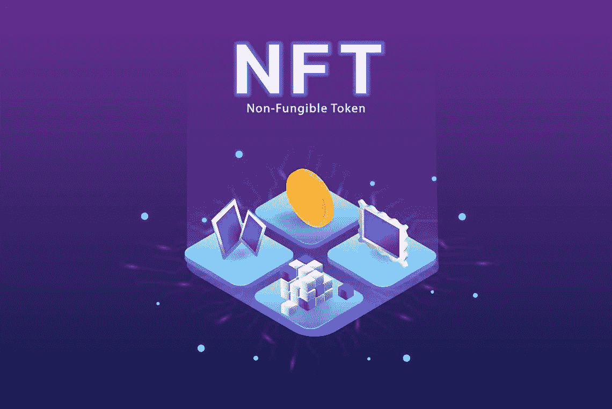

# 股票 NFT 是如何运作的？

> 原文：<https://medium.com/geekculture/how-does-the-stock-nft-work-5e371bbfa503?source=collection_archive---------22----------------------->

## 好吧，现在网上发生了一些超级奇怪的事情。

先看这条推文。

twitter 历史上的第一条推文。这条推特是杰克·多西发的。twitter 的联合创始人之一。这条推文不知何故以 2，915，835.47 美元的价格被购买。这不仅仅是一条推特。

就在上个月，一张 jpeg 图片卖到了 6900 万美元。NBA 正在以几十万美元的价格出售篮球比赛的小瞬间。这是各种各样的数字东西，人们花很多钱购买它们的一个版本。

你需要理解三个简单的字母来理解这里发生的事情。那些字母是 N，F 和 t。

这个故事比一个 60 万美元的猫 gif 大得多。或者 300 万条微博。这是一个关于人类心理的故事，也是一个关于我们评价事物的方式如何因科技而改变的故事。一些人认为这项技术可能会彻底改变我们的社会。同时加速气候灾难。这真的很疯狂，所有这些都在一起，我想解释给你听，所以让我们开始吧。

NFT 代表不可替代的令牌。我在这个话题上的一个问题是，人们到处扔像区块链、密码艺术、NFT 这样的东西，他们希望你能理解他们在说什么。就用可替代这个词吧。不可替代意味着不可替代，你不能替代它，它们只有一个，它是独一无二的。

让我给你举一个我强烈感受到的例子。假设你想买一件红色夹克。你在网上买一件夹克要 39 美元。如果你花 39 美元买了一件这样的夹克，你不知道他们会寄给你什么样的夹克，他们会按照你的尺寸做 1000 件，送到商店，寄给别人，寄给别人，他们会寄给你一件。你不在乎是哪一个。这件夹克是可替换的，它是可替换的。只要你得到一个和其他的一样的，它对你来说就是一样的，它们是可以互换的。

不过，还是说说红色外套吧。红色夹克是不可替换的。如果我在一个网站上花 39 美元买了一件和这款一模一样的红色夹克，它就不会是我现在穿的夹克。这件夹克是不可替换的。它是这个星球上唯一存在的。它有情感价值。这是非常有价值的东西，因为它是稀缺的。他们只有一个人，

我们经济中的所有事物都是可替代或不可替代的。一袋豆子是可以互换的，你只要一袋大米，你不在乎是哪一袋。蒙娜丽莎，不可替代的只有一个存在。不出所料，不可替代的东西比可替代的东西更有价值。对于 NFT 国家队来说，是不可替代的。

现在我们来谈谈 NFT 的 T，也就是 token。这是一个非常互联网化的词。为了解释这一点，我必须解释一些我很久以来一直回避解释的东西，区块链。幸运的是，有很多方法可以理解这一点，我会尽可能让它不那么痛苦。假设我想给我的朋友安娜买三片比萨饼。她向我索要 6 美元的树木切片费。所以我拿出我的借记卡，我的银行卡，在她的小终端上刷。我一刷这张卡，就会有一条信息发送到我的银行。上面写着，

> 嘿，约翰，他在你的银行有一个账户，想花 6 美元买比萨饼，这笔钱需要存入安娜的银行。

这就像是银行的基本工作，他们整天记录客户的每一笔交易，他们把钱汇给其他银行，在一天结束时，他们会记录所有进出你账户的钱，他们会给你一个数字。

他们可以说，根据所有的交易，你的银行账户里有 40 美元。所以当我刷卡的时候，当这个请求进来的时候，我的银行就像好的，所以根据你所有的交易，你的银行账户里有 40 美元。我可以寄六美元到安娜的银行，批准。他们批准了交易。一旦这笔钱进入安娜的银行，安娜的银行也在做同样的事情。他们喜欢，酷她有 70 美元，现在她有 76 美元，他们把它添加到她的记录。

越来越多的钱只是屏幕上的一个数字。是一堆交易的结果。因此，银行保留每笔交易的详细记录变得非常重要。我们相信银行会正确地做这件事。几个世纪以来，银行和其他中间人一直让这种东西平稳运行。有没有一种方法可以让我们做同样的事情，在没有银行的情况下协调人与人之间的转账交易？结果是一个非常聪明的概念叫做区块链。

区块链实现了银行正在做的同样的事情，但不是在我的银行账户上私下做这件事，而是与安娜的银行交谈，所有的交易实际上都在互联网上公开记录。举个例子，如果安娜三片披萨收我 6 比特币。我去刷银行卡说，是的我要付 6 比特币。银行不是看到交易请求并试图验证它，而是进入这个公共记录，世界各地的一群人的计算机一直在跟踪每个人的每一笔交易。

如果我的账户里真的没有 6 个硬币来支付安娜，所有记录每笔交易的人的电脑都会注意到有出入。

他们会像哇哇老兄，你没有 6 个硬币。我们在看每一笔交易，你没有硬币。您的交易被拒绝。如果我真的有 6 枚硬币，所有查看公共记录的计算机都会看到交易请求，并且会说是的，批准了！你有 6 个硬币，现在安娜有 6 个硬币。他们会将交易记录在案。现在安娜有了那些多余的硬币，这是每个人的事，每个人都知道。

因此，在我的比萨饼例子中，我们谈到了区块链作为一种验证货币交易的方式。如果有什么能让人类心理学重视某样东西的话，那就是如果整个群体都确认它是真实的，并且只有一个人。

有成千上万各种各样的 NFT。一些音乐被赋予代币，许多艺术被铸造成代币，被买卖。下一个前沿是在没有内在价值的事物中创造价值。

现实是，作为所有这一切的支柱的技术，我们一直在谈论的区块链的东西，永远依赖于公共账本和日夜不停地进行大量计算的计算机。这些电脑不是真正的电脑。他们所做的只是整天整夜地做微型计算。

大多数非功能性食物储存在区块链的以太坊。区块链以太坊使用 33 太瓦时的电力。这相当于塞尔维亚这个国家的力量。以太坊区块链的电力消耗呈爆炸式增长，在八个月内翻了两番，而且没有减缓的迹象。

这是很大的能量。想想看，这么多的能量不是用来喜欢，移动人们或生产东西，而是用来在某个怪异的计算机仓库中处理数字，以便有人可以购买假代币。

这是一个极具讽刺意味的时刻，像这样的一切都是数字的，都是假的，不是真的，但却有着非常真实的世界效果。这绝对是炒作，这才是重点。人们蜂拥投资，价格上涨。

我只知道这是一个疯狂的时刻，我们正在思考一项新技术及其意义，最终我们会适应。这不会是疯狂的，这不会是新奇的，价格会下降，但允许这一切发生的技术可能会一直存在。