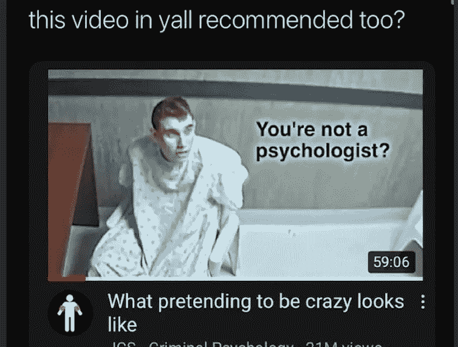
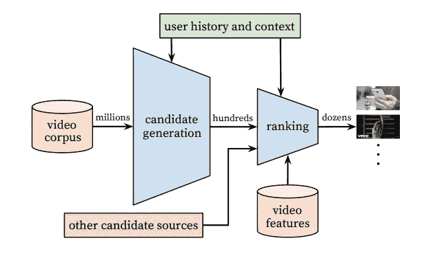
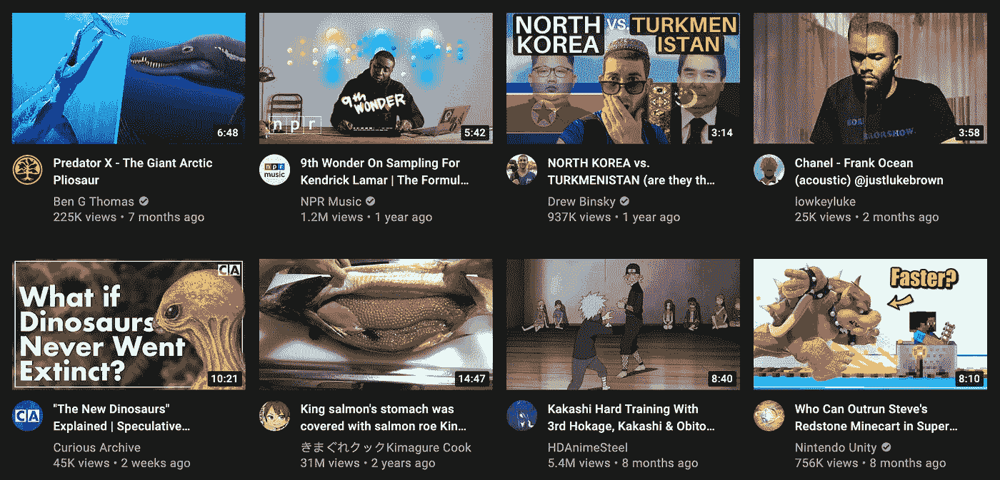
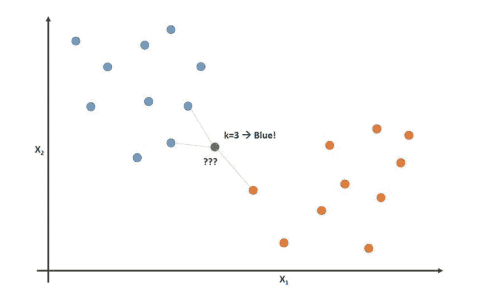

# YouTube 如何向你推荐视频？

> 原文：<https://medium.com/geekculture/how-does-youtube-suggestvideos-toyou-20bbfa23f16d?source=collection_archive---------35----------------------->

你在你的 YouTube 推荐名单上看过下面这个视频吗？

@kheslime / Twitter

几天前，我关注的一个 instagram 账户发布了一个关于一个视频的模因，这个视频不久前出现在我的 YouTube feed 上。这是关于一个据称假装患有精神疾病的青少年，以便被认为不适合接受审判。正如你可能会告诉，该频道的视频的前提是可疑的。然而，这让我想进一步调查，找到一些我们似乎都知道的细节；YouTube 是如何推荐美国视频的，为什么？

# 为什么？

第二个问题更容易解决。简单地说，通过向我们推荐视频，媒体公司能够让我们的注意力保持更长时间。通过让我们娱乐更长的时间，频道(以及随后的 YouTube)能够从促销、广告和优质内容中获得最大的收入。YouTube 甚至为其内容创作者发布了视频，以优化他们的视频和描述，从而提高他们频道的流量。

那么，YouTube 如何知道向其观众推荐什么呢？通过一个算法。不出所料，21 世纪最普遍的概念是让该公司向顾客提供内容，吸引他们继续观看。

# 怎么会？

该算法作为反馈回路工作。观众观看的视频越多，所述算法就越能够预测推荐什么其他类型的相关内容。[这背后的引擎是一个机器学习模型，它对内容进行多次过滤，只有少数内容才能到达观众的推荐列表](https://static.googleusercontent.com/media/research.google.com/en//pubs/archive/45530.pdf)。

Structure of the filtering system YouTube uses.

像哪些频道吸引相同的观众这样的模式被密切监视。诸如缩略图、描述、标题、喜欢、不喜欢和订阅的其他细节被用作训练机器学习模型的特征。

# 例子

下图是我推荐名单的一部分截图。目前，该算法正在向我推荐两个音乐相关的视频、一个海鲜烹饪频道、一个动漫场景、一个视频游戏分析、一个旅游 vlog 和两个史前动物视频。这是 YouTube 使用的机器学习模型的结果，该模型预测了我*应该*感兴趣的视频类型。

这到底是怎么回事？我们介绍过，该算法根据它认为用户想看的内容来推荐视频。这让我们看到它是如何根据用户的观看历史过滤视频的。那么它是如何过滤的呢？

# 最近邻

YouTube 使用的机器学习模型通过根据观众之前观看的其他视频来确定观众喜欢某个视频的可能性。尽管算法很复杂，但这是开始理解它在做什么的简单方法。

k-Nearest Neighbor or kNN

上图是最近邻分类算法的简化图，类似于 YouTube 使用的算法。你可以把这种分类想成二进制的，这样会更简单。这个观众是会喜欢这个视频还是不会喜欢这个视频？*邻居*在这个意义上可以认为是之前的观看历史、喜欢、不喜欢、描述、缩略图等。因为算法知道这个历史，并根据这个数据进行训练，所以它可以被描述为已经被“分类”。现在，这种分类所做的是尝试和预测观众喜欢基于其邻居的视频的可能性。用户倾向于缩略图之间的哪些相似之处？观众喜欢什么样的视频长度？哪些渠道吸引相同的人群？通过使用这些邻居，YouTube 采用的机器学习算法可以过滤并确定哪些视频最有可能被观众按下并观看。