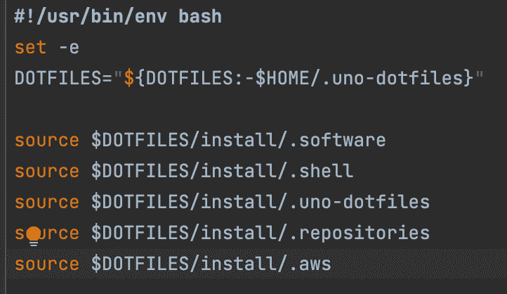

# Dotfiles 如何用一行命令安装应用程序和配置

> 原文：<https://medium.com/geekculture/how-dotfiles-installs-applications-and-configurations-with-one-line-of-command-b12f9c0b8ccc?source=collection_archive---------10----------------------->

由开发者 Jun Chatani 撰写

**在这个博客中，你可以发现 Dotfiles 如何在一台全新的机器上安装所有的应用程序和程序；这将有助于您在每台设备上进行统一配置。不要再说:“它在我的机器上工作”！**

想象一下这是工作的第一天。你拿到了一台新电脑，是时候开始工作了，但是等一下，你仍然没有必要的应用程序。所以现在你必须一个一个地安装它们。之后，你就可以走了；该开始工作了。它花了一段时间来启动和运行，但你终于在那里…还是没有？您还缺少另一个加入会议的应用程序，您需要再次下载并安装该程序。这样的例子不胜枚举。

Photo by [Yingchih](https://unsplash.com/es/@yingchih_hao?utm_source=medium&utm_medium=referral) on [Unsplash](https://unsplash.com?utm_source=medium&utm_medium=referral)

此外，作为开发人员，您需要特定的 Java、Node.js 或 Python 版本。因此，对于这些语言，您将再次需要安装版本管理器，如 SDKMAN！、nvm 和 pyenv。通过命令行一个一个地安装它们是一个非常耗时和繁琐的过程。您必须查阅文档并根据您团队的需要进行配置。

这就是点文件派上用场的地方。您基本上可以运行一行命令，它将为您自动完成上述过程。我们以前的一位技术教练启发了我们的想法，他想要一种简化的方式来招募新的开发人员或帮助团队成员设置新设备。Dotfiles 的最初想法被认为是 Dries Vints 的，他有一个更详细的[博客](https://driesvints.com/blog/getting-started-with-dotfiles)。

# 它是如何工作的？

我们希望有一种方法可以方便地让新人加入我们的团队，或者在开发人员收到新设备时加入。它不需要成为一个黑匣子，做你不知道的事情。因此，我们把它保持得非常简单，只安装我们团队使用的必要工具。

在高层次上，过程如下:首先运行一个脚本来安装 Homebrew，然后运行 Git。这将允许您克隆脚本的其余部分。您可以从一个开放的 Git 存储库中卷曲脚本，也可以从任何保存它的地方复制粘贴它:

1.  首先，它将通过家酿安装所有必要的应用程序，然后为您的终端进行一些配置，如 p10k。稍后可以根据您的喜好进一步配置终端。
2.  除此之外，脚本还会为您的编程语言安装必要的版本管理工具，并在您的。zshrc，以便正确设置所有路径。
3.  最后，我们有一些特定于团队的脚本，比如将我们所有强大的存储库克隆到/projects 中的一个文件夹中。

使用点文件有很多好处，我们希望这可以加速你的团队加入新成员或简单地设置新设备。特别感谢最初的博客作者 Dries Vints 和我们过去的技术教练 Michel Grootjans，他们提出了令人敬畏的[想法](https://github.com/michelgrootjans/dotfiles)。