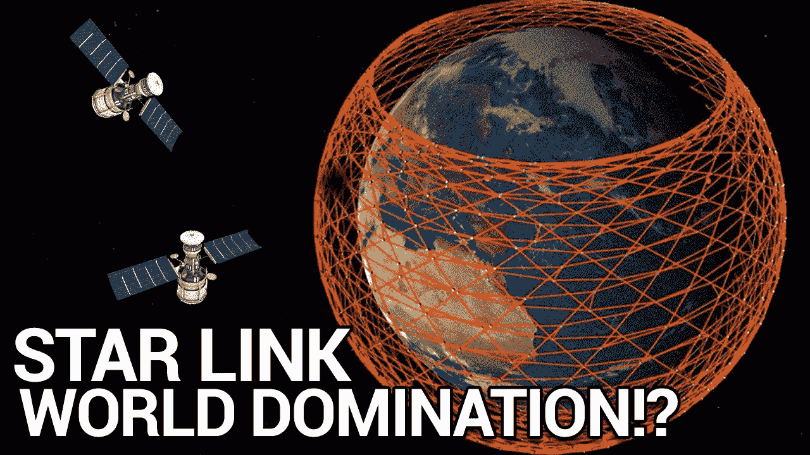
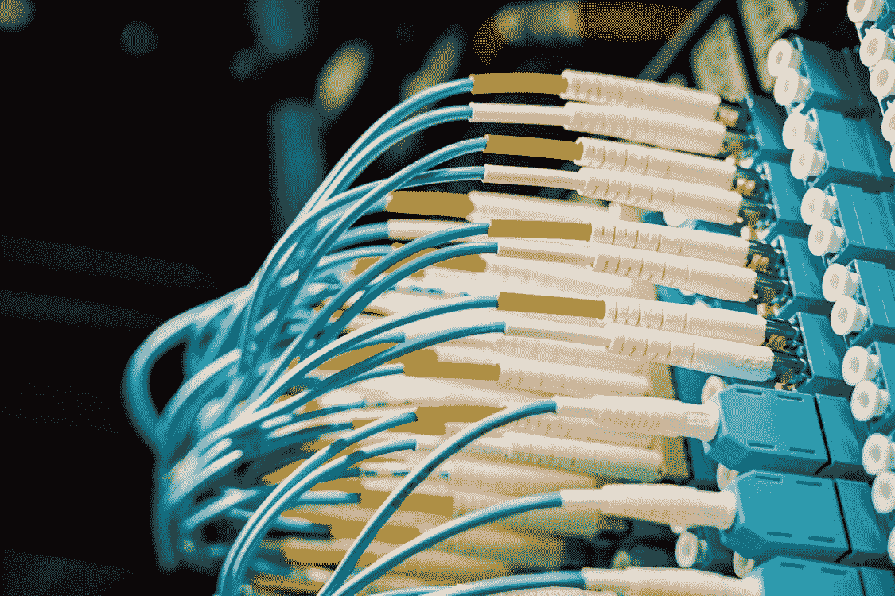
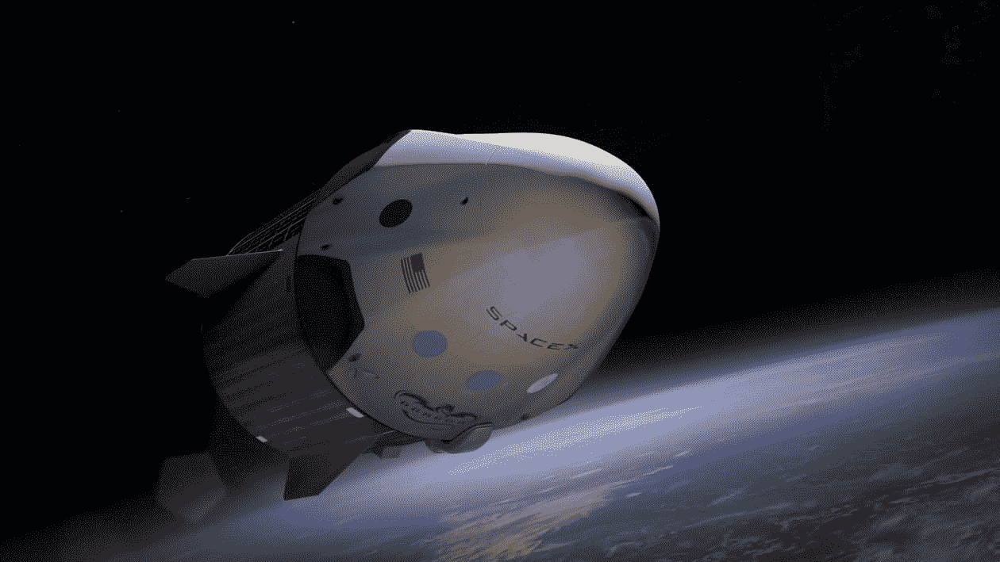
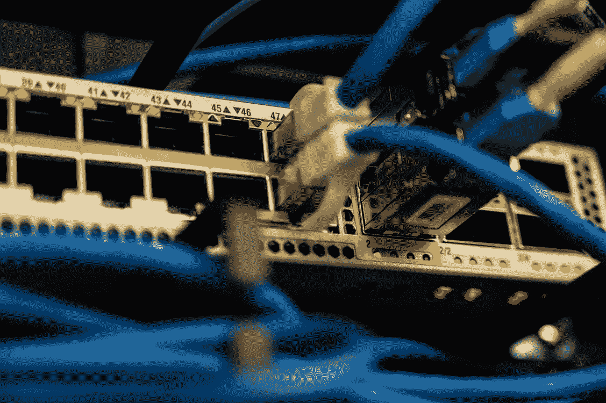
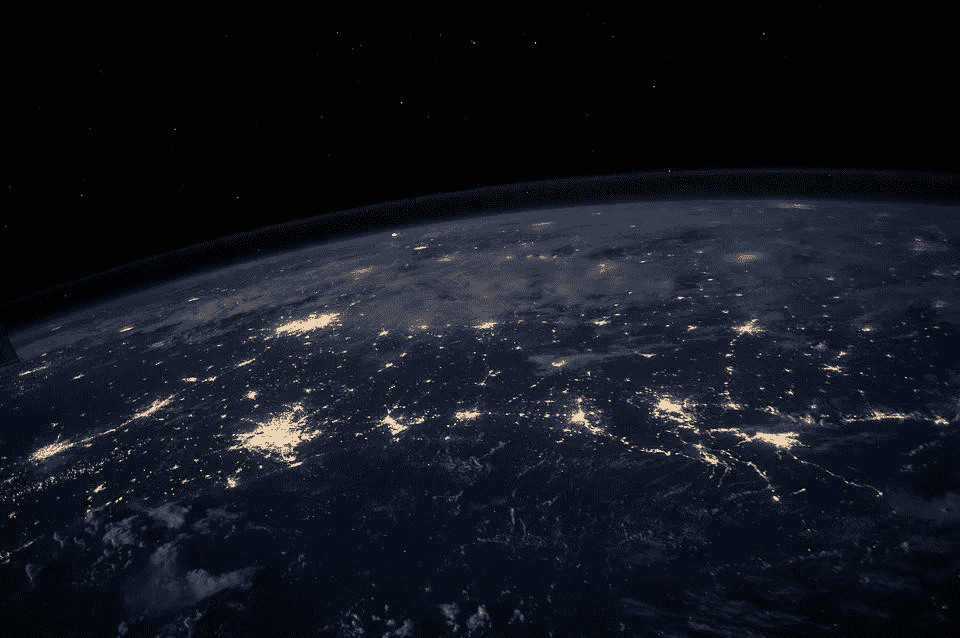

# 埃隆·马斯克的 STARLINK 卫星将如何为全球提供互联网！

> 原文：<https://medium.com/geekculture/how-elon-musks-starlink-satellites-will-provide-internet-to-the-entire-planet-a285a7cf687b?source=collection_archive---------28----------------------->

Image by Author

因此，埃隆·马斯克正在考虑与 Starlink 一起征服太空，并计划为整个地球提供互联网，如果一切顺利，这将永远改变我们的世界。让我们开始吧。

我们都听说过 Elon Musk，他是特斯拉和 SpaceX 等公司背后的先驱。人们总是看到他大胆的新项目，这些项目对我们大多数人来说可能是荒谬的，比如他的公司 SpaceX 的主要目标火星殖民。这一次，埃隆对电信行业有计划，包括开发一个覆盖全球的卫星网络，提供宽带互联网，并创建一个子公司，SpaceX 可以在以后的 IPO 中将其剥离。因此，埃隆·马斯克希望向太空发送 42，000 颗卫星来实现这一目标。他已经在太空中拥有约 12，000 颗卫星，并在 2019 年震惊了世界，当时 SpaceX 申请了 3 万多颗卫星。

这是向太空发射的过多的高科技物体。例如，联合国外层空间事务办公室估计，目前在低轨道上大约有 4000 个。所以，仅 SpaceX 一家，42000 颗就相当于这些卫星的十倍左右。其背后的想法是形成一个巨大的卫星星座，并提供全球覆盖。世界上将近一半的人口无法访问互联网，因为它的许多选项需要一个庞大的地下电缆网络，使偏远地区离线。这些光缆通过光缆长距离传输大量信息。这些玻璃纤维束利用光的极限速度，将光束从一点传送到另一点。

Photo by [Brett Sayles](https://www.pexels.com/@brett-sayles?utm_content=attributionCopyText&utm_medium=referral&utm_source=pexels) from [Pexels](https://www.pexels.com/photo/connected-fc-cables-in-modern-data-center-4425157/?utm_content=attributionCopyText&utm_medium=referral&utm_source=pexels)

因为光必须通过玻璃解释才能前进，所以它不会达到和在真空中一样的最高速度，就像在太空中一样。在真空中，光以每秒近 3 亿米的速度移动，但会穿过玻璃；它达到大约每秒 2.04 亿米。它导致每公里数毫秒的延迟。长期以来，卫星向世界的偏远地区发送数据，但通常情况下，我们使用的卫星是地球同步的，因为它们似乎停留在天空的一个点上。为了实现这一目标，定位卫星必须处于 35，800 公里以上的非常遥远的高度。这意味着即使以最高速度使用光，延迟时间也在 700 毫秒左右。因此，SpaceX 计划将卫星放得更近，以便在 550 公里的高空发挥作用。在这个高度，它们无法停留在一个地方。他们必须迅速行动，因为他们中的许多人要保持覆盖面。但是在这个距离上，以光速传输数据的卫星网络将不会延迟，即使是任何超过 3000 公里的光纤网络。

信息传输的距离越远，像 Starlink 这样的组织就比地球上的光纤合作伙伴更有利可图。这种高速与非同寻常的现金总量一起进入货币市场，在那里毫秒的延迟解释了数百万美元的不幸。Starlink 要实现还有很长的路要走。卫星需要便宜和坚固，而不需要合法发射。

Photo by [SpaceX](https://www.pexels.com/@spacex?utm_content=attributionCopyText&utm_medium=referral&utm_source=pexels) from [Pexels](https://www.pexels.com/photo/space-rocket-orbit-galaxy-23769/?utm_content=attributionCopyText&utm_medium=referral&utm_source=pexels)

现在我们知道 SpaceX 是一家以盈利为目的的公司，所以如果不是为了盈利，它绝不会投资 Starlink。埃隆·马斯克说，完全运行时，仅这个卫星互联网项目就能给他们带来 300-500 亿美元。埃隆·马斯克的公司开始了 Starlink 的公开测试程序，价格估计为每月 99 美元，前期费用增加到 499 美元，以安排 Starlink 套件，其中包括一个用户终端和 Wi-Fi 开关，以连接卫星。该公司向美国北部、加拿大和英国的客户提供这项优惠

SpaceX 的卫星和火箭都依赖 Linux 工作框架。每批 60 颗卫星包含 4000 多台 Linux 计算机。参与该项目的卫星将通过激光束连接到其他几个卫星，形成类似网络主干的东西。据用户称，Starlink 目前的下载速度为 80Mbps 至 150Mbps，上传速度约为 30Mbps。与此同时，延迟约为 30 毫秒，与地面互联网相当。当然，凡事有利有弊。这个项目也引起了一些关注，因为 Starlink 卫星是明亮和反射性的，在黎明和黄昏时看起来像星星。这干扰了天文学家寻找可能撞击我们的近地天体的工作，因为这是一个绝佳的时机。

Photo by [Brett Sayles](https://www.pexels.com/@brett-sayles?utm_content=attributionCopyText&utm_medium=referral&utm_source=pexels) from [Pexels](https://www.pexels.com/photo/ethernet-cables-plugged-in-network-switch-2881224/?utm_content=attributionCopyText&utm_medium=referral&utm_source=pexels)

庞大的卫星群也可能限制对黑洞或新行星的搜索。SpaceX 公司试图通过创造一种黑暗卫星来解决这个问题，这是一种涂有非常黑暗物质的卫星。然而，它正在努力改进，因为它不是一个持久的解决方案。有太多关于碎片的担忧，因为一旦你有许多卫星在围绕地球的近距离轨道上，这些卫星就有可能相互碰撞或与其他卫星碰撞。这些碰撞会产生碎片云，这些碎片将围绕地球运行数年、数十年甚至数百年，这些碎片最终会增加，并导致一种称为凯斯勒综合症的效应。如果我们达到这一点，潜在的影响是如此之大，以至于研究人员正在努力控制这种情况的发生。有一天，高速互联网将被送到各地家庭中的披萨盒状设备，埃隆·马斯克将会感到满意。如果 SpaceX 首席执行官如愿以偿，SpaceX 卫星 Starlink 将成为人类历史上最杰出的卫星星座。

Photo by [Free-Photos](https://pixabay.com/users/free-photos-242387/) from [Pixabay](https://pixabay.com/images/id-1149733/)

**OUTRO:**

那么，现在是时候告诉我们你对 Starlink 有多兴奋了？

请在评论区给我们你的反馈。

另外，如果你喜欢这篇文章，请给我们鼓掌，并考虑订阅我们的博客。我们会在下一集看到你。在那之前。