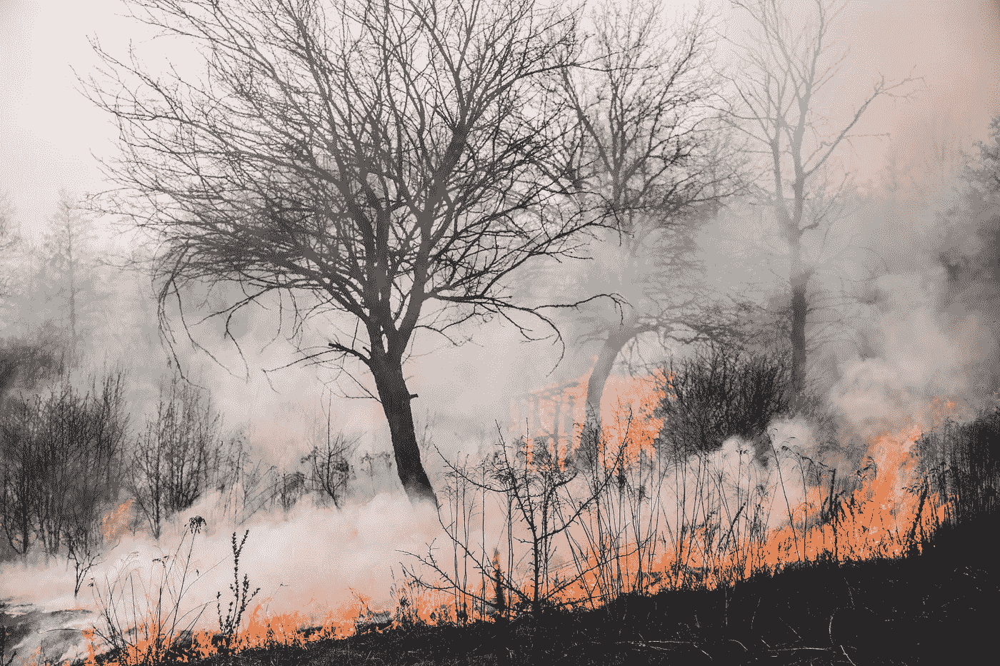

# 嵌入式人工智能如何帮助预防野火

> 原文：<https://medium.com/geekculture/how-embedded-ml-is-helping-to-prevent-wildfires-b68d7b3ed63e?source=collection_archive---------38----------------------->

## 真实世界人工智能

## *毁灭性的野火可以通过设备上的嵌入式机器学习来预防*

*如果你不是中等会员，你可以在这里* *找到这篇文章的无限制版本* [*。*](https://highdemandskills.com/preventing-wildfires-embeddedml/)

Photo by [Vladyslav Dukhin](https://www.pexels.com/@vladyslav-dukhin?utm_content=attributionCopyText&utm_medium=referral&utm_source=pexels) from [Pexels](https://www.pexels.com/photo/forest-fire-4070727/?utm_content=attributionCopyText&utm_medium=referral&utm_source=pexels)

2018 年夏天，加州的一场野火托马斯大火摧毁了 1000 栋建筑，导致 22 人死亡[1a]。火灾是由*输电(电)线*引发的。

在另一起事件中，也是在加利福尼亚州，输电线被归咎于 2017 年导致 18 人死亡的十几起野火[1b]。

许多年前，在澳大利亚，2009 年，全国最严重的火灾季节之一，墨尔本附近的整个城镇被夷为平地。

火灾是由电线引起的。

仅在那个季节的一天，由电线引起的火灾就导致了 159 人死亡。

在德克萨斯州，近几年已经有超过 4000 起野火是由电线引起的。

还有很多例子可以说。

由电线引起的野火是世界上几个地方反复出现的问题，特别是在有大片林地的地方，以及夏天炎热、干燥和多风的地方。

像加利福尼亚和澳大利亚这样的地方。

# 电线和野火

根据加州林业和消防部门的说法，当树木和树枝接触到电线时，就会引发野火。

德克萨斯州野火缓解项目也发现了电线引发野火的其他几种方式。其中包括:

*   **下线**。在高达 30%的情况下，当电力线落地时，它们的保护短路机制失效，导致可能的*高压电弧*——这很容易点燃倒下的电力线附近的植物或可燃材料。
*   **售票员一巴掌**。电源线在导体之间设计有足够的间隙，但它们有时会*撞在一起*，产生电弧，从而喷射出热金属颗粒并引起火灾。
*   **重复性故障**。大多数电力线路偶尔会出现故障，具有一定的火灾风险——然而，一些电力线路会出现*重复故障*，如果不加以纠正，可能会导致重大火灾风险。
*   **仪器故障**。电力线组件(开关、绝缘体、变压器等)大多可以无故障工作多年，尽管其中一些组件有时会出现故障——当这种情况发生时，无论是突然还是逐渐退化，电弧和火花都可能引发火灾。

不管用什么方法，毫无疑问的是*阻止由电线*引起的野火可以拯救生命并防止严重的财产损失。

问题是——*怎么做？*

# 防止由电线引起的野火

一种显示出巨大前景的方法是使用 [**人工智能(AI)**](https://highdemandskills.com/what-is-artificial-intelligence/)——特别是 ***嵌入式机器学习***——来识别和警告由电力线引起的潜在野火威胁。

有了及时的警报，公用事业公司可以采取*预防措施*(或*预防性维护*)来防止可能的火灾风险。

但是，考虑到输电线穿越的广阔区域、输电杆和组件的绝对数量，以及合格技术人员访问和监控可能故障的高成本，识别和警告输电线上可能的火灾风险是一个巨大的挑战。

*怎么做？*

# 什么是嵌入式机器学习？

这就是机器学习可以发挥作用的地方。

机器学习算法可以被训练来*识别电力线中可能出现火灾威胁的条件*。

一旦确定，警报可以在重大火灾发展之前触发公用事业公司和消防队，并且可以收集数据以进行持续改进。

但是通常形式的机器学习有其局限性——算法可能很复杂，需要高功率和带宽资源。这使得标准的机器学习解决方案对于一系列现场应用不切实际，在这些应用中，访问和资源可能是有限的。

然而，嵌入式机器学习可以解决这些挑战。

嵌入式机器学习(***embedded ML***)——*也称为 AIoT，on-device machine learning，或*[***tiny ML***](https://highdemandskills.com/tinyml/)——是人工智能的一个新兴领域，专注于将机器学习的力量带到*小型、便携、高效的外形规格*。

凭借这些特性，嵌入式 ML 可以部署在一系列对电源、通信和计算资源的访问可能非常有限的应用中。

对于跨越数百(或数千)英里的电力线，通常位于偏远或困难的地形，通信距离或(合适的低压)电源接入有限，嵌入式 ML 提供了理想的解决方案。

嵌入式 ML 可用于对电力线进行*自动、智能监控*，对可能引发火灾的故障进行*连续、实时检测*。

# **嵌入式 ML 自动智能监控电力线**

这正是斯洛文尼亚的 Izoelektro 公司正在做的事情，该公司专门从事建立和维护电网系统。

Izoelektro 与技术公司 [**Edge Impulse**](https://www.edgeimpulse.com/) 和 [**Arm**](https://www.arm.com/) 以及创新顾问 [**Irnas**](https://www.irnas.eu/) 合作，开发了 ***RAM-1*** 系统。

RAM-1 是一个智能电网监控系统，它使用*嵌入式 ML* 实时监控电力线的火灾威胁。它的工作原理如下:

*   专门构建的机器学习算法被训练来检测电力线中出现的可能导致火灾的各种故障
*   然后，通过使用*修剪*(移除不需要的网络节点)、以及*量化*(将浮点数转换成整数)以及其他方法来减少内存需求，将经过训练的算法**变得更加紧凑**
*   算法**仅用于推理** — *以根据训练参数*识别故障，比训练阶段需要更少的计算资源
*   该型号在一个高效、低功耗集成电路—*[*Nordic NRF 9160*](https://www.nordicsemi.com/Products/nRF9160)*中实现，采用 Arm Cortex-M33，支持 1 MB 闪存和 256 kB RAM*——允许在远程电力线安装中轻松部署*
*   *该设备安装在一个坚固的**包装**中，能够承受各种极端环境条件*

*每个 RAM-1 设备都是*高效、便携、功耗极低的*——一次充电可以持续 20 年！*

*RAM-1 设备是对电网中通常存在的现有电气组件的新颖和创新的补充，其中许多组件可能已有几十年的历史。*

*使用 RAM-1，对电源线*进行持续监控，以发现可能引起火灾的故障*(例如火花或电弧)。*

*嵌入式 ML 为 RAM-1 提供了识别相关威胁的*智能*能力，一旦识别出*实时警报*就发送到维护系统。*

# *嵌入式 ML 提供了许多可能性*

*通过使用 RAM-1，Izoelektro 对其电力线系统的监控能力进行了大规模的提升。*

*RAM-1 将减少由故障引起的野火的可能性，防止不必要的破坏，并因此挽救生命。*

*RAM-1 是一个令人兴奋的例子，它展示了便携式、高效、小尺寸人工智能(*嵌入式 ML、AIoT 或 tinyML* )为一系列未来应用带来的令人兴奋的可能性，而这在以前是很难或不可能实现的。*

# *概括起来*

*   *在世界许多地方，由电线故障引起的野火是死亡和破坏的主要来源*
*   ***监测电力线**可能的故障是*困难且昂贵的*任务，特别是考虑到电力线穿越的广阔、有时甚至是偏远的地形*
*   ***嵌入式 ML** — *也称为 on-device machine learning，AIoT，或 tinyML* —是人工智能的一个新兴领域，它将机器学习的*功能封装到小型、便携和高效的外形中**
*   *使用嵌入式 ML，**电力线的自动、智能和便携式监控**成为可能*
*   *izoelektro*与 Edge Impulse、Arm 和 Irnas* 合作，开发了一款用于监控电力线的**创新嵌入式 ML 解决方案，名为 RAM-1***
*   *RAM-1 *自动检测可能导致野火的*电源线故障，并且*实时提醒维护系统**
*   *嵌入式 ML 为 RAM-1 等许多应用提供了可能性，每个应用都有可能以以前难以或不可能的方式改善我们的生活*

**最初发布于:*[*https://highdemandskills . com/preventing-wild fires-embedded ml/*](https://highdemandskills.com/preventing-wildfires-embeddedml/)*

* [## 最近的帖子- HDS

### 直觉及其在人工智能中的应用

highdemandskills.com](https://highdemandskills.com/blog/) 

**参考文献**

[1a，b] William Atkinson，*电力线与野火之间的联系*，电力承包商，2018 年 11 月 26 日(下载自:[https://www . ecmag . com/section/systems/Link-Between-Power-Lines-and-wild fires](https://www.ecmag.com/section/systems/link-between-power-lines-and-wildfires)，2021 年 7 月)

[2] Peter Fairley，*澳大利亚如何反击电网引发的野火*，IEEE Spectrum，2019 年 11 月 11 日(下载自:[https://Spectrum . IEEE . org/energy wise/energy/the-smarter-Grid/How-a-Australia n-State-faced-destruction-from-Grid-Sparked-wild fires](https://spectrum.ieee.org/energywise/energy/the-smarter-grid/how-an-australian-state-faced-devastation-from-gridsparked-wildfires)，2021 年 7 月)

[3] *电力线如何引起野火*，得克萨斯州野火缓解项目(下载自:[https://wild fire remediation . tees . tamus . edu/FAQs/How-Power-Lines-Cause-wild fires](https://wildfiremitigation.tees.tamus.edu/faqs/how-power-lines-cause-wildfires)，2021 年 7 月)*