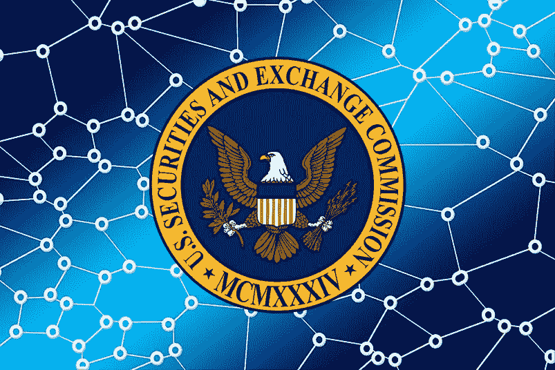
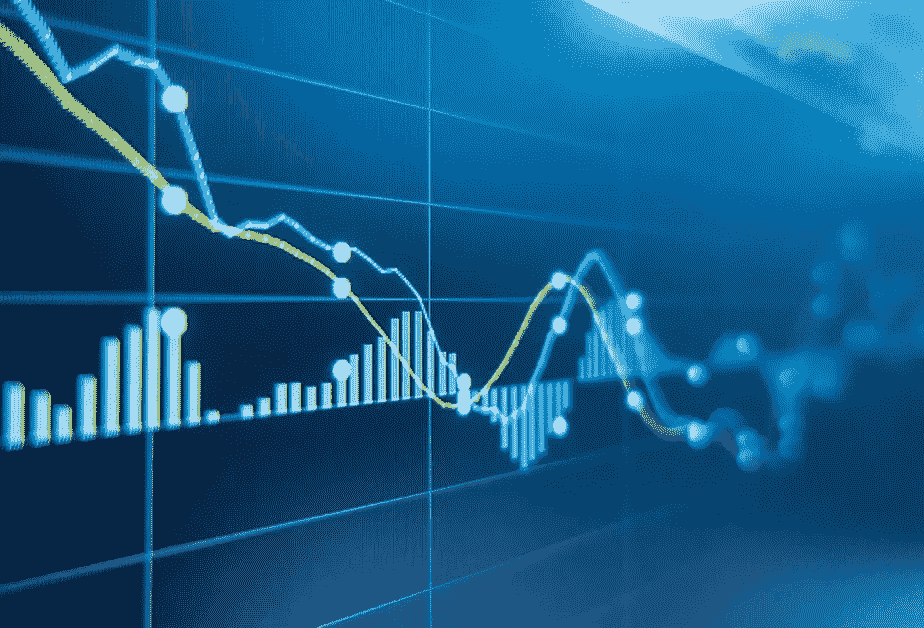

# 美国证券交易委员会到底是如何发现非法内幕交易的？

> 原文：<https://medium.com/geekculture/how-exactly-the-sec-detects-illegal-insider-trading-dba34f0b399b?source=collection_archive---------11----------------------->

## 从使用人工智能技术来获取你的谷歌搜索历史

在这篇文章中，我将向你展示美国证券交易委员会(又名 SEC)如何检测非法内幕交易活动。如果你不知道什么是内幕交易或者想刷新一下基础，建议你先看一下[这个帖子](https://wire.insiderfinance.io/how-to-spot-profitable-insider-trades-that-you-can-benefit-from-26db98e6003a)。

这个话题特别有趣，因为**这是一个非常难以证明的罪行**。买卖股票的行为是完全合法的，只有交易者的想法才能使这种合法行为成为被禁止的内幕交易行为。

此外，大多数内幕交易案件都不涉及直接或实物证据(除非犯罪人供认不讳)，因此**整个调查就是拼凑拼图**(交易活动、电话、电子邮件、实物会面……等等)。).

为了说明这有多困难，考虑一下最近的影子交易(利用你自己公司的重要信息在另一家公司进行交易)案例:SEC 调查了一名制药公司高管，他在得知自己的公司被辉瑞收购后购买了竞争对手股票的期权。

请注意，当向市场宣布一项收购时，被收购公司的股价会上涨(几乎达到收购价格)，但其他潜在目标的股价通常也会上涨。

这里的棘手之处在于，从技术上讲，这位公司高管没有竞争对手的任何机密信息，而这正是重大事件的主题，他也没有交易自己公司的股票，而这正是当前内幕交易法的目的。最重要的是，你必须证明交易的欺诈“意图”，这就像试图证明一个想法。

既然我们同意内幕交易案件相当复杂，我们可以为 SEC 定义两大类案件来源:

1.  **线人**
2.  **市场监督**

我们来详细看看这两个！

# **线人**

## **告密**

第一个信息来源是**告密计划**:证券交易委员会可能会奖励任何提供信息导致内幕交易和/或泄密案件民事处罚的人。

奖金总额不得超过罚金的 10%,要发放奖金，该信息必须导致成功执行所涵盖的司法或行政诉讼。

例如，2010 年[美国证券交易委员会向一对夫妇奖励了 100 万美元](https://www.sec.gov/litigation/litreleases/2010/lr21601.htm),这对夫妇提供了关于一桩内幕交易案件调查的信息和关键文件，该案件涉及一名前微软员工和一家对冲基金的首席执行官。显然，这位受雇于对冲基金的前雇员从微软的一位前同事那里得到了重要信息。

这位微软前雇员恰好是获奖夫妇中一名成员的前夫，所以记得友好地结束你们的关系，以防万一。

## **(愤怒的)市场参与者**

实施非法内幕交易的一个常见且有利可图的方法是使用短期价外(OTM)期权。

这里我不想讲得太专业，为了简单起见，我们假设这些是金融衍生品，如果你非常幸运，或者像在这种情况下，你知道将要发生什么，它们可以在很短的时间内让你的投资倍增。

现在想象一下，你在交易的另一方(因为你相信市场是公平的，市场参与者是有道德的人，lol)，因为一件几乎不可能的事件发生了而损失了一大笔钱。

结果是，这些愤怒的(现在是可怜的)交易员中的一些人会联系 SEC，向他们展示这一可疑交易，看看他们是否被耍了。

## **(愤怒的)(前)员工或竞争对手**

这一点不需要太多解释:如果这些类别中的任何一个以某种方式获得了任何公司高管的不法行为信息，他们可以用它来换取奖励(例如，一名愤怒的前员工加入了举报计划)，纯粹是为了报复(例如，你讨厌你的老板)，或者只是为了损害竞争对手的业务或股价。

# **市场监督**

## 蓝图数据和 ARTEMIS

首先要注意的是，市场监督活动不是由一个单独的部门进行的，而是通常由证券交易委员会内部几个小组共同努力的结果，例如 DERA 的***(经济和风险分析部门)***OMI 的** *(执法部门内的市场情报办公室)*， 仅举几个例子，如 **CRQA** *(风险与量化分析中心)*或 **MAU** *(市场滥用部门，*可能与内幕交易案 *s)* 最相关。 新的内幕交易案件的线索也可能来自这些部门。**

**这些单位分析的大部分信息来自所谓的**“蓝皮书数据”**(基本上是交易和客户交易数据)，这些数据要求经纪自营商、做市商和清算所维护并以电子方式提供给 SEC。例如，在去年的 GameStop 狂潮期间，SEC 向著名经纪人 Robinhood 询问了这些数据，其中包括。**

**可以想象，所有这些信息意味着每个交易日产生数百万个数据点，这意味着您的常规 Microsoft Excel 不足以进行适当的数据分析。**

**出于这个原因，MAU 拥有自己的大数据分析工具，名为**高级关系交易执行指标调查系统*(ARTEMIS)****，该系统专注于分析可疑的交易模式和多个交易者之间的关系，并结合了*“来自 SEC 和 FINRA 的约 100 亿份股票和期权交易记录，并使用由部门员工创建的高级分析方法，根据不同的指标“* ***”对交易进行排名。*** 这个指标当然不是公开的。***

***例如，这个工具被用来揭露三个网飞工程师设置的[内幕交易计划:](https://www.natlawreview.com/article/streaming-data-sec-charges-netflix-trading-ring)***

> ***三位网飞软件工程师根据网飞用户群的变化，尤其是增长进行交易。他们在定期收益公告中披露这些信息之前就使用了这些信息。在首席工程师于 2017 年离开网飞后，他继续从一位朋友和前同事那里获取机密的用户信息。另一位前同事就 2019 年 7 月的收益公告向主要违规者提供了线索。工程师们使用加密信息并支付现金回扣，试图避免被发现，但 MAU 发现了网飞股票“不可能成功”的交易模式***

## *****SROs &声纳*****

***SEC 的另一个信息来源是 sro(自我监管组织，也称为交易所),它们主要负责监督其市场，每年向 SEC 提供数百份可疑交易报告。***

***这种监督主要涉及对异常交易量和价格行为的监控，尤其是在市场变动事件之前(要求公司在向公众发布之前提供相关的新闻稿)。***

***最著名的 sro 之一是纳斯达克，它有自己的大数据工具，称为**证券观察、新闻分析和监管(声纳)**系统。***

***声纳用于监控纳斯达克交易所，*“处理大约 10，000 条新闻报道和 SEC 文件，评估 25，000 种证券的价格/交易量模型，每天生成 50-60 个警报(或“中断”)，供几个监管分析师和调查人员小组审查”。****

***它还利用了几种人工智能和统计技术“*，包括 NLP 文本挖掘、统计回归、基于规则的推理、不确定性和模糊匹配”*，这大大提高了生成的警报的质量。***

***有趣的是，这些引用的功能来自 2003 年的一篇论文，当时人工智能领域还没有像今天这样广泛。声纳从 2001 年开始运作，我无法想象现在的系统有多复杂。***

# ***结论***

***正如我们所见，非法内幕交易案件的线索可能来自于人力资源，也可能来自于非常复杂的市场和客户交易数据的定量分析。***

***美国证券交易委员会的技术能力比人们想象的要先进得多，他们的量化技术和统计工具比许多高档对冲基金使用的工具要复杂得多。***

***也就是说，如果内幕人士真的知道自己在做什么，并且保持低调，那么抓住非法内幕交易计划就不是一件容易的事情。即使证交会能够发现交易异常，他们仍然必须在法庭上证明“意图”。***

***在另一篇文章中，我们将讨论 SEC 的调查过程，以及他们如何开发收集证据的新技术:从证人访谈等传统方法，到使用窃听或访问您的谷歌搜索历史(结果发现您在有效实施非法内幕交易前几天确实搜索了*“SEC 如何检测异常交易”*和*“国际账户内幕交易”* [)。](https://www.sec.gov/litigation/complaints/2017/comp-pr2017-125.pdf)***

***如果你喜欢这个帖子，请鼓掌，并在 Medium 和 [Twitter](https://twitter.com/insider_cyborg) 上关注我，了解更多关于内幕交易和投资的内容！***

*****感谢您的阅读！*****

***查看更多故事:***

*** [## 如何发现有利可图的内幕交易

### 学会跟随最有见识的市场参与者之一

wire.insiderfinance.io](https://wire.insiderfinance.io/how-to-spot-profitable-insider-trades-that-you-can-benefit-from-26db98e6003a)  [## 传奇内幕交易

### 或者如何在一次交易中获得 700%的回报

medium.com](/@insider_cyborg/legendary-insider-trades-a7feb8db3776)***