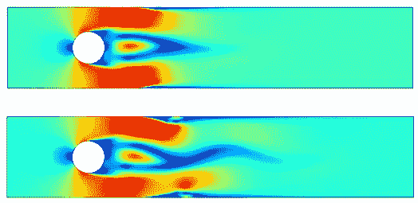

# 流体如何绕着圆柱体流动(还有特斯拉 Cybertrucks！)

> 原文：<https://medium.com/geekculture/how-fluids-flow-around-circular-cylinders-and-tesla-cybertrucks-cdd1403402d1?source=collection_archive---------10----------------------->

## 用 COMSOL Multiphysics 模拟圆柱绕流

Screenshot made by author

根据斯托克斯定律，当固体球体在粘性流体中运动时，受到的摩擦力(也称为阻力)与它的运动速度、球体半径成正比。