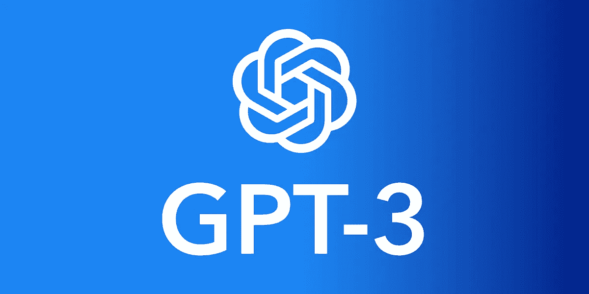

# GPT-3 如何为您的下一个项目提供动力

> 原文：<https://medium.com/geekculture/how-gpt-3-can-power-your-next-project-12523b6ae923?source=collection_archive---------3----------------------->

在本文中，我将向您展示如何为您的下一个项目构建一个自然语言处理(NLP) API。我们将利用 GPT-3 的通用功能来快速完成您想要的任何语言任务。

Image by Author

如果你还不知道，OpenAI 的 GPT-3 是一种先进的机器学习模型，可以用于从情感分类到代码完成的所有事情。进入 GPT-3 曾经…