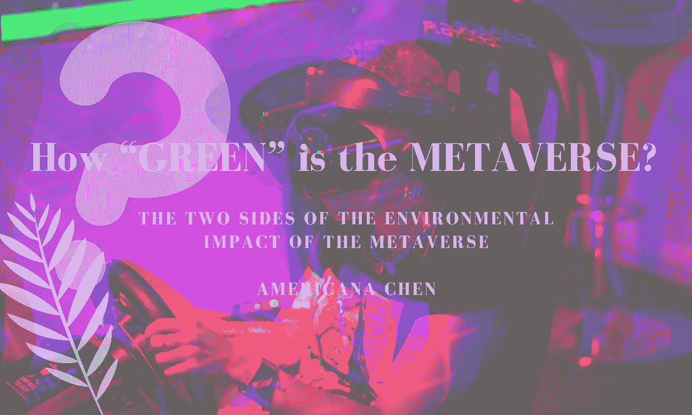

# 元宇宙有多“绿”？元宇宙环境影响的两面性

> 原文：<https://medium.com/geekculture/how-green-is-the-metaverse-the-two-sides-of-the-environmental-impact-of-the-metaverse-6a35913fd329?source=collection_archive---------1----------------------->

# **元宇宙？到底是什么？**

自从马克·扎克伯格宣布“脸书”将更名为“Meta”后，“M etaverse”就一直充斥着新闻。无论是让你想起爱莉安娜·格兰德在堡垒之夜吸引了 7800 万玩家的虚拟演唱会，还是马克·扎克伯格谈论如何…