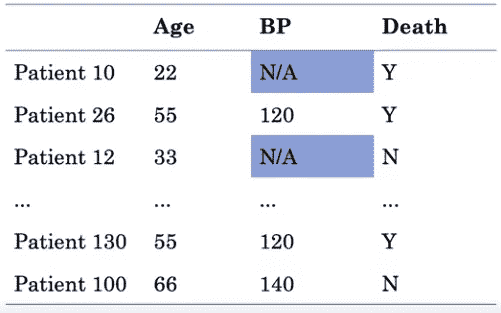
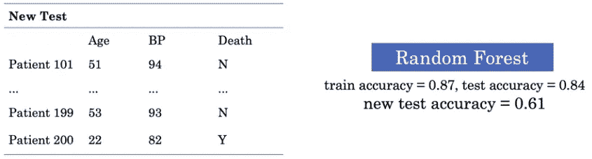
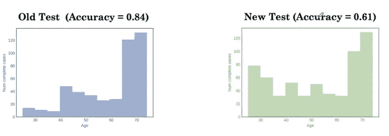
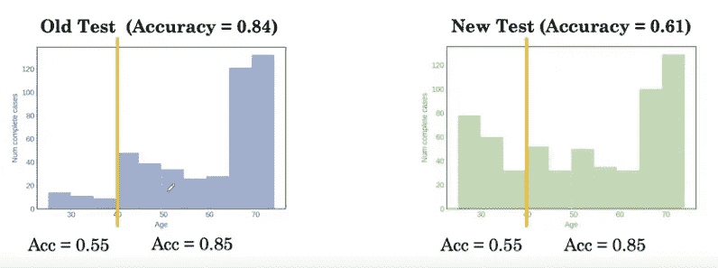
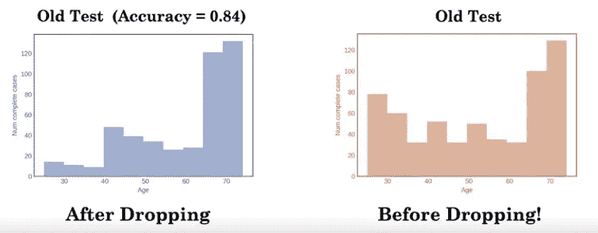
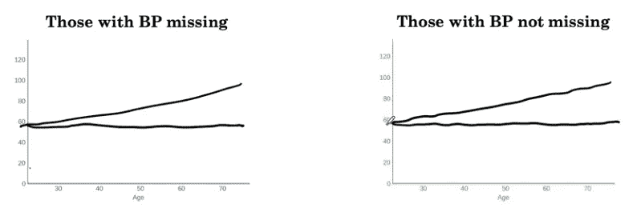
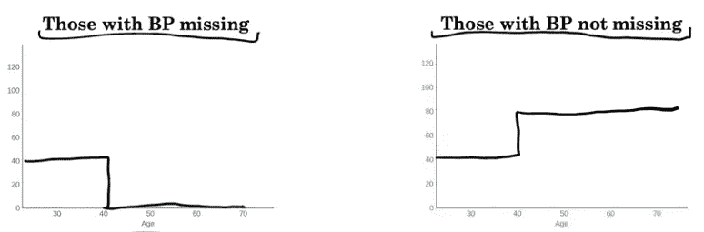
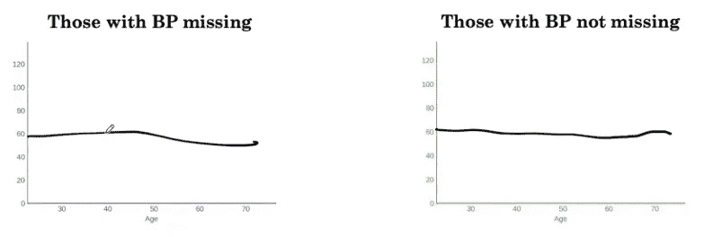

# 不恰当地处理缺失数据如何导致有偏差的 ML 模型

> 原文：<https://medium.com/geekculture/how-handling-missing-data-inappropriately-leads-to-biased-ml-models-abe4e4cadbfa?source=collection_archive---------19----------------------->

## 识别缺失数据的类型以建立无偏 ML 模型

在构建现实世界的 ML 模型时，处理某些属性缺失的数据是一个非常常见的挑战。因此，了解和研究缺失数据至关重要，以了解缺失数据是否与其他要素相关，或者只是随机缺失。通常，在没有适当分析的情况下丢弃缺失数据会导致模型在现实世界中出现偏差。

> 本文改编自 deeplearning.ai 的医学专业人工智能课程 2 的讲座，其中讨论了以下案例研究，以暗示正确分析缺失数据的重要性。提出的想法不是我的。

在本文中，我们将做一个完整的案例分析，以了解当我们没有恰当地处理缺失数据时会发生什么。我们将查看包含患者 ID、年龄和血压特征的患者数据集，以建立预测模型来预测 10 年死亡风险。

Dataset of patients with 10 year risk of death

我们可以看到，对于患者的属性 BP，数据中缺少许多值。

## 创建训练/测试分割

首先，我们将创建一个训练/测试分割，以便能够通过比较直方图来测试分布。

Splitting data into train and test sets

## 删除缺失的行

处理缺失数据的一个非常简单的方法就是在数据缺失的地方删除病人的记录。假设我们在这样的数据集上训练一个随机森林分类器，我们发现训练和测试精度分别是 87%和 84%。我们可能会认为我们的模型有相当的准确性。现在，我们在一个新的测试集上测试该模型，其中没有丢失的记录。当我们在这个新的测试集上运行该模型时，我们发现准确率下降到了 61%！那么这里出了什么问题呢？

Evaluating classifier on new test set

为了直观显示可能出现的问题，我们可以绘制新旧数据集的分布，并并排比较它们在每个要素中的分布。

Comparing distributions of old and new test set

在比较了特征“年龄”的分布之后，我们可以清楚地看到先前的分布与我们的新测试集的分布不匹配。有更多的人年龄在 40 岁左右，分别评估两个部门的模型，我们看到模型在两个数据集上对年轻患者表现不佳。由于新数据集中较年轻患者的数量较多，因此低准确度对总准确度有较大影响。

Evaluating accuracy on subsets of patients

因此，我们可以清楚地看到，该模型偏向于年轻患者。这可能是因为删除了丢失的行吗？删除这样的行会改变数据集的分布吗？我们可以通过绘制丢弃前后数据集的直方图来发现这一点。

缺失数据的类型

Comparing distribution of dataset before and after dropping rows

# 意识到数据可能偶然丢失或由于一些其他变量的相关性而丢失是有用的。这有助于建立公正的模型。不幸的是，我们通常不能确定数据是否真的是随机缺失的，或者缺失是否取决于未观察到的预测值。

缺失数据有三种情况:

完全随机失踪

## 假设医生决定随机记录病人的血压(通过抛硬币)。在这种情况下，思念不依赖于任何东西。任何 BP 记录丢失的概率是常数(0.5)。对于这样的数据集，数据集在删除丢失的行之前和之后的分布将是相似的。对于完全随机缺失的数据，删除行不会导致有偏差的模型。

p(缺失)=常数= 0.5

> 随机失踪

Distributions before and after dropping rows is similar

## 现在，假设医生决定总是记录年龄> 40 岁的患者的血压，但如果年龄< 40 岁，则通过掷硬币来记录血压(概率为 0.5)。这种情况下的分布在删除丢失的行之前和之后是不一致的。这是因为对于年龄< 40 岁的患者，一半的数据将会丢失。对于这样的数据，遗漏仅取决于可用的信息。在这里，年龄决定了 BP 缺失的概率。在这样的数据集中删除行会导致模型有偏差。

P(缺失|年龄< 40 ) = 0.5 =/= P(缺失|年龄≥ 40) = 0

> 思念不是随意的

Distribution before and after dropping are not similar

## 最后，假设医生只在诊所没有病人等候时记录血压。当有病人等待时，不记录血压。在这里，数据不是随机缺失的。此外，变量“患者等待”甚至不是数据集的一部分。收集数据时未观察到。我们可以说，遗漏依赖于不可用的信息，BP 遗漏的概率不是常数。

p(缺失)=/=常数

> 这里的挑战是，这样一个数据集在删除丢失值之前和之后的分布将是相似的，我们不能通过查看数据集来真正判断数据不是随机丢失的。

包扎

Distribution before an after dropping rows is similar even when data are not missing at random

# 我们已经看到了在将缺失数据输入 ML 模型之前研究和分析缺失数据的重要性。意识到丢失价值观的后果有助于对抗人工智能中的伦理挑战。正如人们所说，“机器学习模型的好坏取决于它所输入的数据。”当然，这并不是在所有情况下都是正确的，但是数据确实对 ML 模型的质量有很大的影响。

We’ve seen why it is important to study and analyse missing data before feeding it into ML models. Being aware of the consequences of dropping missing values helps in combating challenges of ethics in AI. As it is said, “A machine learning model is only as good as the data it is fed.” This may of course not be true in every situation, but data indeed have a high weightage on the quality of ML models.