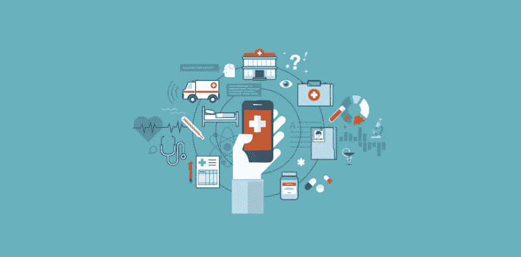
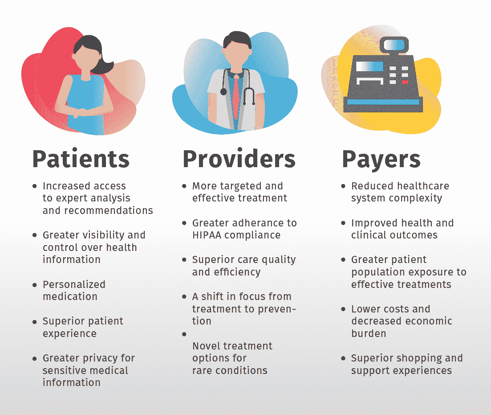
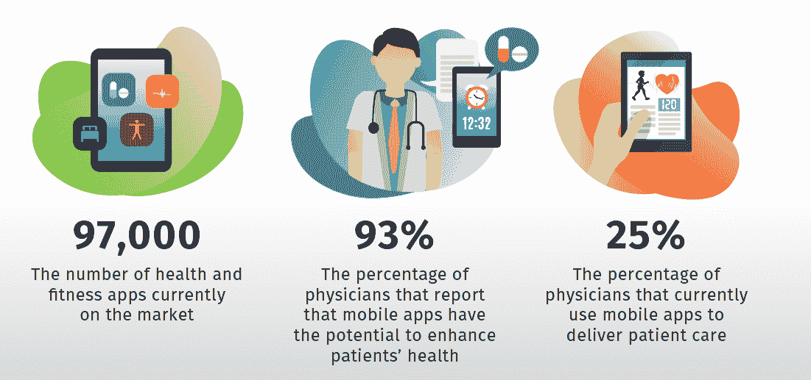

# HealthTech 如何帮助患者构建尖端解决方案

> 原文：<https://medium.com/geekculture/how-healthtech-helps-to-build-cutting-edge-solutions-for-patients-5d5eee6f5290?source=collection_archive---------35----------------------->

你知道吗，每五个美国人中就有一个使用应用程序追踪他们的健康数据。[医疗保健软件解决方案](https://www.botreetechnologies.com/blog/custom-healthcare-app-when-should-your-facility-decide-to-get-one/)在注重健康的千禧一代中非常受欢迎，他们希望定期监控自己的健康状况。

疫情也在推动医疗保健解决方案的发展。人们希望跟踪他们的健康状况，确保他们是安全的。COVID 特别强调普通人的血氧水平(SpO2 ),这导致了具有 SpO2 监测功能的智能手表的增长。

Source: [https://global.hitachi-solutions.com/blog/digital-health-technology-and-therapeutics](https://global.hitachi-solutions.com/blog/digital-health-technology-and-therapeutics)

如今，患者需要能够让他们与医疗机构保持联系的解决方案。许多医疗机构都有自己的数字健康解决方案，人们可以在这里联系医生、获取测试报告、支付账单等等。

[医疗保健领域的尖端解决方案](https://www.botreetechnologies.com/blog/how-healthtech-helps-to-build-cutting-edge-solutions-for-patients/)如用于诊断的 AR 和 VR 成像正在成为患者的游戏规则改变者。通过显示精确的图像，AR & VR 使医生能够更快地识别疾病，并在为时过晚之前开始治疗。

> **阅读更多:**[**2021 年十大移动医疗 App 发展趋势**](https://www.botreetechnologies.com/blog/top-mobile-healthcare-app-development-trends/)

# 什么是最新的医疗保健技术？

数字医疗公司一直在整合更新的医疗保健技术，以增强患者的疗效并提供更好的结果。

疫情正在推动[数字医疗技术公司](https://botreetechnologies.medium.com/top-15-healthcare-software-development-companies-you-should-know-4a37a483bf2f)测试技术，以满足其全面的医疗服务潜力。一些最新的医疗技术包括-

**人工智能**

*   [人工智能](https://www.botreetechnologies.com/artificial-intelligence-solutions)有助于评估大量患者数据，识别健康风险。它使医生能够更快地分析问题所在，并开始治疗。
*   [人工智能还帮助构建医疗保健领域的尖端技术产品](https://www.botreetechnologies.com/blog/grow-your-healthcare-business-using-artificial-intelligence/)，为患者提供个性化的医疗、测试等服务。

**区块链**

*   区块链提供了巨大的互操作性，通过分散的网络实时存储数据，使所有利益相关者都能访问患者数据。
*   最重要的是，这是一个存储数据的安全网络，因为患者对他们的信息拥有完全的所有权，因为这些信息不存储在任何服务器上。

**聊天机器人**

*   聊天机器人是最具创新性的医疗保健解决方案之一，可以充当患者的虚拟助手，提醒他们吃药、安排预约、回答常见问题等等。
*   聊天机器人是全天候与医疗机构保持联系的好方法。对于需要不断提醒多种健康相关方面的老年人来说，它们是一个很好的工具。

**可穿戴设备**

*   医疗保健软件开发的驱动力之一是可穿戴设备。人们可以跟踪和监控他们的健康数据，包括他们的日常健身历史，睡眠模式，压力水平等。
*   可穿戴设备在每一代人中都非常受欢迎。智能手表提供了一种实时监控健康数据并做出必要改变的好方法。

**移动健康应用**

*   如今，移动健康应用正致力于管理像新冠肺炎这样的全球健康问题。印度政府的应用程序 Aarogya Setu 旨在跟踪特定地区检测呈阳性的人，并打破这一链条。
*   对于在疫情期间困在家里的这一代人来说，移动健康应用变得非常有用。它提供了一种移动方式来保持与他们的健康联系，并正确跟踪它。

让我们了解一下这些 app 到底有多有用。

> **点击这里:** [**医疗保健中的机器学习:你不能错过的 5 个重要发展**](https://www.botreetechnologies.com/blog/machine-learning-in-healthcare/)

# 健康类 app 有什么用？

在过去的 12 个月里，44%的美国人使用过移动健康应用程序。由于持续的疫情，健康监测系统的需求也在增长。应用程序链接到这些系统，展示健康数据。

Source: [https://global.hitachi-solutions.com/blog/digital-health-technology-and-therapeutics](https://global.hitachi-solutions.com/blog/digital-health-technology-and-therapeutics)

医疗保健解决方案和应用有各种各样的使用案例。随着世界朝着数字医疗服务的方向发展，应用程序在大多数人的日常生活中找到了自己的位置。

**以下是 2021 年移动健康应用的主要使用案例-**

**电子健康记录**

*   一个[健康管理平台](https://www.botreetechnologies.com/case-studies/caregiver-app)的最佳用例之一是 EHRs 或电子健康记录。现在，医疗 IT 公司不再使用容易丢失的纸质记录和文件，而是为医疗保健提供商构建移动应用程序来记录患者数据。
*   它帮助医生实时访问患者的健康数据，评估他们的病史，并做出有价值的决策。由于记录在云上，临床医生可以通过电子病历查看整个治疗和诊断历史。

**安排约会**

*   [医疗保健应用](https://www.botreetechnologies.com/blog/python-in-healthcare-application/)使患者能够安排、重新安排和取消他们的预约。它减少了给忙碌的医院工作人员打电话和预约的麻烦。人们可以通过应用程序查看医生的日历并预约时间，以便按时进行咨询。
*   医疗保健应用程序会提醒患者他们的预约，从而降低失约率。人们经常抱怨他们忘记了他们的约会。好吧，你猜怎么着——现在有一些应用程序可以帮助你准时到达医生的办公室。

**远程医疗设施**

*   医疗保健行业的另一项有用的发明是远程医疗应用的开发。它们是联系医生和获得咨询的一种舒适、方便和经济的方式。远程医疗应用程序使患者能够通过网络摄像头或手机获得远程咨询。
*   医生们也在利用远程医疗[医疗保健应用开发](https://www.botreetechnologies.com/healthcare-app-development)来开发应用程序，病人可以用它们来联系他们。AmWell、MDlive、Doctor on Demand 是为患者提供远程医疗应用的几个例子。

**健康跟踪**

*   随着可穿戴设备变得越来越受欢迎，健康跟踪正在占据中心舞台。人们现在使用健康跟踪应用程序来监控他们的心率、SpO2 水平、压力水平、每日步数、睡眠健康等等。健康跟踪使他们能够更密切地关注自己的日常健康状况。
*   健康应用是许多人关注的焦点，因为智能手表可以跟踪大量与健康相关的数据。有些甚至到了提醒人们健身目标的程度。移动健康应用市场正在蓬勃发展，这些应用有可能跟踪健康的各个方面。

**健身&营养**

*   医疗保健应用的一个更先进的[趋势用例是将它们用于健身和营养。这些应用程序为锻炼、瑜伽、冥想、舞蹈和其他形式的锻炼提供视频和在线课程。由于它们不需要去健身房，人们羡慕这些应用程序的便利性。](https://www.botreetechnologies.com/blog/how-artificial-intelligence-and-robotics-is-transforming-healthcare/)[医疗专家](https://www.botreetechnologies.com/blog/fitness-based-healthcare-applications-the-trusted-way-to-stay-healthy-at-home/)建议，这些应用程序是一个很好的开始方式。
*   帮助跟踪营养和饮食模式的应用程序也很受欢迎。他们提供食物日志，人们可以在上面记录他们的饮食习惯，他们摄入的营养物质，以及他们应该吃多少。对许多人来说，健康饮食是一个起点。

> **结账:** [**医疗保健 App 开发:你的 App 必须解决的问题**](https://www.botreetechnologies.com/blog/healthcare-app-development-the-problems-your-app-must-solve/)

# 包扎

如今，人们非常需要一家[医疗保健应用开发公司](https://www.botreetechnologies.com/)来构建医疗保健解决方案，为患者提供更好的治疗效果。医疗保健技术每天都在进步，更新的发明带来了更好的护理方法。随着世界的进步，医生会发现健康应用程序可以更好地帮助患者。

BoTree Technologies 是领先的医疗保健应用程序开发服务提供商，为医疗机构和公司构建移动医疗和数字健康应用程序。

今天就联系我们进行[在线咨询](https://www.botreetechnologies.com/contact)。

*最初发表于 2021 年 9 月 1 日*[*https://www.botreetechnologies.com*](https://www.botreetechnologies.com/blog/how-healthtech-helps-to-build-cutting-edge-solutions-for-patients/)T22。