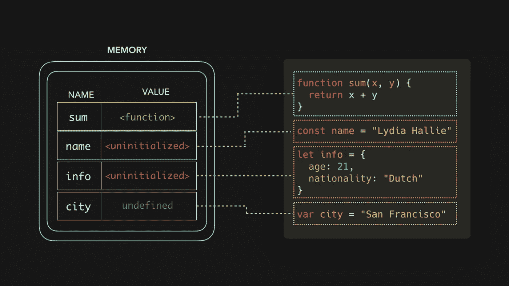

# 如果被解释，提升在 JavaScript 中是如何工作的？—采访的热门话题。

> 原文：<https://medium.com/geekculture/how-hoisting-works-in-javascript-if-it-is-interpreted-9d44e0487987?source=collection_archive---------10----------------------->

在 JavaScript 中，变量和函数提升是你需要准备面试的最重要的话题之一。如果你是 JavaScript 世界的新手，请阅读我的[文章](https://mevasanth.medium.com/hoisting-in-javascript-hot-topic-for-interview-43b463a6a77)，它解释了 JavaScript 中的提升。



Source — dev.to

在开始提升之前，让我们理解一些基本的编程范例，这对于详细理解提升概念是必要的。

**编译型和解释型编程语言有什么区别？**

人们可以在这个[环节](https://www.geeksforgeeks.org/difference-between-compiled-and-interpreted-language/)中找到具体的差异。我坚持用外行的术语，在编译语言中，目标机器直接翻译程序。在解释语言中，源代码不是由目标机器直接翻译的。相反，一个不同的程序，也就是解释器，读取并执行代码。解释总是一行一行的。(在 Google V8 的情况下，引擎是用 c++编写的，它将解释 JavaScript。)

**Ex 为编译语言** : Java、c#等。

**Ex for interpreted languages**:JavaScript、Python 等。

按照官方定义， **JavaScript 是解释型，单线程编程语言**。现在我们已经知道什么是解释语言，**当程序被一行一行执行时，像提升这样的功能是如何实现的？考虑到更多的观众，我在下面给出了提升的定义。**

**JavaScript 中的提升是什么？**

"提升是 JavaScript 将声明移动到顶部的默认行为."人们可以把它与升旗仪式联系起来，在升旗仪式中，旗帜将被升到旗杆的顶端。在这里找到详细的文章。

假设到现在为止，你们都知道 JavaScript 中的提升，让我们理解一下，

**为什么用 JavaScript 实现提升？**

在 JavaScript 中，当你必须调用一个定义在特定块之上或之下的函数时，主线程必须知道函数定义在哪里。(猜测下面代码的输出)

例如:

```
function one(){console.log('Inside function one')}function two() {one();three();}function three(){console.log('Inside function Three')}two()
```

正如您所猜测的，输出是:

```
Inside function one
Inside function Three
```

这是因为 JavaScript 主线程知道函数一和函数三在哪里。这是通过提升函数来实现的，或者所有的函数定义都放在程序块的顶部，这样主线程就知道了。

JS 的创造者 Brendan EichJavaScript 的创造者曾在 Twitter 上说，他们出于上述原因想要实现函数提升，提升用 var 关键字(例如:var x)定义的变量是无意的，而且是在匆忙中发生的**。我相信后来它没有被删除，因为 var 具有全球范围。因此，团队可能决定不移除 var 吊装。**

**现在让我们进入主题，提升是如何在 JavaScript 中实现的**

编写完 JavaScript 代码后，解释分两个阶段进行。

**完成或编译。**

在第一次运行期间，没有执行，解释器逐行检查代码，同时寻找函数或变量声明。一找到它们，它就把它移到街区的顶端。
这就是解释器如何了解哪些函数和变量将在当前上下文中使用，以及执行当前函数需要多少近似内存。此外，它还有助于在函数开始执行之前为执行上下文创建 variableObject。

*以下事情在这个阶段被跳过:*
1。变量和函数赋值。
2。“类”声明。
3。代码语句。
4。函数调用

**执行**

这是实际执行的阶段，调用函数，进行网络调用，接受用户输入，分配内存所有这些都发生在这一步。

由于 JavaScript 中的两步解释方法，提升是可能的。

在下一次面试中，如果他们问这个问题，你将能够自信地回答，阅读愉快。

**同一作者的更多文章:**

1.  [JavaScript 中的一切如何都是对象？](https://mevasanth.medium.com/how-everything-is-object-in-javascript-a4164d7e6a2d)
2.  [异步等待函数返回值的问题](https://javascript.plainenglish.io/problem-with-returning-values-from-async-await-function-javascript-e99c94a47ca5)
3.  [JavaScript 中的吊装:面试热门话题](https://mevasanth.medium.com/hoisting-in-javascript-hot-topic-for-interview-43b463a6a77?source=follow_footer---------0----------------------------)
4.  [JavaScript 中的记忆化——采访热门话题](https://mevasanth.medium.com/memoization-in-javascript-hot-topic-for-interview-815475544ab0)

在这里阅读作者[的所有文章。](https://mevasanth.medium.com/)

在这里观看作者[的所有 youtube 视频](https://www.youtube.com/channel/UCSCNvSCk_Z9mBvUM-FJexRg)