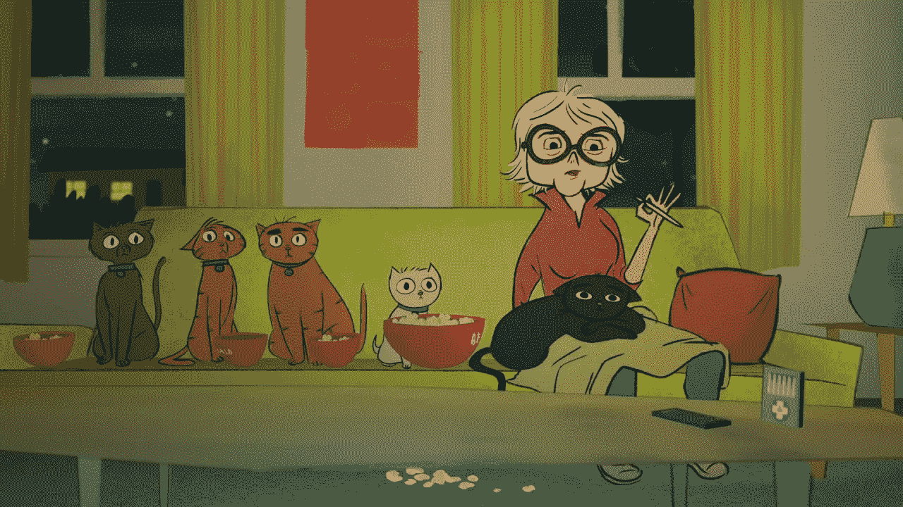

# 好莱坞演员如何参与 NFT 市场

> 原文：<https://medium.com/geekculture/how-hollywood-actors-participate-in-the-nft-market-53e55a4821d6?source=collection_archive---------17----------------------->

NFT 与阿什顿·库彻、米拉·库妮丝和维塔利克·布特林一起众筹了一系列关于被石头砸死的猫的资金

你可能会认为以太坊正在冲击主流:动画系列“瘾君子猫”将由不可替代的代币(NFT)资助。除了米拉·库妮丝、阿什顿·库彻和简·方达，维塔利科·布特林还把自己的声音借给了一只猫。演员的报酬是乙醚。