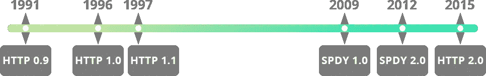

# HTTP/2 将如何改变我们的交流方式？

> 原文：<https://medium.com/geekculture/how-http-2-will-change-the-way-we-communicate-6d92925b912d?source=collection_archive---------15----------------------->

How HTTP/2 will Change The Way We Communicate?

[HTTP/2](https://www.w3.org/Protocols/HTTP/HTTP2.html) 最初被认为是[谷歌的 SPDY](https://developers.google.com/web/fundamentals/performance/http2) (读作“speedy”)协议，旨在解决 [HTTP/1.1](https://www.w3.org/Protocols/rfc2616/rfc2616.html) 固有的性能问题。HTTP/2 是超文本传输协议自 1999 年以来的首次升级。它通过优化 HTTP“在线”表达方式来提高网站性能它没有改变 HTTP 的语义，这意味着头字段、状态代码和 cookies 的工作方式与 HTTP/1.1 完全相同。

[Http Timeline](https://www.w3.org/Protocols/Timeline.html)

# 什么不起作用？

**HTTP1.1** 被限制为每个 [TCP](http://w3schools.sinsixx.com/tcpip/tcpip_intro.asp.htm) 连接只能处理一个未完成的请求，迫使浏览器使用多个 [TCP](http://w3schools.sinsixx.com/tcpip/tcpip_intro.asp.htm) 连接来同时处理多个请求。但是，并行使用过多的 [TCP](http://w3schools.sinsixx.com/tcpip/tcpip_intro.asp.htm) 连接会导致 [TCP](http://w3schools.sinsixx.com/tcpip/tcpip_intro.asp.htm) 拥塞，造成网络资源的不公平垄断。

**Web** 使用多个连接来处理额外请求的浏览器会占用更多的可用网络资源，从而降低其他用户的网络性能。

从浏览器发出多个请求还会导致数据传输线路上的数据重复，这又需要额外的协议来提取所需的信息，而不会在终端节点出错。

**在** [之前，HTTP/2](https://www.w3.org/Protocols/HTTP/HTTP2.html) 行业用解决方案实践来处理这些约束，例如[域分片](https://www.keycdn.com/support/domain-sharding#:~:text=Domain%20sharding%20is%20a%20technique,website%20by%20using%20multiple%20domains.&text=Web%20browsers%20traditionally%20place%20limits,(between%202%2D16).)、[串联](https://blog.josephscott.org/2017/11/17/http-2-and-concatenation/)、数据内联和 spriting 等等。

Web 的发展已经远远超出了传统的基于 HTTP 的网络技术的能力。十多年前开发的 [HTTP1.1](https://www.w3.org/Protocols/rfc2616/rfc2616.html) 的核心品质为一些令人尴尬的性能和安全漏洞打开了大门，例如 [Cookie Hack](https://book.hacktricks.xyz/pentesting-web/hacking-with-cookies) 。

# HTTP/2 的优势

**服务器推送**

> [*HTTP/2*](https://developers.google.com/web/fundamentals/performance/http2) *使用一种称为服务器推送的程序，在浏览器请求文件之前，服务器知道浏览器需要哪些文件。
> 在浏览器请求这些文件之前，服务器会从技术上把它们“推”给浏览器。这使得检索运行网站所需的所有资源的整个过程更快。*

**复用**

> *One* *与*[*HTTP/1.1*](https://www.w3.org/Protocols/rfc2616/rfc2616.html)*的惊人局限性在于，它每次只能传输一个请求每个*[*TCP*](http://w3schools.sinsixx.com/tcpip/default.asp.htm)*连接。这迫使浏览器利用多个*[*TCP*](http://w3schools.sinsixx.com/tcpip/default.asp.htm)*连接来同时处理多个请求。有了*[*HTTP/2*](https://www.w3.org/Protocols/HTTP/HTTP2.html)*，多个*[*HTTP*](https://en.wikipedia.org/wiki/Hypertext_Transfer_Protocol)*请求现在可以在仅仅一个*[*TCP*](https://en.wikipedia.org/wiki/Transmission_Control_Protocol)*连接上实现。这意味着将资源转移到一个网站会更快更有效率。*

**二进制协议**

> [*HTTP/1.1*](https://tools.ietf.org/html/rfc2616)*处理基于文本的命令来完成可能会传输多余数据的请求。*[*HTTP/2*](https://developers.google.com/web/fundamentals/performance/http2)*通过采用二进制协议来简化客户端计算机对传输信息的解释，从而减少了传输的数据量。这节省了将信息从文本转换成二进制的时间。这可以显著改善加载时间和整体性能。*

**标题压缩**

> *对于富媒体网站，客户端要推送多个头帧；这会导致延迟，并消耗额外的网络资源。*[*HTTP/2*](https://developers.google.com/web/fundamentals/performance/http2)*通过压缩大尺寸的冗余报头帧来解决这个问题。*
> 
> *它使用* [*HPACK*](https://livebook.manning.com/book/http2-in-action/chapter-8/) *压缩，在传输到服务器之前压缩每个报头的单独值。然后，它从先前传输的报头值列表中搜索编码信息，以重新组装完整的报头信息。*

**流优先级**

> *[*HTTP/1.1*](https://tools.ietf.org/html/rfc2616)*的弱点之一就是 CSS 文件和 JavaScript 的缩小化。这是为了在较小文件大小的基础上减少带宽和提高性能。* [*HTTP/2*](https://developers.google.com/web/fundamentals/performance/http2)*优先级的实现允许客户端提供对特定数据流的偏好。这意味着只有某个网页需要的代码才会提供给访问者。由于请求是在*[*HTTP/2*](https://developers.google.com/web/fundamentals/performance/http2)*上同时进行的，加载几个小样式表文件不会有问题。**

*感谢您的阅读💜*