# 人类的学习如何与人工智能联系起来

> 原文：<https://medium.com/geekculture/how-human-learning-can-be-related-to-ml-938c890ec?source=collection_archive---------15----------------------->

你有没有想过机器学习到底学的是什么？我们能够解释 ML 模型和人类学习之间有多少相似之处？例如，什么基于 transformer 的模型真正从大量数据中学习。

我想以艾伦·凯以前说过的话开始:“(T2)一旦我们能够了解自己，我们就能够了解世界”。

如果我们能够理解我们是如何学习的，我们就可以使用计算机创建类似的模型。在本文中，我们主要关注两个话题，**语言学习，**和**图像学习。**

**语言学习**

先说一个问题。**孩子光看课本能学会语言吗？**

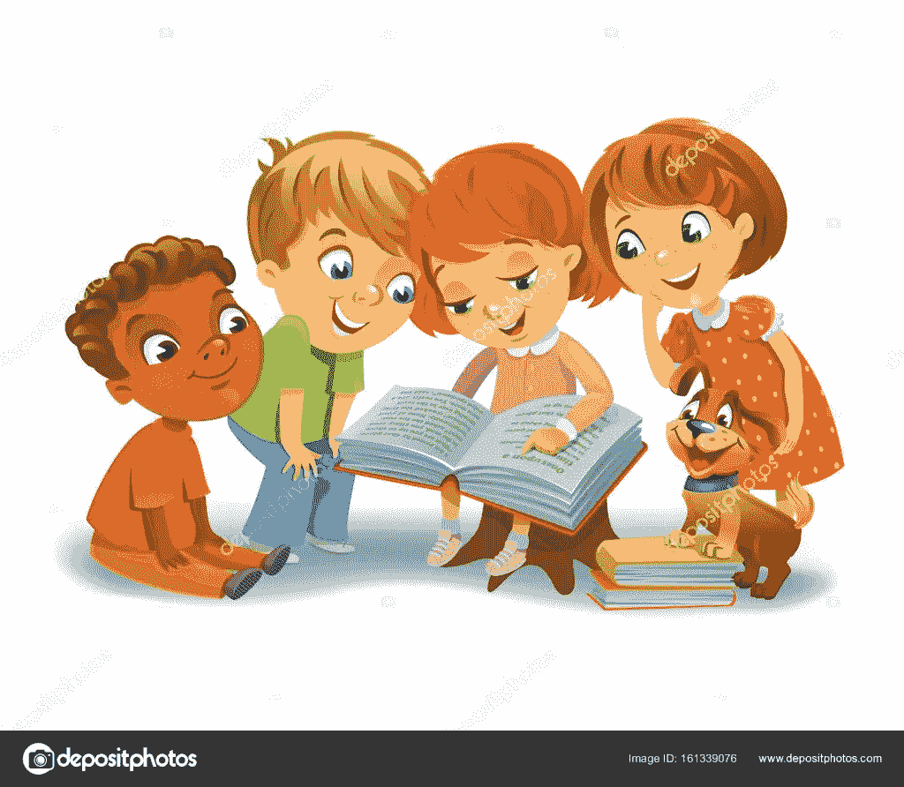

from [https://depositphotos.com/161339076/stock-illustration-cute-children-reading-books.html](https://depositphotos.com/161339076/stock-illustration-cute-children-reading-books.html)

如果父母不显示手势，不监督和不断纠正这个孩子，她/他能理解一个单词吗？

from [https://unsplash.com/photos/UH-xs-FizTk](https://unsplash.com/photos/UH-xs-FizTk)

如果一个孩子只阅读文本而没有任何图像，那么这个孩子可能无法理解一个单词的意思。然而，如果孩子读了足够多的书，他/她会发现什么呢？如果我们能够弄清楚这个孩子通过不断阅读教科书来学习语言可以发现什么，我们可能就能弄清楚机器学习通过大量的文本来学习什么。

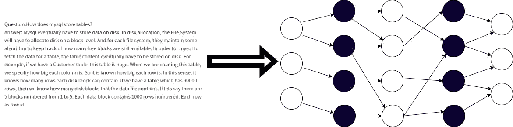

孩子在没有监督的情况下学习语言和成人学习外语是一样的。想象一下，当我们仅仅通过阅读一门外语的教科书来学习这门语言时，我们会学到什么。

我们会有意识地发现，有些模式总是一起出现。例如，“**就**而言”经常一起出现。在“**我爱**”、“**我喜欢**”、“**我要**”、“**我有**”这种“**我**”经常出现在开头。在“**想**中，“**到**往往发生在“**想**”之后。在“**一个苹果**”中，“**一个**”经常出现在“**苹果**”之前。

为什么**“要”**往往发生在**“要”之后？因为我们的英语语法要求。那些经常出现的模式是由语法规定的。那么我们应该问语法到底是什么？我们能给语法下一个明确的定义吗？**

**语法定义:**

*   定义固定短语中单个单词的顺序
*   定义句子中短语的顺序

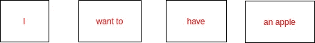

在上面的句子中，“**一个苹果**”可以看做一个短语。”**想**也可以看作是一个词组。语法规则构成了这些短语。如果我们把一个单词也看作一个短语，那么我们有 4 个短语。这四个短语出现在索引 0、1、2、3 位置。

## **“我”**和**“想”有什么关系？**

最常用的回答是**【想要】**发生在**【我】**之后。感觉就像“**想**的位置依赖于**“我”**的位置。如果反过来想，当**【想】**出现的时候，**【我】**只出现在它的前面。

我们可以把词或短语的位置信息称为空间信息。语法决定了不同单词和短语的空间关系。

这种关系本身不是单向的，而是双向的。对象之间的关系是相对的。从我们上面的例子也可以看出。

当我们仅仅通过阅读课文学习外语时，不能理解句子中一个单词的意思，然而，我们能够发现单词之间、短语之间的空间关系。我相信这也是无监督的 ML 只学的东西。我们也可以从图像学习来看。

**图像学习**

我们从最简单的情况开始，到复杂的情况。

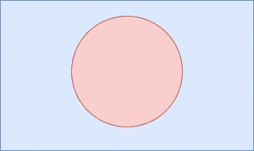

如果有人问我们从上面的形状中能看到什么，我们可以不假思索地说，“这是一个**红色圆圈**在一个**蓝色矩形**里面”。

为什么我们可以立即看到它是一个红色的圆圈？因为它的形状明显不同于长方形。我们需要继续追问。**既然是形状，那我们能定义一下图片里的形状是什么吗**？

现在越来越难，越来越有意思了。我们能够看到形状的原因是颜色差异太大。**颜色的鲜明差异及其位置信息**决定了形状。我们都知道颜色是由图片中的像素值来表示的。现在我们可以给一个形状一个清晰的定义。

**形状定义:**

像素值及其位置的明显差异形成直线或曲线，这些直线或曲线构成更长的直线和曲线。那些较长的直线和曲线一起形成一个形状。

**怎样才能画出圆形？**

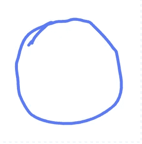

这不是完全圆的。但是，我想将绘图分解成更小的步骤。

让我们从一个小笔画开始

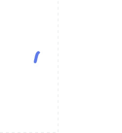

现在如果我们继续画另一个笔画，**另一个笔画是完全随机的吗？明明没有**！如果我们把第一笔叫做曲线，那么不管我们在哪里画第二笔，它都和第一笔有某种联系。它与第一个有一些关系，以便形成一个圆形。

如果我们把图片放大，我们可以看到曲线是由许多平方像素组成的。

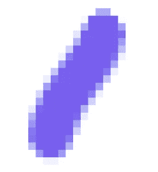

想象一下，我们是从像素级别开始绘制的。

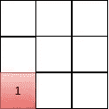

我们放置第一个像素后，**下一个像素的位置和颜色是完全随机的吗**？答案依然是否定的，第二个位置的位置和颜色也是依赖于第一个的。我们可能希望放置第二个像素，如下所示。

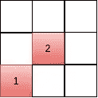

但是，如果我们用另一种颜色放置第二个，就会打破圆形。

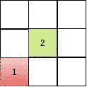

这告诉我们，即使在像素级别上，像素实际上也是相互关联的。它们的值和位置关系一起形成小的直线或曲线。

从上面看，我们是顺时针方向看像素。我们也可以逆时针方向思考。但结果是一样的。

看下面的情况。在第一次划臂之后，我们不想让第二次划臂靠近第一次划臂，无论距离多远。

红圈区域是第二个笔画。第二笔的位置与第一笔对称。

**笔画可以认为是由连续像素组成的小线条，如下图。**

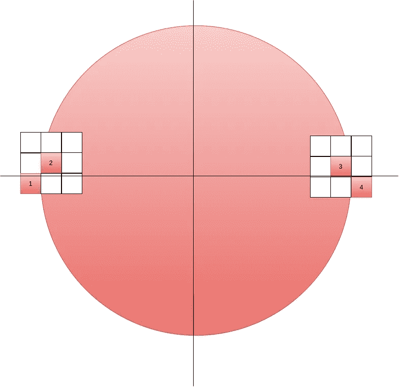

像素 1 和 2 形成第一笔画。

像素 3 和 4 形成第二笔划。

如果我们考虑像素 4 的颜色和位置。似乎它与像素 1(相对于上述坐标对称的像素)有很强的关系。

但是，如果我们旋转坐标，像下面这样。

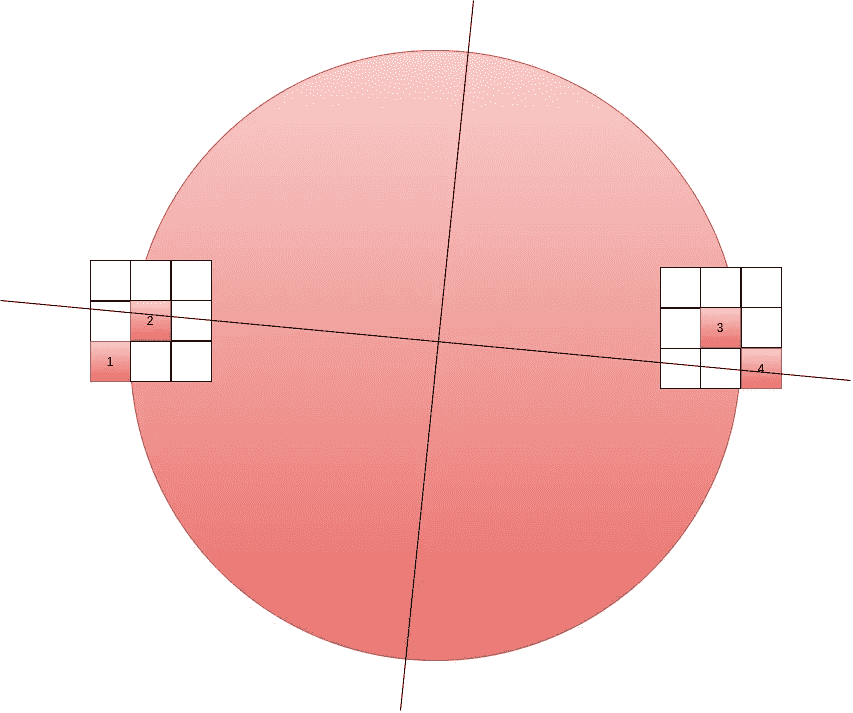

那么像素 4 和像素 2 变得对称。这些关系在某种程度上被形状本身的中心所限制。

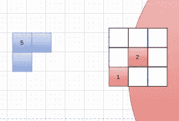

看上面的像素。我们还可以问像素 1 和像素 5 之间的关系有多强。像素 1 是红色圆圈的边缘，像素 5 离它很远。像素 5 来自蓝色矩形背景。可能他们的颜色和位置关系不是那么强烈。

我们实际上可以认为每个像素与所有其他像素都有关系，并为这种关系定义一个大小。例如，像素 1 与所有其他像素都有关系。如果有 100 个像素，那么我们可以使用向量 *w* 来表示像素 1 和其他 99 个像素之间的关系。

**像素 1 和像素 2 形成一条曲线。像素 3 和像素 4 也形成一条曲线。正如我们之前看到的，第二个笔画与第一个笔画的颜色和位置有很大的关系。**

如果我们在语言示例中将一个像素与一个单词进行比较。几个像素形成一条曲线，几条曲线形成一个形状。几个词组成一个短语，几个短语组成一个句子，看起来不是很相似甚至相等吗？

**使用数量**定义关系

如果我们使用 *wi* 向量来定义每个像素与其他像素之间的关系，我们得到一个矩阵 *W.*

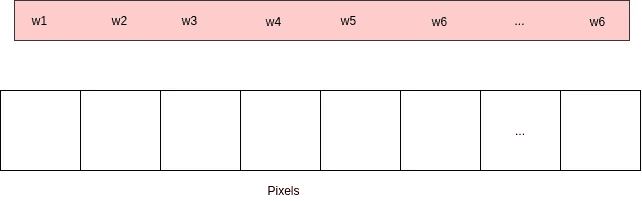

如果我们认为单个像素的颜色和位置关系可以形成小曲线，小曲线的关系形成更长的曲线，我们可以继续使用上述机制定义矩阵 W 来表示曲线之间的关系，并重复多次。

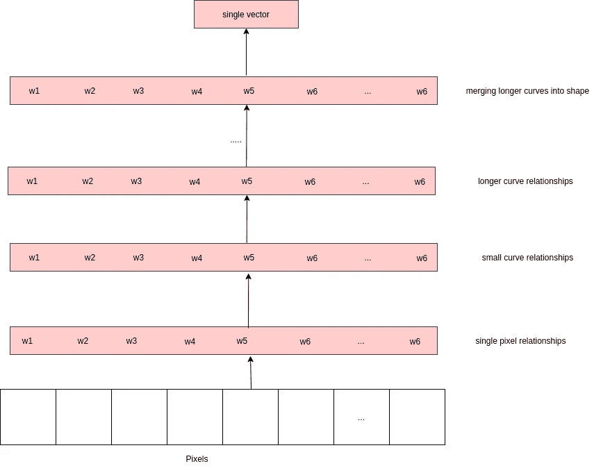

在最后一层，我们可以将那些已经代表更长曲线的 *w* 组合成一个形状。

**它看起来不像多头变压器中的编码方式吗？这个机制非常通用。**

如果上面的推导成立，那么它就直接解释了机器学习中的每一层在做什么。如果我们将此应用于 NLP，那么 NLP 中的转换器只是将单词构造成短语，将小短语构造成更长的短语，将更长的短语构造成句子。较长的句子可以合并成一篇文章。这就有意思了！

如果你认为这篇文章有什么不对的地方，请留下评论。作为一个机器学习的自学者，我不知道这是否正确。