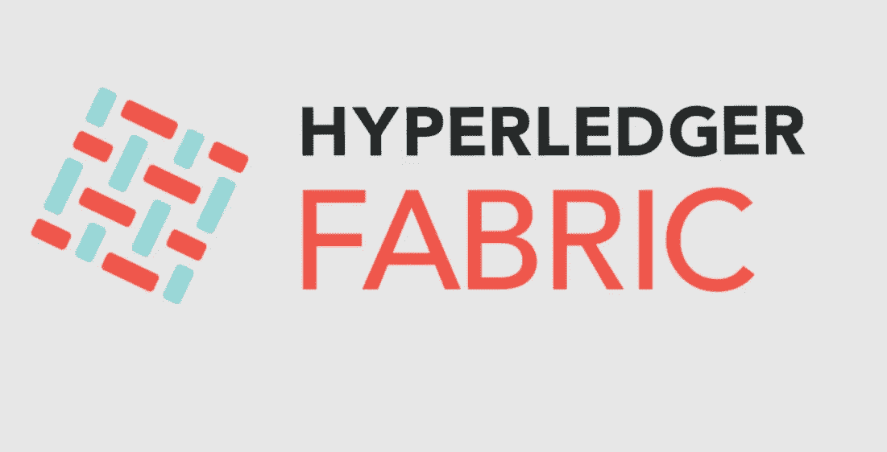
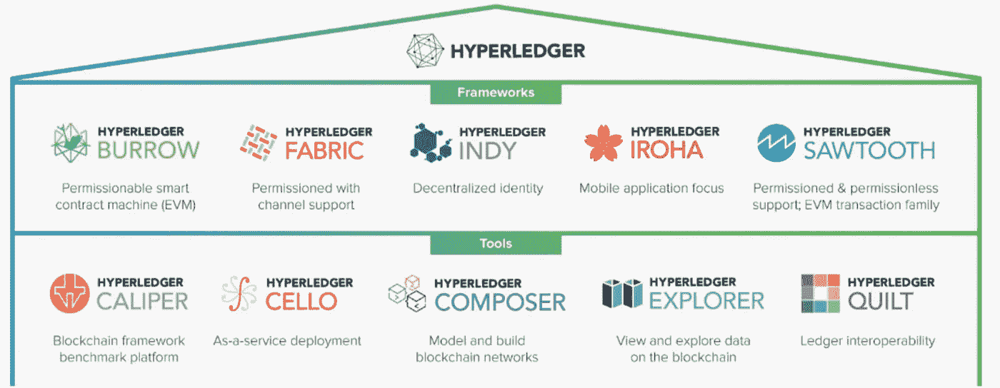
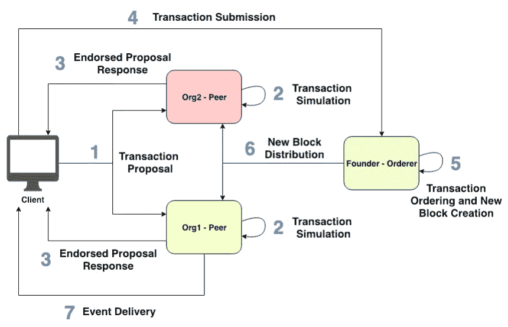
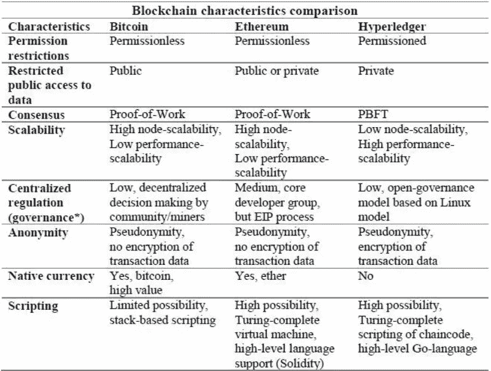

# Hyperledger Fabric 区块链的工作原理。解释

> 原文：<https://medium.com/geekculture/how-hyperledger-fabric-blockchain-works-explained-9a93d52d044c?source=collection_archive---------11----------------------->

这篇博文的目的是描述 Hyperledger Fabric 区块链如何工作的关键概念，以便您可以对如何使用有一个基本的了解。

Image [Source](https://cn.hyperledger.org/wp-content/uploads/2018/04/fabric-logo.png)

# 内容。

*   Hyperledger 简介。
*   Hyperledger 结构详细信息。
*   Hyperledger 结构工作流。
*   超级账本 vs 以太坊 vs 比特币。

# 什么是 Hyperledger？

Hyperledger 是 Linux 基金会自 2015 年以来创建和托管的伞式开源项目。

*   Hyperledger 是 Linux 基金会自 2015 年以来创建和托管的伞式开源项目。
*   它旨在推进和促进跨行业的区块链技术，以确保商业伙伴之间的问责制、透明度和信任。
*   Hyperledger 使业务网络和交易更加高效。

Credit: [https://www.hyperledger.org/](https://www.hyperledger.org/)

*   Hyperledger 区块链通常是许可的区块链，这意味着每一方都有明确的标识，每一笔交易都经过验证、授权、确认和跟踪。您可以在内部运行光纤网络，或者使用[区块链即服务](http://blockchain.kompitech.com/)平台来为您维护总账基础设施。
*   Hyperledger 的主要目标是创建企业级、开源、分布式分类帐框架和代码库，以支持业务用例。

# Hyperledger 织物。

[Hyperledger Fabric](https://www.hyperledger.org/projects/fabric) 是**第一个提出代码库**的提案，结合了数字资产控股公司、Blockstream 的 libconsensus 和 IBM 的 OpenBlockchain 之前所做的工作。

# Hyperledger 结构网络中的角色:

*   **客户端**
    客户端是代表个人在网络上提议交易的应用程序。**客户端**可以是服务于特定组织/业务活动的任何特定应用/门户。客户端应用程序使用 Hyperledger Fabric SDK 或 REST web 服务与 Hyperledger Fabric 网络进行交互。
*   **对等体**
    成员组织内的对等体接收来自组织内客户端的事务调用请求。对等体维护网络的状态和分类帐的副本。因此出现了分布式账本技术(DLT)。
*   **排序服务**
    排序服务接受已签署的事务，将它们排序到一个块中，并将这些块交付给提交对等方。

> 因此并非所有的对等节点都是相同的。网络中有不同角色的不同类型的对等节点:

*   背书人同行
*   锚定对等体
*   订购方对等方

# 背书人同行

该对等体在接收到来自客户应用程序的“事务调用请求”时继续工作

*   验证交易。ie 检查证书细节和申请人的角色。
*   执行链码(即智能合约)并模拟交易结果。但它不会更新分类账。

# Hyperledger 结构工作流

Hyperledger Fabric Workflow

以下是解释步骤:

1.  首先，*客户机*将事务调用请求广播给背书者对等体。
2.  背书人对等方检查证书详细信息和其他信息以验证交易。如果验证检查通过，认可对等体模拟交易，生成响应以及读写集，并使用其证书认可生成的响应，否则拒绝作为认可响应的一部分。
3.  客户从批准方收到批准的提案回复。
4.  客户现在将批准的交易发送给订购方，以便正确订购并包含在块中。
5.  订购者节点将交易包括到块中，并将该块转发到 Hyperledger 结构网络的不同成员组织的锚节点。
6.  订购方在相关通道上向所有对等方(认可对等方和提交对等方)广播生成的块。然后，每个对等点确保接收到的块中的每个事务都由适当的签署对等点签名。这些个体对等体然后用最新的块更新他们的本地分类帐。因此，所有网络都同步了分类账。
7.  客户端从 EventHub 服务接收任何订阅的事件。

# **超级账本 vs 以太坊 vs 比特币**

下表总结了比特币、以太坊和 Hyperledger 的比较。

为了找出这对于每个区块链平台的详细意义，在下面的帖子中。最后，你可以很好地理解区块链空间中最重要的主题。

先说比特币:工作证明在比特币中是如何工作的？ [**一探究竟，请看这里**。](/datadriveninvestor/blockchain-moves-from-buzzword-to-reality-4e3d6b80b1d5)

感谢阅读！

干杯！