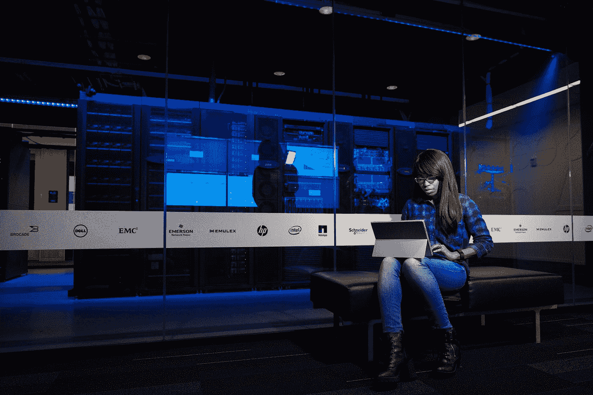

# 我如何意外地阻止了一次大规模黑客攻击

> 原文：<https://medium.com/geekculture/how-i-accidentally-prevented-a-mass-hacking-e9cd7ddc15fd?source=collection_archive---------4----------------------->

## 并不是所有的英雄都穿着斗篷或者为他们的工作获得报酬

Photo by [Christina @ wocintechchat.com](https://unsplash.com/@wocintechchat?utm_source=medium&utm_medium=referral) on [Unsplash](https://unsplash.com?utm_source=medium&utm_medium=referral)

# 介绍

我从事道德黑客和开发工具已经有很长时间了。但出于某种原因，我从未对制作或运营网站感兴趣。几周前，我为我的第一个网页买了一个域名和主机。我觉得自己是一个试图理解的人…