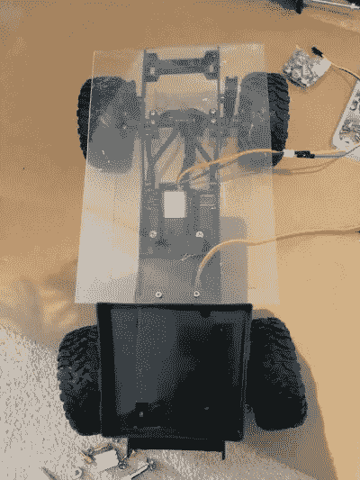
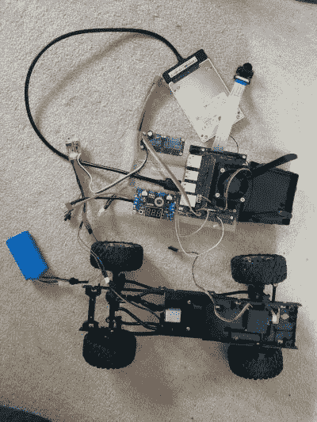
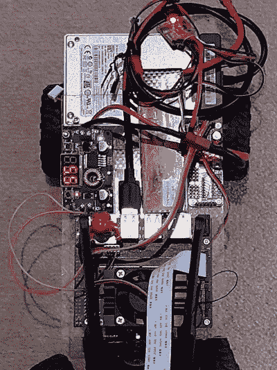
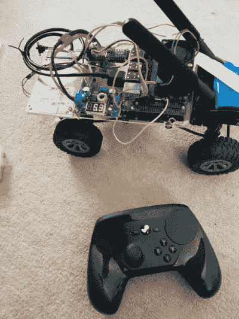

# 我是如何建造一辆自动驾驶模型车的

> 原文：<https://medium.com/geekculture/how-i-built-a-self-driving-model-car-5beaa869dded?source=collection_archive---------34----------------------->

## 第 1 部分—基础知识

你如何着手建造一辆自动驾驶的汽车模型？这一系列文章将带领读者从基础到高级技术，包括基于驾驶行为的简单物体检测。这需要一点时间和决心，但我乐在其中！

先说我的帖子列表:

1.  基础知识，包括为第一个原型设置硬件
2.  [软件](/@al.mclean/how-i-built-a-self-driving-model-car-8e70d024f117)，学习第一个模型
3.  [试图让它驱动](https://al-mclean.medium.com/how-i-built-a-self-driving-model-car-b5277dee57e2)——使用图像预处理来帮助和对付 bug！
4.  [更上一层楼](https://al-mclean.medium.com/how-i-built-a-self-driving-model-car-b8cc7566a28b) —一辆更大更快的汽车，使用 TensorFlow Lite、max performance mode 改进性能，采用基于 TensorRT 的物体检测器来避开路上的物体。

# 第一个原型的硬件

首先，你需要一些硬件。为了开始，我从 donkeycar 和 NVidia 的 JetBot 中获得了灵感。我已经有了一辆遥控车，但它真的是为了外面，因为它非常快，我很难在里面驾驶它。所以我想买一个便宜的遥控履带车来练习。然而，我知道我想在某个时候尝试一些更复杂的计算机视觉应用，比如物体识别。由于这一点和推理性能(见[这里](https://developer.nvidia.com/embedded/jetson-nano-dl-inference-benchmarks)和[这里](https://www.hackster.io/news/benchmarking-machine-learning-on-the-new-raspberry-pi-4-model-b-88db9304ce4))我决定从 Jetson Nano 开始，尽管它的价格是树莓派 4 的两倍左右！

这是我的材料清单:

*   FY003–1A 遥控汽车全比例四轮驱动爬坡遥控车:36.24
*   Jetson Nano 开发套件 4GB : 99
*   罗技 F710 游戏手柄(秒针:15.20)
*   PCA9685 16 通道 12 位 PWM 伺服驱动器:9.99
*   DC-DC 降压转换器调节器:6.50
*   防水拉丝电子调速器:11.19
*   英特尔 AC8265 蓝牙、WiFi 无线适配器:11.70
*   NGFF M.2 卡 Wifi 天线:8.99
*   捷信 IMX219 摄像头模块(8Mp IMX219) — 160 FOV : 20.02
*   Etronix 17G 3.5kg/0.11s 微型服务器金属齿轮:11.19
*   垫片和电路板支架:5.84
*   伺服延长线:6.50
*   柔性带状电缆(30 厘米):3.29
*   5V 4A 电源:12.99
*   LiPo 11.1V 电池:14.99
*   LiPo 7.4V 电池:？—我身边就有一个
*   LiPo 充电器:？—我身边就有一个
*   DC 冷却风扇为杰特森纳米 5V 风扇支持 PWM 速度调整:6.75
*   固态硬盘:？—我身边就有一个

总共 280.38 英镑。值得注意的是，搭载 Jetson Nano 的 NVidia JetRacer Pro 售价 304 英镑，但不含电池。其他版本，如 DonkeyCar 网站上列出的细节也有类似的价格。然而，我希望能够将我的自动驾驶硬件从测试车转移到更快的车上，并且还希望挑战从零开始构建东西！

# 首要问题

我在这里会有什么不同的表现吗？是啊！买下“测试”车后不久，我意识到接收器/ESC/伺服控制器都是一体的，我需要一些更复杂的东西来插入 nano。因此，我需要购买电子稳定控制系统和伺服。

一辆稍微贵一点的“测试”车实际上可能变得更便宜、更容易使用！

拆卸汽车后，删除组合接收器，电子稳定控制系统和伺服控制器，我发现伺服是一个无电路类型，这意味着它有 5 线和'智能'是在组合电子模块。所以那也必须取消。我的第一个替代品规定了 35mm 的宽度，但这个**不包括**固定法兰，所以当它到达时，它不适合底盘。在订购替代品时，我找到了一块丙烯酸板，并将其切割成合适的尺寸——这将成为我的组件基座。然后我开始钻孔来安装电子设备。

# 内核黑客和固态硬盘

我想马上做的一个修改是使用 SSD 而不是 microsd 卡。原因很简单，就是性能问题，幸运的是，我有一个备用的固态硬盘。SSD 提供了更快的[启动和吞吐速度，虽然这不是推断所必需的，但如果你想对设备本身进行任何培训，它们是有用的。如果你在另一台机器上训练，从 Jetson 上复制图像会更快。](https://tutorial.cytron.io/2020/10/21/nvidia-jetson-nano-boot-from-usb/)

这有一点复杂，Jetson 需要在启动时加载一些固件来启用 USB 端口，但我们实际上想从 USB 启动！

解决方案是破解 Jetson Nano 内核，使根文件系统位于 USB 上，Nano 可以从那里加载 USB 实用程序。不幸的是，现在有实用工具可以提供帮助。我跟随[这个](https://forums.developer.nvidia.com/t/foolproof-guide-to-move-from-microsd-to-usb-ssd/167785/6)和[这个](https://docs.nvidia.com/jetson/l4t/index.html#page/Tegra%20Linux%20Driver%20Package%20Development%20Guide/flashing.html#wwpID0E0HM0HA)来指导我完成这个过程，并且当我在那里时，我还将 Jetson 上的[交换空间](https://www.jetsonhacks.com/2019/11/28/jetson-nano-even-more-swap/)增加到 4GB，因为我认为我以后可能会需要它。

# 建造第一个原型

使用各种指南，例如用于 [JetRacer](https://github.com/NVIDIA-AI-IOT/jetracer/blob/master/docs/tamiya/hardware_setup.md) 、 [DonkeyCar](https://docs.donkeycar.com/guide/build_hardware/#roll-your-own-car) 的指南以及来自 [Ori 的信息。代码](https://ori.codes/hardware/building-the-car/)我将英特尔 AC8265 适配器插入 Jetson 并连接天线，将电源调节器连接到 Jetson，连接 SSD 和相机，然后将 Jetson 连接到伺服控制器，将伺服控制器连接到 ESC，将伺服和 ESC 连接到电机。

# 手动驾驶

随着硬件的组装和运行基本的 DonkeyCar 代码(我将在下一篇文章中描述)，我能够使用游戏手柄风格的控制器手动驾驶汽车。

我最初使用现有的蒸汽控制器，我必须通过蓝牙控制汽车，但这有一些问题(细节如下)。

然而，我现在有了一辆手动控制的遥控汽车，所有的硬件都准备好了，可以学习如何自动驾驶。这些组件和装置被设计成便携式的，以便将来证明我的学习和我计划的越来越复杂的实验。

在下一篇文章中，我将谈论软件的设置以及我是如何着手学习我的第一个模型的。