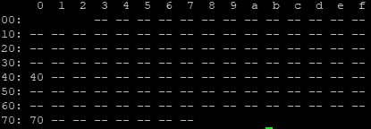
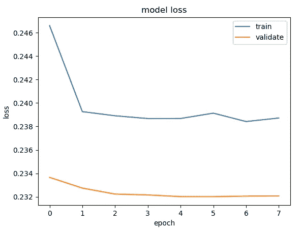

# 我是如何建造一辆自动驾驶模型车的

> 原文：<https://medium.com/geekculture/how-i-built-a-self-driving-model-car-8e70d024f117?source=collection_archive---------55----------------------->

## 第 2 部分—软件和学习第一个模型

这个系列以前的文章可以在这里找到。

# 安装软件

我喜欢使用 ssh 登录 Jetson，然后使用安装了 tmux _ resurrect 的 byobu 来允许我在 putty 控制台中运行多个窗口，并从我上次关闭汽车之前停止的地方进行恢复。

## 虚拟

在 Jetson 上，首先安装 VirtualEnv 并创建一个 DonkeyCar 环境。激活这个，在这个环境里做所有的事情。我在这里使用[的 virtualenvwrapper】。](https://virtualenvwrapper.readthedocs.io/en/latest/)

## 东奇卡

要安装的第一个也是主要的软件来自 [DonkeyCar](https://github.com/autorope/donkeycar) 。对于 Nano，根据您的 JetPack 版本，配置会有小的变化。DonkeyCar 发行版附带了一个为 JetPack 4.4 安装的脚本，但我安装的是 4.5。转到 install/nano 文件夹，创建一个新的 install-jp45.sh 并更改相关行:

```
sudo -H pip3 install --pre --extra-index-url [https://developer.download.nvidia.com/compute/redist/jp/v45](https://developer.download.nvidia.com/compute/redist/jp/v45) tensorflow==2.2.0+nv20.6
```

然后可以运行 pip install -e .[nano]

## 校准

DonkeyCar 带有一个校准工具，允许您确定汽车的最大、最小和中心或零位置。首先，值得检查 PCA9865 总线是否配置正确。

```
sudo i2cdetect -r -y 1
```



它会输出类似这样的内容。据说 PCA9865 可以通过 0x40 和 0x70 寻址。第一种是默认设置，应该已经配置好了。在 myconfig.py 中查找以下内容，它表示我们在 0x40 上使用 1 号总线。

```
PCA9685_I2C_ADDR = 0x40
PCA9685_I2C_BUSNUM = 1
```

然后，运行校准工具，将数值手动输入控制台，观察转向和油门(确保汽车离开地面！).通过迭代和逐渐增加/减少值，您可以找到阈值的位置。这些进入我车里的 myconfig.py。

```
donkey calibrate --channel 0 --bus=1
```

这例如可能导致

```
STEERING_CHANNEL = 0
STEERING_LEFT_PWM = 480
STEERING_RIGHT_PWM = 280THROTTLE_CHANNEL = 1
THROTTLE_FORWARD_PWM = 450
THROTTLE_STOPPED_PWM = 370
THROTTLE_REVERSE_PWM = 330
```

## 操纵杆

我有一个现有的蒸汽控制器，想用它来让我前进。不幸的是，这不是 DonkeyCar 的标准配置之一，所以我不得不使用 DonkeyCar 自带的自定义游戏杆工具创建自己的配置。然而，Steam 控制器需要 PyGameController 和其他一些小部件才能工作。

```
sudo apt-get install python-dev libsdl-image1.2-dev libsdl-mixer1.2-dev libsdl-ttf2.0-dev libsdl1.2-dev libsmpeg-dev python-numpy subversion libportmidi-dev ffmpeg libswscale-dev libavformat-dev libavcodec-dev libfreetype6-dev
sudo apt-get install libsdl2-dev
sudo apt-get install python-pygame
```

然后从[这里](https://github.com/ynsta/steamcontroller)获取 steamcontroller 代码。我克隆了它并运行了设置，然后在/etc/udev/rules.d 中添加了 steamcontroller 规则。现在我们可以运行:

```
sc-xbox.py start
```

您将看到 js0 出现在/dev/input 中。这是 DonkeyCar 查找控制器的默认位置。

现在运行操纵杆向导:

```
donkey createjs
```

这将写出一个 python 文件，但该类被配置为扩展 JoystickController。我们需要编辑它，以便它扩展 PyGameController:

```
from donkeycar.parts.controller import PyGameJoystick, JoystickController
class MyJoystick(PyGameJoystick):
```

接下来，我们需要让 DonkeyCar 使用 CustomController，这意味着编辑 myconfig，以便创建 CustomController:

```
# add controller
    if cfg.USE_JOYSTICK_AS_DEFAULT:
        from my_joystick import MyJoystickController
        ctr = MyJoystickController(throttle_dir=cfg.JOYSTICK_THROTTLE_DIR,
            throttle_scale=cfg.JOYSTICK_MAX_THROTTLE,
            steering_scale=cfg.JOYSTICK_STEERING_SCALE,
            auto_record_on_throttle=cfg.AUTO_RECORD_ON_THROTTLE)
        ctr.set_deadzone(cfg.JOYSTICK_DEADZONE)
        print('created myjoystick controller')
        print(ctr)
```

并在 myconfig.py 中将控制器类型设置为 custom:

```
CONTROLLER_TYPE=custom
```

我有这个控制器的问题，虽然这是很难控制汽车容易，有时有很多滞后或控制没有反应，蓝牙范围不是很大。我还尝试了一个“标准”控制器，罗技 F710，但是范围更差(最多几米)。

这些控制器对第一辆室内原型车来说还可以，尽管我不得不跟着车走，所以我不会超出范围，但它们对下一个版本来说不够好。

## OpenCV

我想做一些图像预处理，所以我安装了 openCV，这意味着建立它。这需要第一篇文章中的额外交换空间，然后我使用了[这个](https://qengineering.eu/install-opencv-4.5-on-jetson-nano.html)。注意这构建了一个支持 gpu 的 OpenCV 版本，尽管你必须修改你的代码来使用 Cuda。它也可以在 cpu 上工作，不需要改变，所以这是我开始做的。

# 学习第一个模型

在开着车在里面转了一圈，收集了大约 8000 张照片后，我准备学习一个模型。我有一台 Nvidia 1080Ti，所以我决定在这台机器上学习模型，然后将模型复制到车上。

我从 480x640 图像开始，我想使用来自[的 Nvidia 架构。当然，这意味着在 DonkeyCar keras.py 文件中添加一个定制的神经架构，如果传入的模型类型是 nvidia，则更新 utils.py 以选择该架构。](https://developer.nvidia.com/blog/deep-learning-self-driving-cars/)

在 keras.py 中:

```
class NvidiaModel(KerasPilot):
    def __init__(self, num_outputs=2, input_shape=(240, 320, 3), *args, **kwargs):
        super(NvidiaModel, self).__init__(*args, **kwargs)
        self.model = customArchitecture(num_outputs, input_shape)
...
```

在 utils.py:

```
elif model_type == "nvidia":
        from donkeycar.parts.keras import NvidiaModel
        kl = NvidiaModel(input_shape=(480,640,3))
```

和列车命令:

```
python train.py --model models/my_nvidia.h5 --type nvidia --tubs data
```

这导致了以下损失曲线:



这是相对较高的损失。无论如何，我把模型下载到车上，并进行测试。这辆车偶尔看起来能认出路边，但大多数时候它只是驶过了路边。

## 下一步是什么？

在下一篇文章中，我将研究如何使用 OpenCV 进行图像预处理来帮助训练，以及在推理管道中查找 bug。